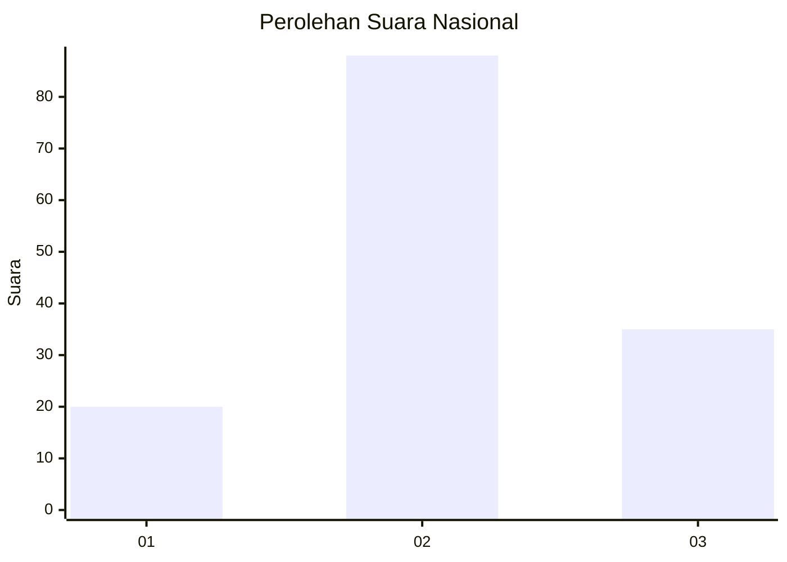
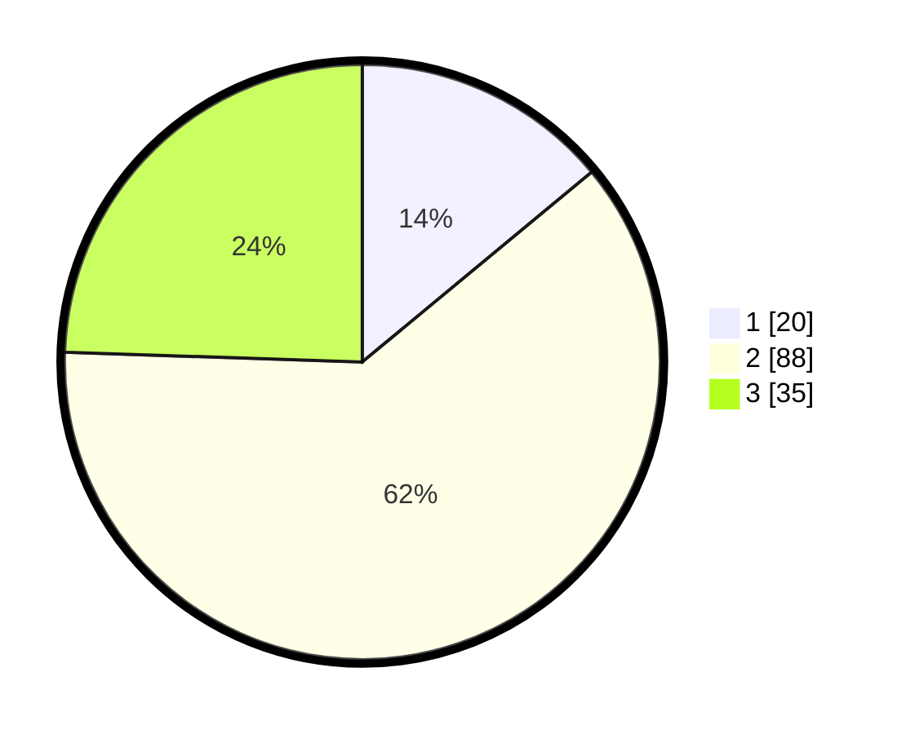

# Hasil

## Grafik

## Tabel

| No. | Nama Paslon    | Suara | Suara (raw) | Persentase |
|:--- |:-------------- | -----:| -----------:| ----------:|
| 1   | ANIES MUHAIMIN | 20    | [20][p-1]   | 13,99      |
| 2   | PRABOWO GIBRAN | 88    | [88][p-2]   | 61,54      |
| 3   | GANJAR MAHFUD  | 35    | [35][p-3]   | 24,48      |

[p-1]: https://github.com/gigit-pemilu/pemilu-2024/blob/main/pilpres/hitung-suara/sub/16-sumatera-selatan/sub/09-ogan-komering-ulu-selatan/sub/12-buay-pematang-ribu-ranau-tengah/sub/2010-tanjung-sari/sub/002-tps/sub/paslon-1.txt
[p-2]: https://github.com/gigit-pemilu/pemilu-2024/blob/main/pilpres/hitung-suara/sub/16-sumatera-selatan/sub/09-ogan-komering-ulu-selatan/sub/12-buay-pematang-ribu-ranau-tengah/sub/2010-tanjung-sari/sub/002-tps/sub/paslon-2.txt
[p-3]: https://github.com/gigit-pemilu/pemilu-2024/blob/main/pilpres/hitung-suara/sub/16-sumatera-selatan/sub/09-ogan-komering-ulu-selatan/sub/12-buay-pematang-ribu-ranau-tengah/sub/2010-tanjung-sari/sub/002-tps/sub/paslon-3.txt

## Foto C Plano

https://sirekap-obj-formc.kpu.go.id/25e2/pemilu/ppwp/16/09/12/20/10/1609122010002-20240215-033857--7af1044d-0fac-4595-8f33-9b0584d808f9.jpg

https://sirekap-obj-formc.kpu.go.id/25e2/pemilu/ppwp/16/09/12/20/10/1609122010002-20240215-034107--47ff9dc7-8821-43d6-be9a-9548f0630107.jpg

https://sirekap-obj-formc.kpu.go.id/25e2/pemilu/ppwp/16/09/12/20/10/1609122010002-20240215-034207--1dce2c96-3ff9-4be7-954e-6e0e0c3e3533.jpg

## Metadata

| Key        | Value               |
| ---------- | ------------------- |
| Time Stamp | 2024-02-16 13:30:32 |

