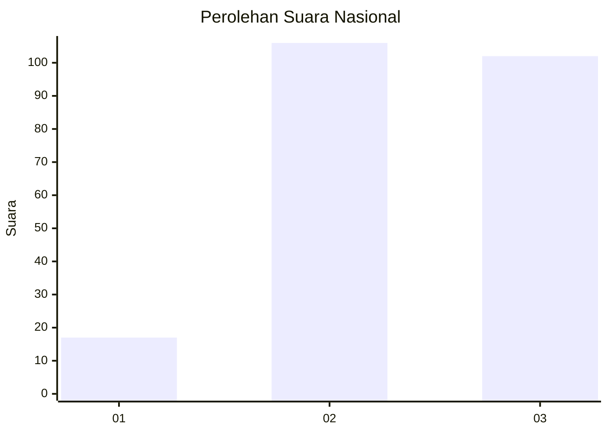
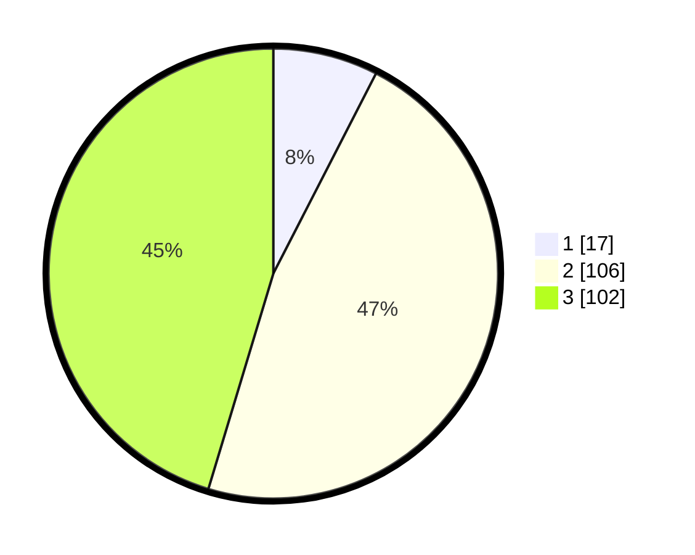

# Hasil

## Grafik

## Tabel

| No. | Nama Paslon    | Suara | Suara (raw) | Persentase |
|:--- |:-------------- | -----:| -----------:| ----------:|
| 1   | ANIES MUHAIMIN | 17    | [17][p-1]   | 7,56       |
| 2   | PRABOWO GIBRAN | 106   | [106][p-2]  | 47,11      |
| 3   | GANJAR MAHFUD  | 102   | [102][p-3]  | 45,33      |

[p-1]: https://github.com/gigit-pemilu/pemilu-2024/blob/main/pilpres/hitung-suara/sub/16-sumatera-selatan/sub/09-ogan-komering-ulu-selatan/sub/12-buay-pematang-ribu-ranau-tengah/sub/2020-sumber-jaya/sub/004-tps/sub/paslon-1.txt
[p-2]: https://github.com/gigit-pemilu/pemilu-2024/blob/main/pilpres/hitung-suara/sub/16-sumatera-selatan/sub/09-ogan-komering-ulu-selatan/sub/12-buay-pematang-ribu-ranau-tengah/sub/2020-sumber-jaya/sub/004-tps/sub/paslon-2.txt
[p-3]: https://github.com/gigit-pemilu/pemilu-2024/blob/main/pilpres/hitung-suara/sub/16-sumatera-selatan/sub/09-ogan-komering-ulu-selatan/sub/12-buay-pematang-ribu-ranau-tengah/sub/2020-sumber-jaya/sub/004-tps/sub/paslon-3.txt

## Foto C Plano

https://sirekap-obj-formc.kpu.go.id/8671/pemilu/ppwp/16/09/12/20/20/1609122020004-20240215-215830--070cc89e-6b2f-429e-bac1-ee3bdbc25a8b.jpg

https://sirekap-obj-formc.kpu.go.id/8671/pemilu/ppwp/16/09/12/20/20/1609122020004-20240215-215837--8197e866-42da-4139-8bcd-ea439cf4cc37.jpg

https://sirekap-obj-formc.kpu.go.id/8671/pemilu/ppwp/16/09/12/20/20/1609122020004-20240216-170305--fef09c99-a623-45d3-8e22-82885854e9ba.jpg

## Metadata

| Key        | Value               |
| ---------- | ------------------- |
| Time Stamp | 2024-02-16 17:30:00 |

