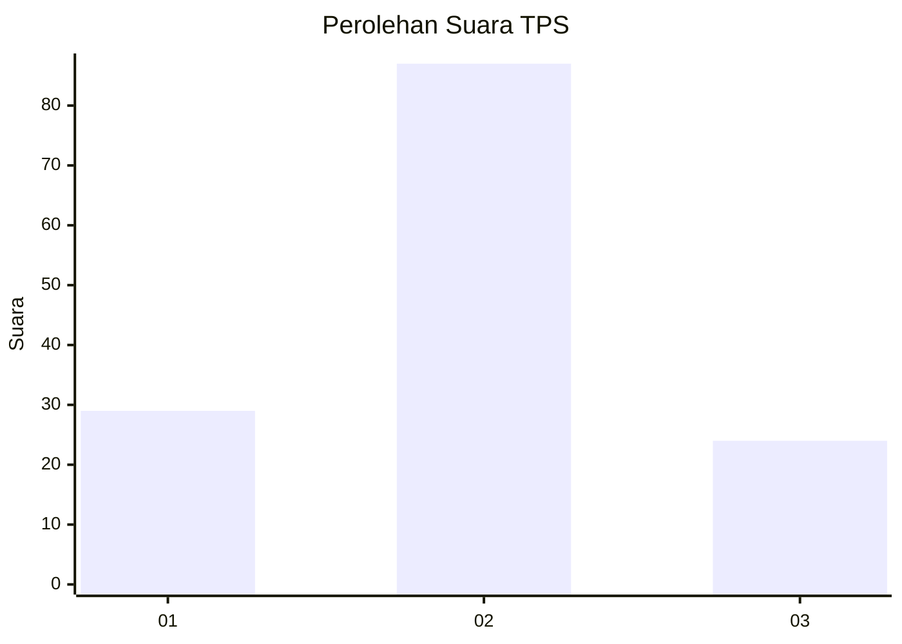
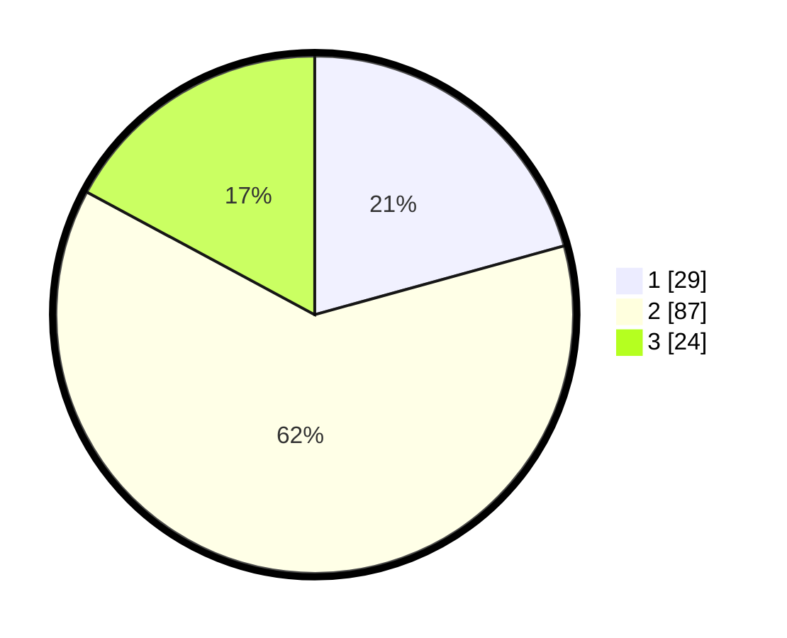

# Hasil

## Grafik

## Tabel

| No. | Nama Paslon    | Suara | Suara (raw) | Persentase |
|:--- |:-------------- | -----:| -----------:| ----------:|
| 1   | ANIES MUHAIMIN | 29    | [29][p-1]   | 20,71      |
| 2   | PRABOWO GIBRAN | 87    | [87][p-2]   | 62,14      |
| 3   | GANJAR MAHFUD  | 24    | [24][p-3]   | 17,14      |

[p-1]: https://github.com/gigit-pemilu/pemilu-2024-16-sumatera-selatan/blob/main/pilpres/hitung-suara/sub/16-sumatera-selatan/sub/09-ogan-komering-ulu-selatan/sub/12-buay-pematang-ribu-ranau-tengah/sub/2022-serumpun-jaya/sub/001-tps/sub/paslon-1.txt
[p-2]: https://github.com/gigit-pemilu/pemilu-2024-16-sumatera-selatan/blob/main/pilpres/hitung-suara/sub/16-sumatera-selatan/sub/09-ogan-komering-ulu-selatan/sub/12-buay-pematang-ribu-ranau-tengah/sub/2022-serumpun-jaya/sub/001-tps/sub/paslon-2.txt
[p-3]: https://github.com/gigit-pemilu/pemilu-2024-16-sumatera-selatan/blob/main/pilpres/hitung-suara/sub/16-sumatera-selatan/sub/09-ogan-komering-ulu-selatan/sub/12-buay-pematang-ribu-ranau-tengah/sub/2022-serumpun-jaya/sub/001-tps/sub/paslon-3.txt

## Foto C Plano

https://sirekap-obj-formc.kpu.go.id/fb35/pemilu/ppwp/16/09/12/20/22/1609122022001-20240215-034936--e01f4ce5-a0c0-43df-9833-3a758d77cbd9.jpg

https://sirekap-obj-formc.kpu.go.id/fb35/pemilu/ppwp/16/09/12/20/22/1609122022001-20240215-035508--f352e148-7b49-4f20-b1b7-070fb3410e99.jpg

https://sirekap-obj-formc.kpu.go.id/fb35/pemilu/ppwp/16/09/12/20/22/1609122022001-20240215-035652--26f63640-4cd3-43a3-b1b1-e7818e9f39fc.jpg

## Metadata

| Key        | Value               |
| ---------- | ------------------- |
| Time Stamp | 2024-02-17 01:07:28 |

