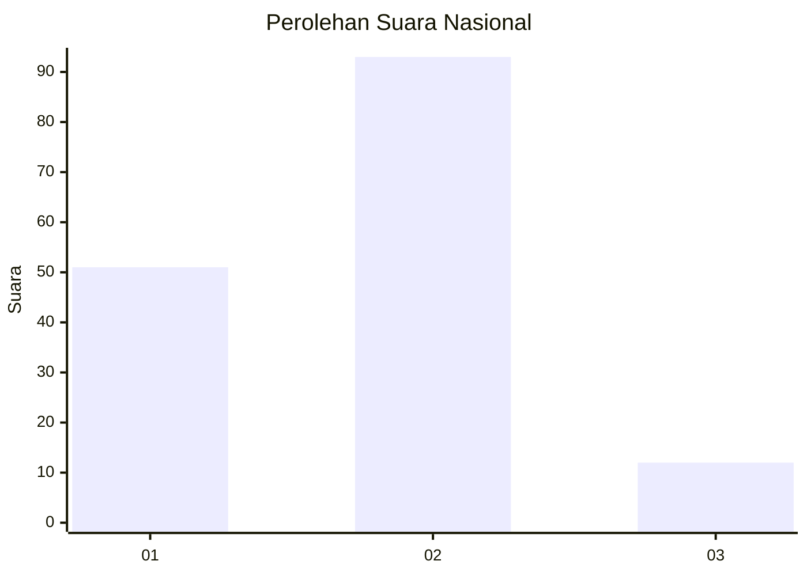
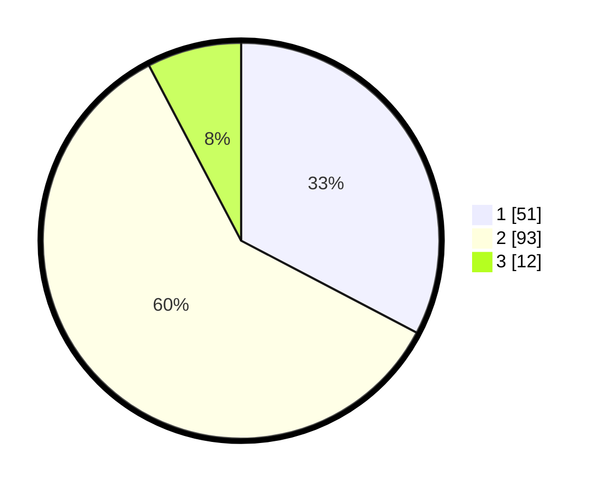

# Hasil

## Grafik

## Tabel

| No. | Nama Paslon    | Suara | Suara (raw) | Persentase |
|:--- |:-------------- | -----:| -----------:| ----------:|
| 1   | ANIES MUHAIMIN | 51    | [51][p-1]   | 32,69      |
| 2   | PRABOWO GIBRAN | 93    | [93][p-2]   | 59,62      |
| 3   | GANJAR MAHFUD  | 12    | [12][p-3]   | 7,69       |

[p-1]: https://github.com/gigit-pemilu/pemilu-2024/blob/main/pilpres/hitung-suara/sub/16-sumatera-selatan/sub/09-ogan-komering-ulu-selatan/sub/13-warkuk-ranau-selatan/sub/2002-kota-batu/sub/001-tps/sub/paslon-1.txt
[p-2]: https://github.com/gigit-pemilu/pemilu-2024/blob/main/pilpres/hitung-suara/sub/16-sumatera-selatan/sub/09-ogan-komering-ulu-selatan/sub/13-warkuk-ranau-selatan/sub/2002-kota-batu/sub/001-tps/sub/paslon-2.txt
[p-3]: https://github.com/gigit-pemilu/pemilu-2024/blob/main/pilpres/hitung-suara/sub/16-sumatera-selatan/sub/09-ogan-komering-ulu-selatan/sub/13-warkuk-ranau-selatan/sub/2002-kota-batu/sub/001-tps/sub/paslon-3.txt

## Foto C Plano

https://sirekap-obj-formc.kpu.go.id/df2c/pemilu/ppwp/16/09/13/20/02/1609132002001-20240220-095625--33dbfe19-74ed-4daf-983b-18fec18c8ee0.jpg

https://sirekap-obj-formc.kpu.go.id/df2c/pemilu/ppwp/16/09/13/20/02/1609132002001-20240215-084104--8c22869d-a459-4016-ad98-592dcbaefac9.jpg

https://sirekap-obj-formc.kpu.go.id/df2c/pemilu/ppwp/16/09/13/20/02/1609132002001-20240215-084110--f9bef635-aed7-4d7e-bea9-85827e7128b1.jpg

## Metadata

| Key        | Value               |
| ---------- | ------------------- |
| Time Stamp | 2024-02-20 10:00:00 |

