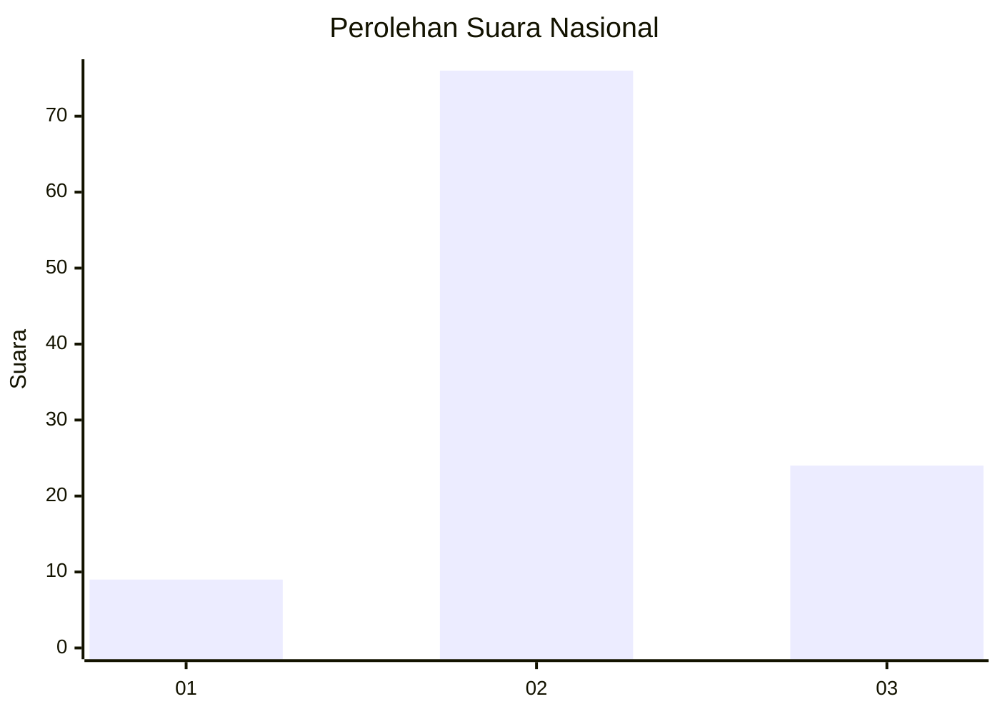
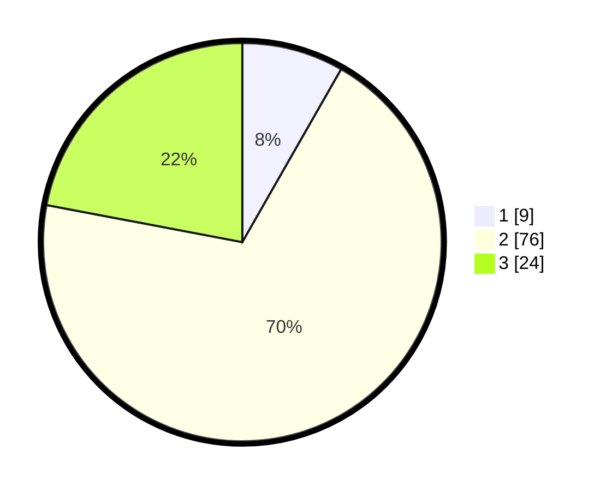

# Hasil

## Grafik

## Tabel

| No. | Nama Paslon    | Suara | Suara (raw) | Persentase |
|:--- |:-------------- | -----:| -----------:| ----------:|
| 1   | ANIES MUHAIMIN | 9     | [9][p-1]    | 8,26       |
| 2   | PRABOWO GIBRAN | 76    | [76][p-2]   | 69,72      |
| 3   | GANJAR MAHFUD  | 24    | [24][p-3]   | 22,02      |

[p-1]: https://github.com/gigit-pemilu/pemilu-2024/blob/main/pilpres/hitung-suara/sub/16-sumatera-selatan/sub/09-ogan-komering-ulu-selatan/sub/13-warkuk-ranau-selatan/sub/2002-kota-batu/sub/004-tps/sub/paslon-1.txt
[p-2]: https://github.com/gigit-pemilu/pemilu-2024/blob/main/pilpres/hitung-suara/sub/16-sumatera-selatan/sub/09-ogan-komering-ulu-selatan/sub/13-warkuk-ranau-selatan/sub/2002-kota-batu/sub/004-tps/sub/paslon-2.txt
[p-3]: https://github.com/gigit-pemilu/pemilu-2024/blob/main/pilpres/hitung-suara/sub/16-sumatera-selatan/sub/09-ogan-komering-ulu-selatan/sub/13-warkuk-ranau-selatan/sub/2002-kota-batu/sub/004-tps/sub/paslon-3.txt

## Foto C Plano

https://sirekap-obj-formc.kpu.go.id/7ea1/pemilu/ppwp/16/09/13/20/02/1609132002004-20240221-011422--c40bdcde-f820-43bd-abca-e9fea977563c.jpg

https://sirekap-obj-formc.kpu.go.id/7ea1/pemilu/ppwp/16/09/13/20/02/1609132002004-20240221-011424--d2c69570-6d53-4c9b-bf79-2ee7a438d039.jpg

https://sirekap-obj-formc.kpu.go.id/7ea1/pemilu/ppwp/16/09/13/20/02/1609132002004-20240221-011423--8cd4c0eb-4a7d-40e3-a5bf-cbc498e81b9e.jpg

## Metadata

| Key        | Value               |
| ---------- | ------------------- |
| Time Stamp | 2024-02-22 12:00:00 |

## DATA PEMILIH TETAP

Jumlah pemilih dalam DPT: **119**.
 * L: **69**.
 * P: **50**.

## DATA PENGGUNA HAK PILIH

Jumlah pengguna hak pilih dalam DPT: **108**.
 * L: **66**.
 * P: **42**.

Jumlah pengguna hak pilih dalam DPTb: **0**.
 * L: **0**.
 * P: **0**.

Jumlah pengguna hak pilih dalam DPK: **3**.
 * L: **3**.
 * P: **0**.

Jumlah pengguna hak pilih: **111**.
 * L: **69**.
 * P: **42**.

## JUMLAH SUARA SAH DAN TIDAK SAH

JUMLAH SELURUH SUARA SAH: **109**.

JUMLAH SUARA TIDAK SAH: **2**.

JUMLAH SELURUH SUARA SAH DAN SUARA TIDAK SAH: **111**.

