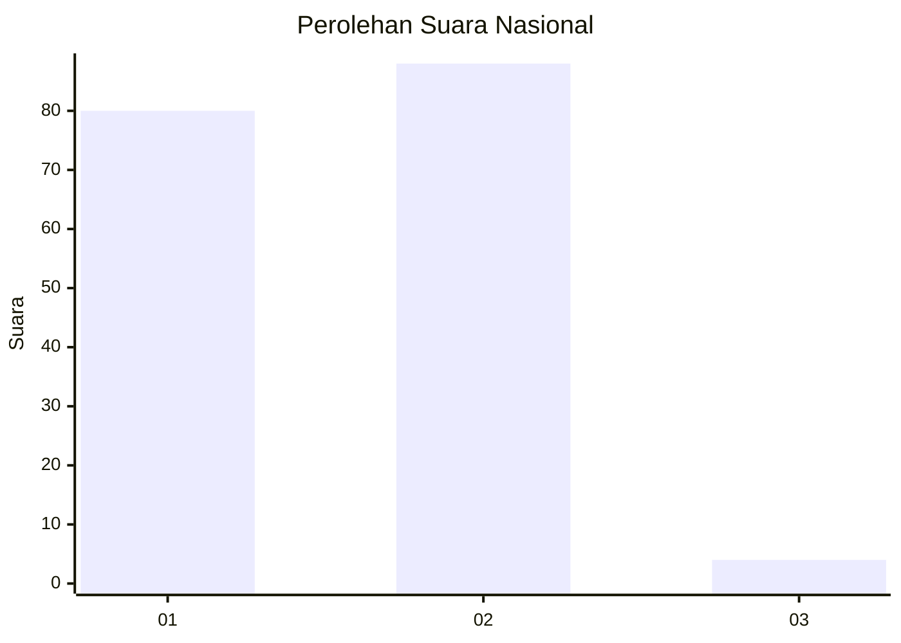
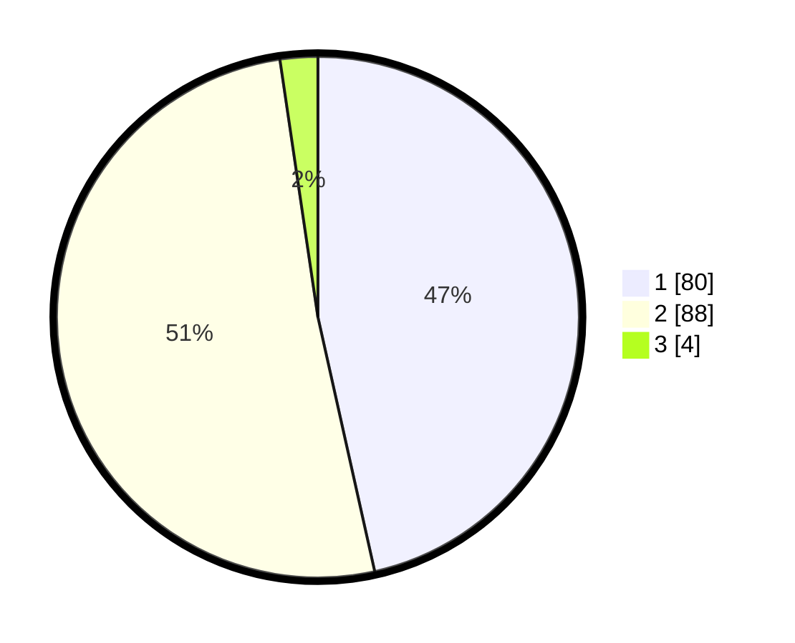

# Hasil

## Grafik

## Tabel

| No. | Nama Paslon    | Suara | Suara (raw) | Persentase |
|:--- |:-------------- | -----:| -----------:| ----------:|
| 1   | ANIES MUHAIMIN | 80    | [80][p-1]   | 46,51      |
| 2   | PRABOWO GIBRAN | 88    | [88][p-2]   | 51,16      |
| 3   | GANJAR MAHFUD  | 4     | [4][p-3]    | 2,33       |

[p-1]: https://github.com/gigit-pemilu/pemilu-2024/blob/main/pilpres/hitung-suara/sub/16-sumatera-selatan/sub/09-ogan-komering-ulu-selatan/sub/16-sindang-danau/sub/2003-muara-sindang-tengah/sub/002-tps/sub/paslon-1.txt
[p-2]: https://github.com/gigit-pemilu/pemilu-2024/blob/main/pilpres/hitung-suara/sub/16-sumatera-selatan/sub/09-ogan-komering-ulu-selatan/sub/16-sindang-danau/sub/2003-muara-sindang-tengah/sub/002-tps/sub/paslon-2.txt
[p-3]: https://github.com/gigit-pemilu/pemilu-2024/blob/main/pilpres/hitung-suara/sub/16-sumatera-selatan/sub/09-ogan-komering-ulu-selatan/sub/16-sindang-danau/sub/2003-muara-sindang-tengah/sub/002-tps/sub/paslon-3.txt

## Foto C Plano

https://sirekap-obj-formc.kpu.go.id/ea39/pemilu/ppwp/16/09/16/20/03/1609162003002-20240214-213354--8731a857-976b-48db-9d4f-b54189492634.jpg

https://sirekap-obj-formc.kpu.go.id/ea39/pemilu/ppwp/16/09/16/20/03/1609162003002-20240214-213606--2f0c7796-b02a-473e-95a9-c039673728f2.jpg

https://sirekap-obj-formc.kpu.go.id/ea39/pemilu/ppwp/16/09/16/20/03/1609162003002-20240214-213852--896f8902-d03f-4e0e-a8f0-a77e4181aa12.jpg

## Metadata

| Key        | Value               |
| ---------- | ------------------- |
| Time Stamp | 2024-02-16 12:51:22 |

