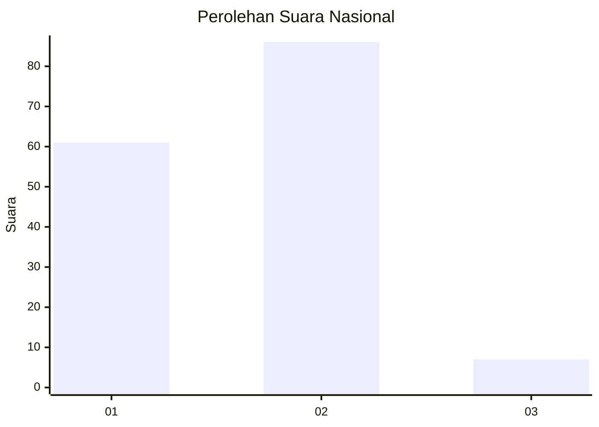
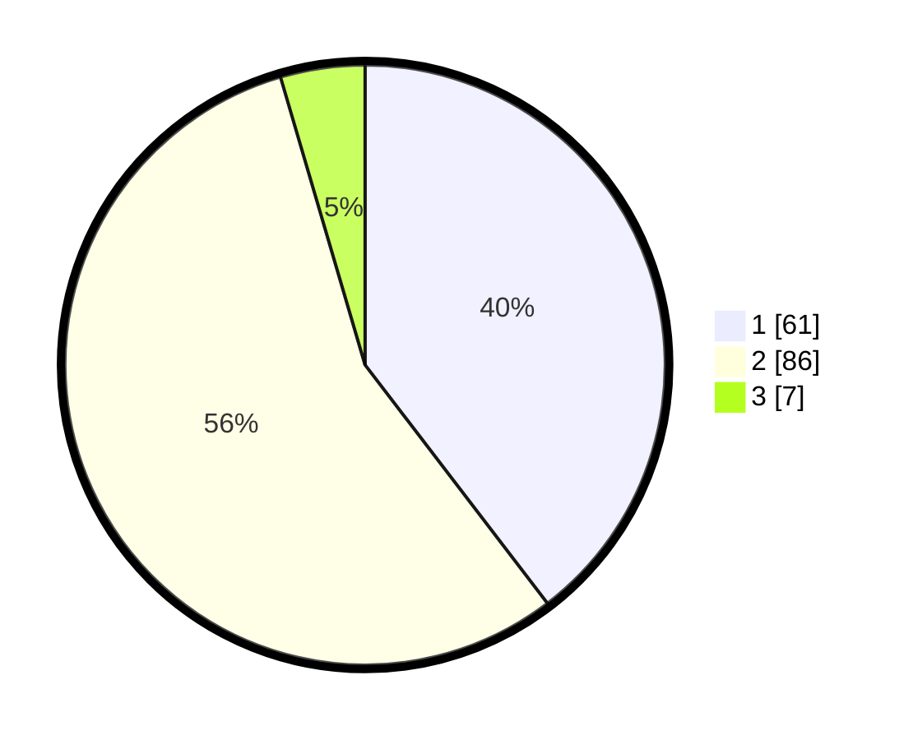

# Hasil

## Grafik

## Tabel

| No. | Nama Paslon    | Suara | Suara (raw) | Persentase |
|:--- |:-------------- | -----:| -----------:| ----------:|
| 1   | ANIES MUHAIMIN | 61    | [61][p-1]   | 39,61      |
| 2   | PRABOWO GIBRAN | 86    | [86][p-2]   | 55,84      |
| 3   | GANJAR MAHFUD  | 7     | [7][p-3]    | 4,55       |

[p-1]: https://github.com/gigit-pemilu/pemilu-2024/blob/main/pilpres/hitung-suara/sub/16-sumatera-selatan/sub/09-ogan-komering-ulu-selatan/sub/16-sindang-danau/sub/2005-ulu-danau/sub/004-tps/sub/paslon-1.txt
[p-2]: https://github.com/gigit-pemilu/pemilu-2024/blob/main/pilpres/hitung-suara/sub/16-sumatera-selatan/sub/09-ogan-komering-ulu-selatan/sub/16-sindang-danau/sub/2005-ulu-danau/sub/004-tps/sub/paslon-2.txt
[p-3]: https://github.com/gigit-pemilu/pemilu-2024/blob/main/pilpres/hitung-suara/sub/16-sumatera-selatan/sub/09-ogan-komering-ulu-selatan/sub/16-sindang-danau/sub/2005-ulu-danau/sub/004-tps/sub/paslon-3.txt

## Foto C Plano

https://sirekap-obj-formc.kpu.go.id/7438/pemilu/ppwp/16/09/16/20/05/1609162005004-20240215-084139--6c89aaed-d43b-4478-a2af-685bb1ed36be.jpg

https://sirekap-obj-formc.kpu.go.id/7438/pemilu/ppwp/16/09/16/20/05/1609162005004-20240215-084608--0f6f312f-ceb2-48e7-b7f7-d12e98ade67d.jpg

https://sirekap-obj-formc.kpu.go.id/7438/pemilu/ppwp/16/09/16/20/05/1609162005004-20240215-084959--b8358d83-79e5-437a-ad72-f44609411ede.jpg

## Metadata

| Key        | Value               |
| ---------- | ------------------- |
| Time Stamp | 2024-02-15 15:30:25 |

