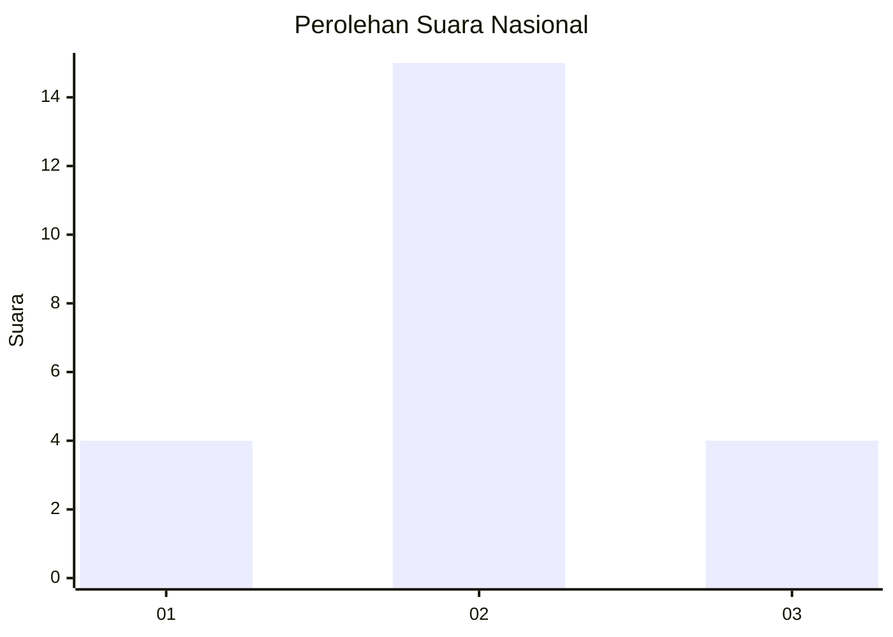
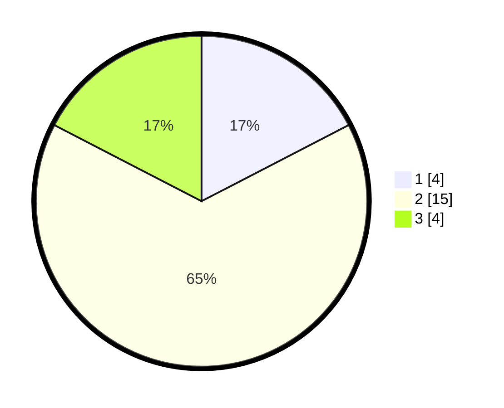

# Hasil

## Grafik

## Tabel

| No. | Nama Paslon    | Suara | Suara (raw) | Persentase |
|:--- |:-------------- | -----:| -----------:| ----------:|
| 1   | ANIES MUHAIMIN | 4     | [4][p-1]    | 17,39      |
| 2   | PRABOWO GIBRAN | 15    | [15][p-2]   | 65,22      |
| 3   | GANJAR MAHFUD  | 4     | [4][p-3]    | 17,39      |

[p-1]: https://github.com/gigit-pemilu/pemilu-2024/blob/main/pilpres/hitung-suara/sub/16-sumatera-selatan/sub/09-ogan-komering-ulu-selatan/sub/16-sindang-danau/sub/2005-ulu-danau/sub/017-tps/sub/paslon-1.txt
[p-2]: https://github.com/gigit-pemilu/pemilu-2024/blob/main/pilpres/hitung-suara/sub/16-sumatera-selatan/sub/09-ogan-komering-ulu-selatan/sub/16-sindang-danau/sub/2005-ulu-danau/sub/017-tps/sub/paslon-2.txt
[p-3]: https://github.com/gigit-pemilu/pemilu-2024/blob/main/pilpres/hitung-suara/sub/16-sumatera-selatan/sub/09-ogan-komering-ulu-selatan/sub/16-sindang-danau/sub/2005-ulu-danau/sub/017-tps/sub/paslon-3.txt

## Foto C Plano

https://sirekap-obj-formc.kpu.go.id/66d6/pemilu/ppwp/16/09/16/20/05/1609162005017-20240214-233949--ad283e54-7e79-40f5-937a-eff21a0028e9.jpg

https://sirekap-obj-formc.kpu.go.id/66d6/pemilu/ppwp/16/09/16/20/05/1609162005017-20240214-234015--4ba4e311-8a13-4092-8ff3-449c8f16bc8f.jpg

https://sirekap-obj-formc.kpu.go.id/66d6/pemilu/ppwp/16/09/16/20/05/1609162005017-20240214-234109--1fbdf601-f3bf-4dfc-9ed8-002503a8d5d7.jpg

## Metadata

| Key        | Value               |
| ---------- | ------------------- |
| Time Stamp | 2024-02-15 03:06:03 |

## DATA PEMILIH TETAP

Jumlah pemilih dalam DPT: **25**.
 * L: **9**.
 * P: **16**.

## DATA PENGGUNA HAK PILIH

Jumlah pengguna hak pilih dalam DPT: **23**.
 * L: **8**.
 * P: **15**.

Jumlah pengguna hak pilih dalam DPTb: **0**.
 * L: **0**.
 * P: **0**.

Jumlah pengguna hak pilih dalam DPK: **0**.
 * L: **0**.
 * P: **0**.

Jumlah pengguna hak pilih: **23**.
 * L: **8**.
 * P: **15**.

## JUMLAH SUARA SAH DAN TIDAK SAH

JUMLAH SELURUH SUARA SAH: **23**.

JUMLAH SUARA TIDAK SAH: **0**.

JUMLAH SELURUH SUARA SAH DAN SUARA TIDAK SAH: **23**.

