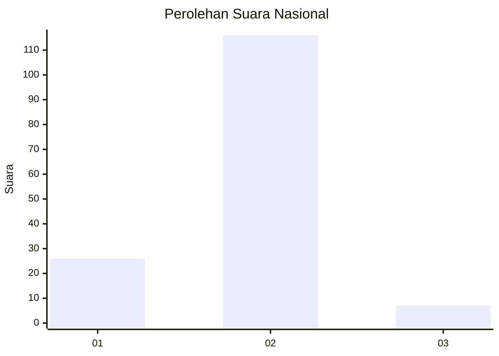
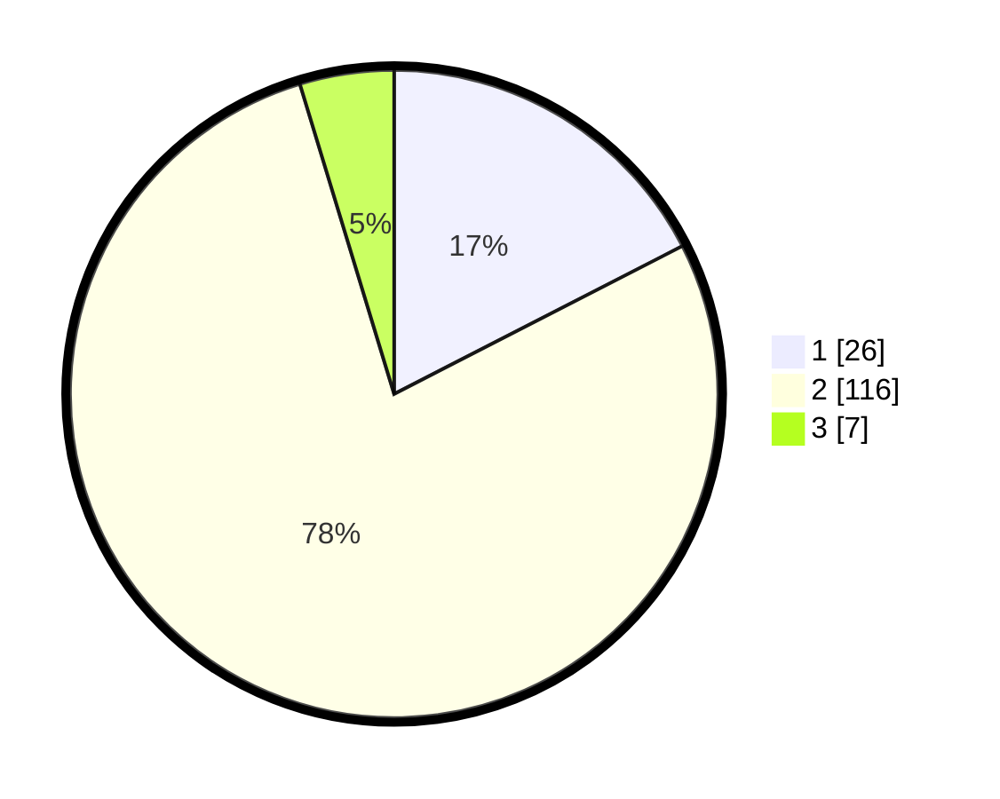

# Hasil

## Grafik

## Tabel

| No. | Nama Paslon    | Suara | Suara (raw) | Persentase |
|:--- |:-------------- | -----:| -----------:| ----------:|
| 1   | ANIES MUHAIMIN | 26    | [26][p-1]   | 17,45      |
| 2   | PRABOWO GIBRAN | 116   | [116][p-2]  | 77,85      |
| 3   | GANJAR MAHFUD  | 7     | [7][p-3]    | 4,70       |

[p-1]: https://github.com/gigit-pemilu/pemilu-2024/blob/main/pilpres/hitung-suara/sub/16-sumatera-selatan/sub/09-ogan-komering-ulu-selatan/sub/17-buana-pemaca/sub/2001-tekana/sub/002-tps/sub/paslon-1.txt
[p-2]: https://github.com/gigit-pemilu/pemilu-2024/blob/main/pilpres/hitung-suara/sub/16-sumatera-selatan/sub/09-ogan-komering-ulu-selatan/sub/17-buana-pemaca/sub/2001-tekana/sub/002-tps/sub/paslon-2.txt
[p-3]: https://github.com/gigit-pemilu/pemilu-2024/blob/main/pilpres/hitung-suara/sub/16-sumatera-selatan/sub/09-ogan-komering-ulu-selatan/sub/17-buana-pemaca/sub/2001-tekana/sub/002-tps/sub/paslon-3.txt

## Foto C Plano

https://sirekap-obj-formc.kpu.go.id/a591/pemilu/ppwp/16/09/17/20/01/1609172001002-20240216-142720--95e0c1d0-967a-49e1-999b-a67bd7ed10e3.jpg

https://sirekap-obj-formc.kpu.go.id/a591/pemilu/ppwp/16/09/17/20/01/1609172001002-20240216-142721--e3ab62c1-2030-4e67-abbf-9c04f8c9af68.jpg

https://sirekap-obj-formc.kpu.go.id/a591/pemilu/ppwp/16/09/17/20/01/1609172001002-20240216-142720--aeb8eec5-4659-4678-858d-2d695af2fee3.jpg

## Metadata

| Key        | Value               |
| ---------- | ------------------- |
| Time Stamp | 2024-02-17 17:00:04 |

## DATA PEMILIH TETAP

Jumlah pemilih dalam DPT: **182**.
 * L: **96**.
 * P: **86**.

## DATA PENGGUNA HAK PILIH

Jumlah pengguna hak pilih dalam DPT: **149**.
 * L: **79**.
 * P: **70**.

Jumlah pengguna hak pilih dalam DPTb: **3**.
 * L: **2**.
 * P: **1**.

Jumlah pengguna hak pilih dalam DPK: **0**.
 * L: **0**.
 * P: **0**.

Jumlah pengguna hak pilih: **152**.
 * L: **81**.
 * P: **71**.

## JUMLAH SUARA SAH DAN TIDAK SAH

JUMLAH SELURUH SUARA SAH: **149**.

JUMLAH SUARA TIDAK SAH: **3**.

JUMLAH SELURUH SUARA SAH DAN SUARA TIDAK SAH: **152**.

