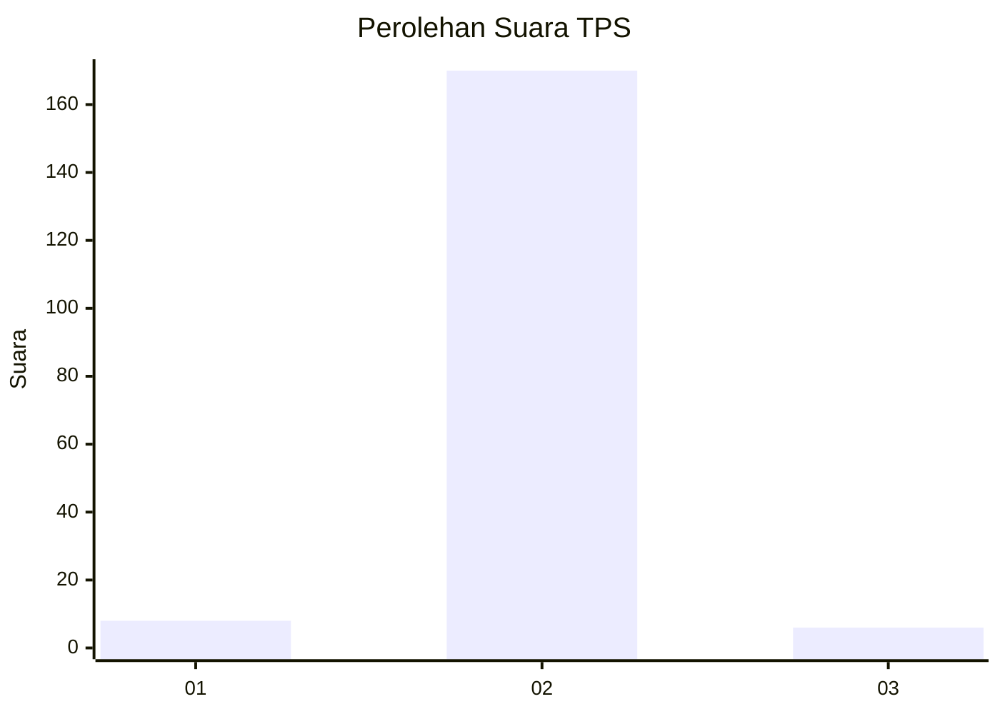
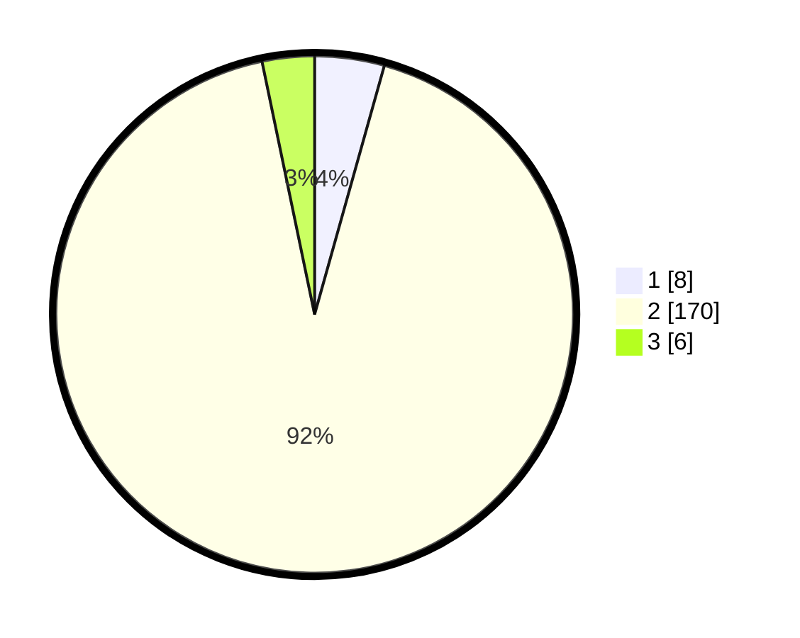

# Hasil

## Grafik

## Tabel

| No. | Nama Paslon    | Suara | Suara (raw) | Persentase |
|:--- |:-------------- | -----:| -----------:| ----------:|
| 1   | ANIES MUHAIMIN | 8     | [8][p-1]    | 4,35       |
| 2   | PRABOWO GIBRAN | 170   | [170][p-2]  | 92,39      |
| 3   | GANJAR MAHFUD  | 6     | [6][p-3]    | 3,26       |

[p-1]: https://github.com/gigit-pemilu/pemilu-2024-16-sumatera-selatan/blob/main/pilpres/hitung-suara/sub/16-sumatera-selatan/sub/09-ogan-komering-ulu-selatan/sub/18-tiga-dihaji/sub/2002-kuripan/sub/002-tps/sub/paslon-1.txt
[p-2]: https://github.com/gigit-pemilu/pemilu-2024-16-sumatera-selatan/blob/main/pilpres/hitung-suara/sub/16-sumatera-selatan/sub/09-ogan-komering-ulu-selatan/sub/18-tiga-dihaji/sub/2002-kuripan/sub/002-tps/sub/paslon-2.txt
[p-3]: https://github.com/gigit-pemilu/pemilu-2024-16-sumatera-selatan/blob/main/pilpres/hitung-suara/sub/16-sumatera-selatan/sub/09-ogan-komering-ulu-selatan/sub/18-tiga-dihaji/sub/2002-kuripan/sub/002-tps/sub/paslon-3.txt

## Foto C Plano

https://sirekap-obj-formc.kpu.go.id/381b/pemilu/ppwp/16/09/18/20/02/1609182002002-20240217-165917--244a6f2b-3dde-4832-b4dd-b6e0f13d891b.jpg

https://sirekap-obj-formc.kpu.go.id/381b/pemilu/ppwp/16/09/18/20/02/1609182002002-20240217-165957--b8a85636-2fa4-4c22-a7f1-35de60cb4dcc.jpg

https://sirekap-obj-formc.kpu.go.id/381b/pemilu/ppwp/16/09/18/20/02/1609182002002-20240217-170034--a015a6d0-d26b-4beb-a73c-7818d0582aa5.jpg

## Metadata

| Key        | Value               |
| ---------- | ------------------- |
| Time Stamp | 2024-02-19 06:16:00 |

