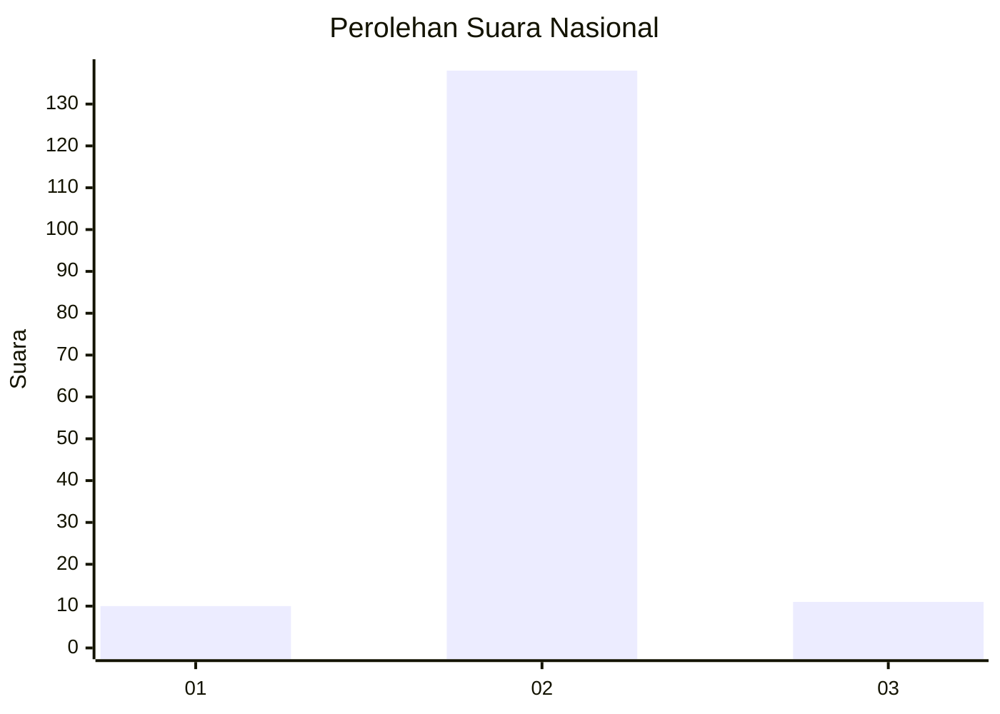
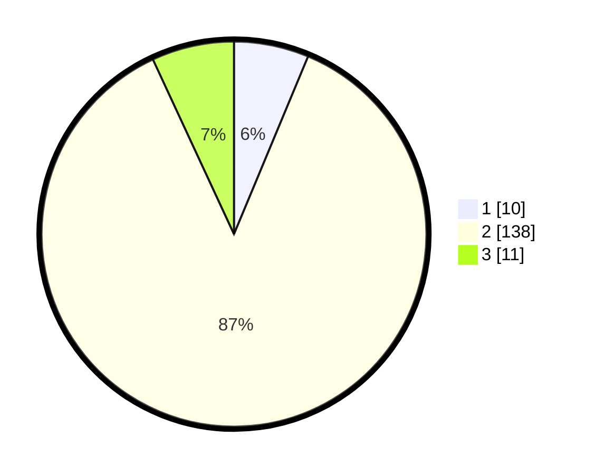

# Hasil

## Grafik

## Tabel

| No. | Nama Paslon    | Suara | Suara (raw) | Persentase |
|:--- |:-------------- | -----:| -----------:| ----------:|
| 1   | ANIES MUHAIMIN | 10    | [10][p-1]   | 6,29       |
| 2   | PRABOWO GIBRAN | 138   | [138][p-2]  | 86,79      |
| 3   | GANJAR MAHFUD  | 11    | [11][p-3]   | 6,92       |

[p-1]: https://github.com/gigit-pemilu/pemilu-2024/blob/main/pilpres/hitung-suara/sub/16-sumatera-selatan/sub/09-ogan-komering-ulu-selatan/sub/18-tiga-dihaji/sub/2004-sukarena/sub/005-tps/sub/paslon-1.txt
[p-2]: https://github.com/gigit-pemilu/pemilu-2024/blob/main/pilpres/hitung-suara/sub/16-sumatera-selatan/sub/09-ogan-komering-ulu-selatan/sub/18-tiga-dihaji/sub/2004-sukarena/sub/005-tps/sub/paslon-2.txt
[p-3]: https://github.com/gigit-pemilu/pemilu-2024/blob/main/pilpres/hitung-suara/sub/16-sumatera-selatan/sub/09-ogan-komering-ulu-selatan/sub/18-tiga-dihaji/sub/2004-sukarena/sub/005-tps/sub/paslon-3.txt

## Foto C Plano

https://sirekap-obj-formc.kpu.go.id/1d4a/pemilu/ppwp/16/09/18/20/04/1609182004005-20240217-145247--1932a0eb-a60d-4166-aed8-f75246d5e401.jpg

https://sirekap-obj-formc.kpu.go.id/1d4a/pemilu/ppwp/16/09/18/20/04/1609182004005-20240217-145323--d69aba83-071c-4efd-8d18-72007379ce9a.jpg

https://sirekap-obj-formc.kpu.go.id/1d4a/pemilu/ppwp/16/09/18/20/04/1609182004005-20240217-145400--bcfaf77f-54d9-4702-aafe-bd3f347356c6.jpg

## Metadata

| Key        | Value               |
| ---------- | ------------------- |
| Time Stamp | 2024-02-19 06:16:00 |

