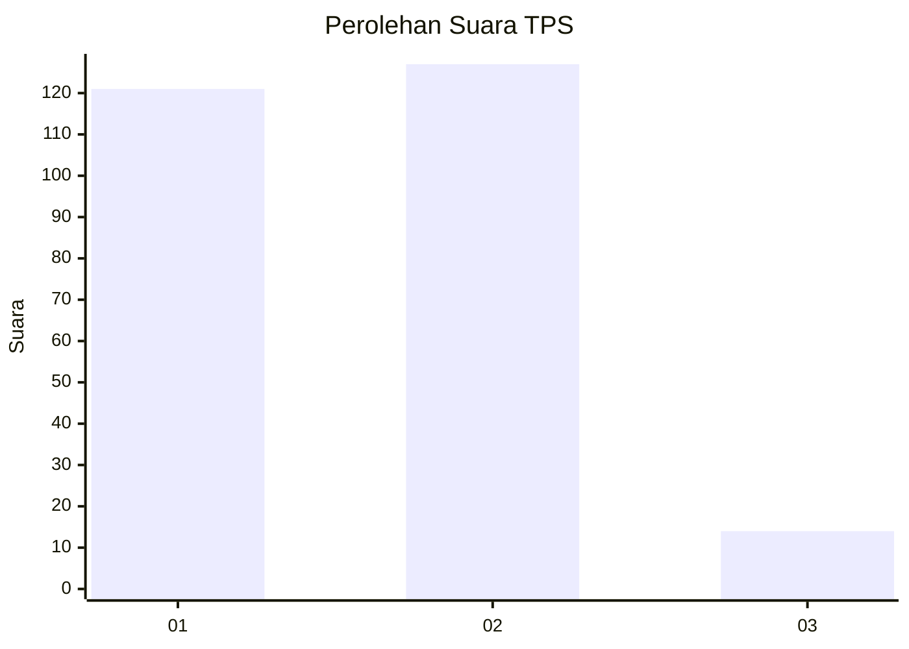
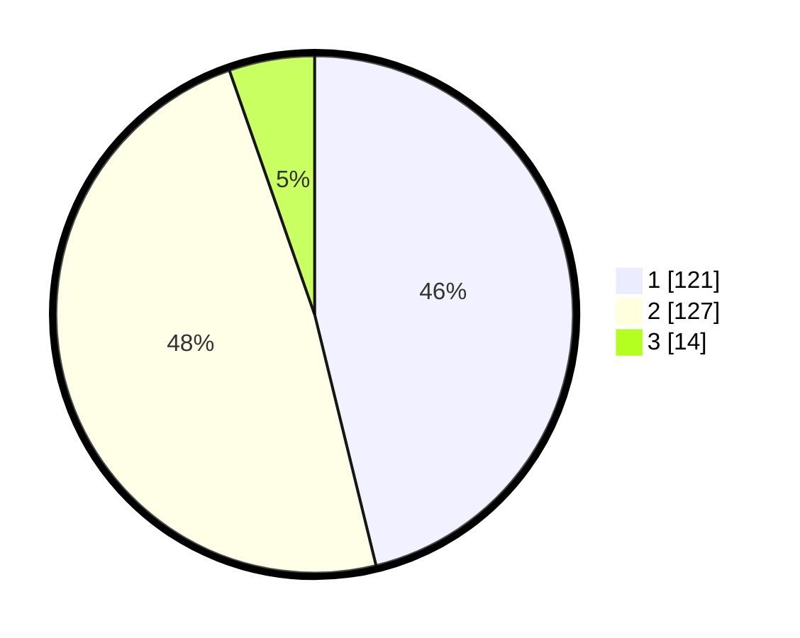

# Hasil

## Grafik

## Tabel

| No. | Nama Paslon    | Suara | Suara (raw) | Persentase |
|:--- |:-------------- | -----:| -----------:| ----------:|
| 1   | ANIES MUHAIMIN | 121   | [121][p-1]  | 46,18      |
| 2   | PRABOWO GIBRAN | 127   | [127][p-2]  | 48,47      |
| 3   | GANJAR MAHFUD  | 14    | [14][p-3]   | 5,34       |

[p-1]: https://github.com/gigit-pemilu/pemilu-2024-16-sumatera-selatan/blob/main/pilpres/hitung-suara/sub/16-sumatera-selatan/sub/10-ogan-ilir/sub/04-indralaya/sub/1030-indralaya-raya/sub/003-tps/sub/paslon-1.txt
[p-2]: https://github.com/gigit-pemilu/pemilu-2024-16-sumatera-selatan/blob/main/pilpres/hitung-suara/sub/16-sumatera-selatan/sub/10-ogan-ilir/sub/04-indralaya/sub/1030-indralaya-raya/sub/003-tps/sub/paslon-2.txt
[p-3]: https://github.com/gigit-pemilu/pemilu-2024-16-sumatera-selatan/blob/main/pilpres/hitung-suara/sub/16-sumatera-selatan/sub/10-ogan-ilir/sub/04-indralaya/sub/1030-indralaya-raya/sub/003-tps/sub/paslon-3.txt

## Foto C Plano

https://sirekap-obj-formc.kpu.go.id/8d5e/pemilu/ppwp/16/10/04/10/30/1610041030003-20240215-043643--2453552f-79b2-453f-92fe-115dc7443e52.jpg

https://sirekap-obj-formc.kpu.go.id/8d5e/pemilu/ppwp/16/10/04/10/30/1610041030003-20240215-043957--8e5b31e7-8228-40be-b35d-75bc3e87e1e8.jpg

https://sirekap-obj-formc.kpu.go.id/8d5e/pemilu/ppwp/16/10/04/10/30/1610041030003-20240215-044219--d6f8af0f-d826-404e-b78b-5f4af1ee228a.jpg

## Metadata

| Key        | Value               |
| ---------- | ------------------- |
| Time Stamp | 2024-02-20 23:00:00 |

