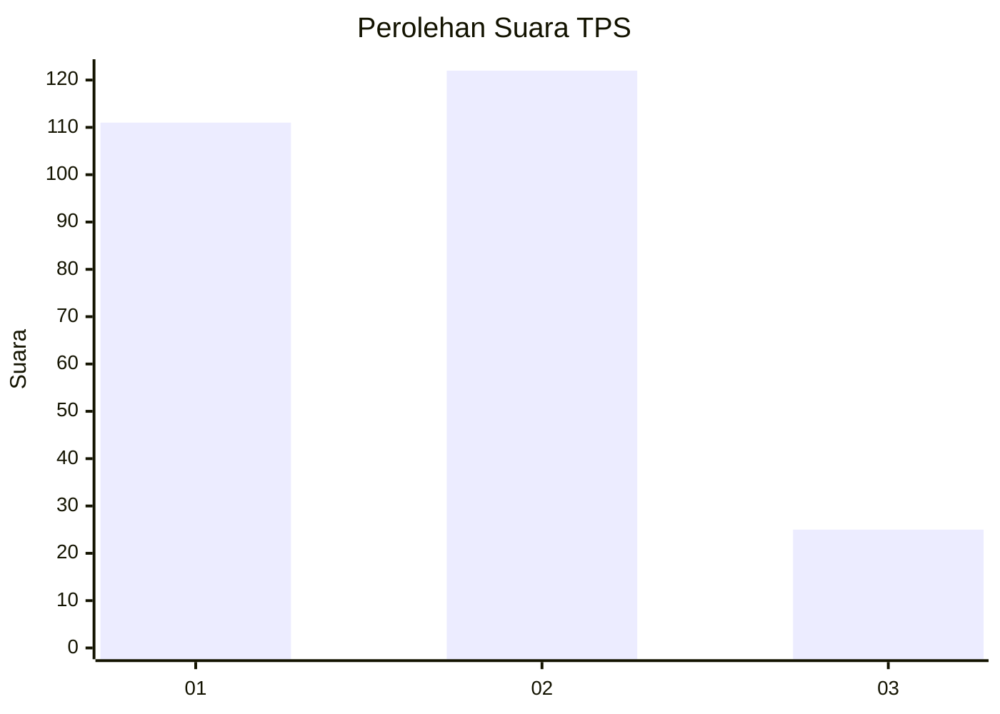
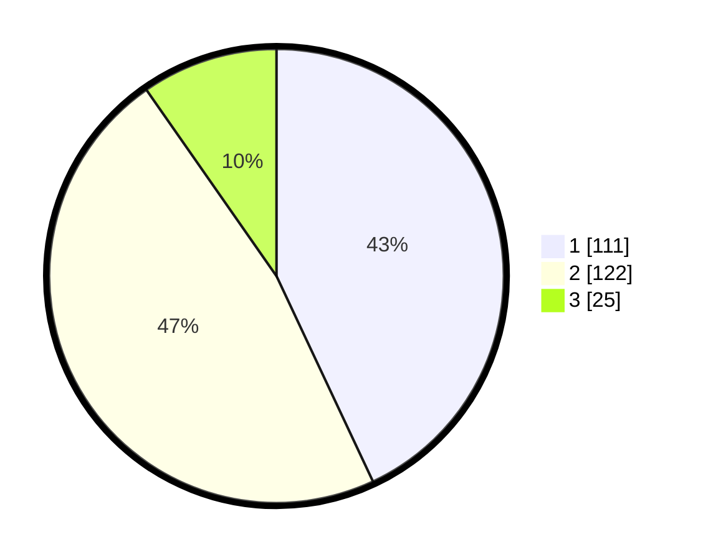

# Hasil

## Grafik

## Tabel

| No. | Nama Paslon    | Suara | Suara (raw) | Persentase |
|:--- |:-------------- | -----:| -----------:| ----------:|
| 1   | ANIES MUHAIMIN | 111   | [111][p-1]  | 43,02      |
| 2   | PRABOWO GIBRAN | 122   | [122][p-2]  | 47,29      |
| 3   | GANJAR MAHFUD  | 25    | [25][p-3]   | 9,69       |

[p-1]: https://github.com/gigit-pemilu/pemilu-2024-16-sumatera-selatan/blob/main/pilpres/hitung-suara/sub/16-sumatera-selatan/sub/10-ogan-ilir/sub/04-indralaya/sub/2012-tanjung-seteko/sub/009-tps/sub/paslon-1.txt
[p-2]: https://github.com/gigit-pemilu/pemilu-2024-16-sumatera-selatan/blob/main/pilpres/hitung-suara/sub/16-sumatera-selatan/sub/10-ogan-ilir/sub/04-indralaya/sub/2012-tanjung-seteko/sub/009-tps/sub/paslon-2.txt
[p-3]: https://github.com/gigit-pemilu/pemilu-2024-16-sumatera-selatan/blob/main/pilpres/hitung-suara/sub/16-sumatera-selatan/sub/10-ogan-ilir/sub/04-indralaya/sub/2012-tanjung-seteko/sub/009-tps/sub/paslon-3.txt

## Foto C Plano

https://sirekap-obj-formc.kpu.go.id/4e49/pemilu/ppwp/16/10/04/20/12/1610042012009-20240215-012053--13ee9d19-1ec9-4b3d-af6f-c64b43d77abe.jpg

https://sirekap-obj-formc.kpu.go.id/4e49/pemilu/ppwp/16/10/04/20/12/1610042012009-20240215-012058--bb24dca7-54f9-402d-8d67-ef8bc5ad696a.jpg

https://sirekap-obj-formc.kpu.go.id/4e49/pemilu/ppwp/16/10/04/20/12/1610042012009-20240215-012110--52994a4c-5a49-499c-868c-b42c49814648.jpg

## Metadata

| Key        | Value               |
| ---------- | ------------------- |
| Time Stamp | 2024-02-15 17:00:25 |

