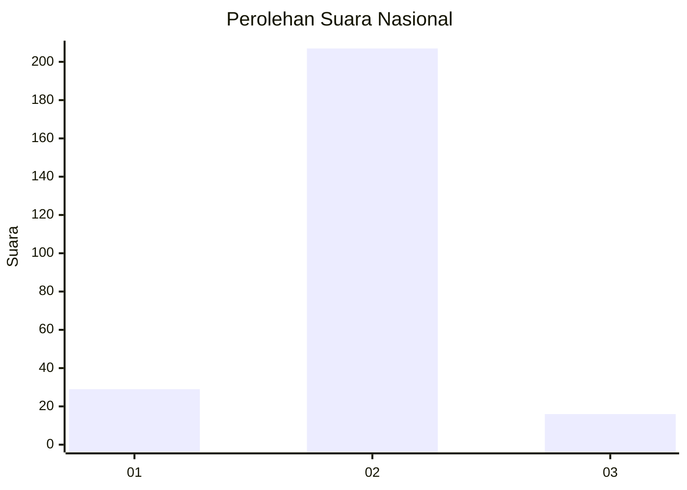
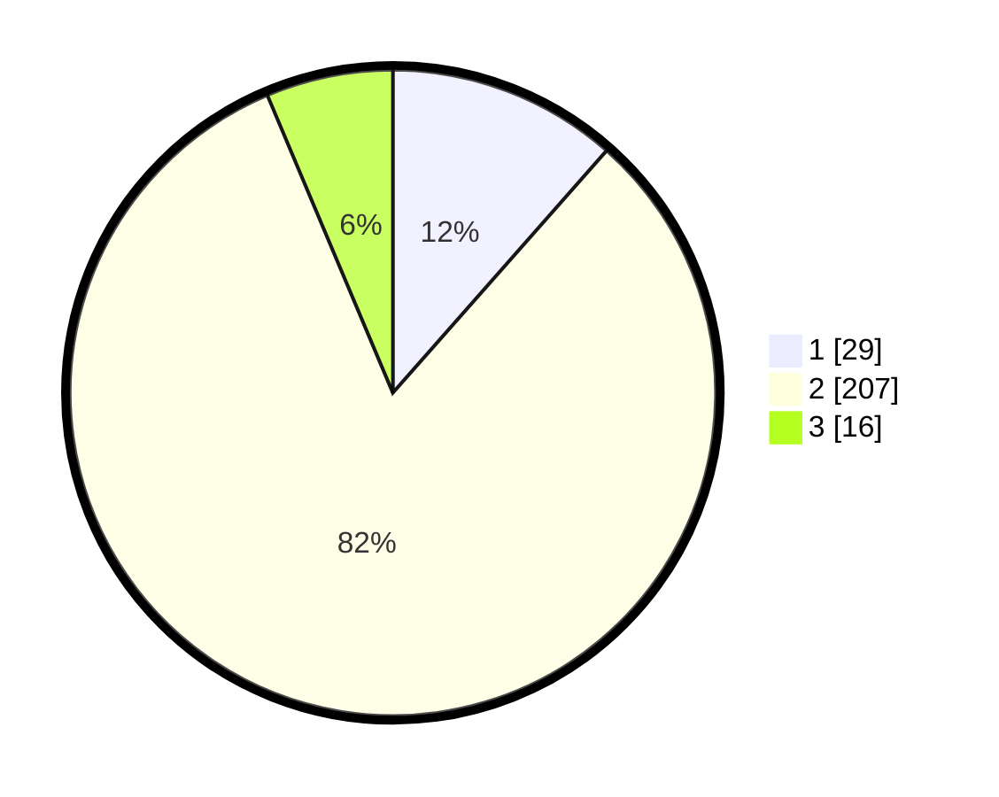

# Hasil

## Grafik

## Tabel

| No. | Nama Paslon    | Suara | Suara (raw) | Persentase |
|:--- |:-------------- | -----:| -----------:| ----------:|
| 1   | ANIES MUHAIMIN | 29    | [29][p-1]   | 11,51      |
| 2   | PRABOWO GIBRAN | 207   | [207][p-2]  | 82,14      |
| 3   | GANJAR MAHFUD  | 16    | [16][p-3]   | 6,35       |

[p-1]: https://github.com/gigit-pemilu/pemilu-2024/blob/main/pilpres/hitung-suara/sub/16-sumatera-selatan/sub/10-ogan-ilir/sub/05-pemulutan/sub/2035-babatan-saudagar/sub/003-tps/sub/paslon-1.txt
[p-2]: https://github.com/gigit-pemilu/pemilu-2024/blob/main/pilpres/hitung-suara/sub/16-sumatera-selatan/sub/10-ogan-ilir/sub/05-pemulutan/sub/2035-babatan-saudagar/sub/003-tps/sub/paslon-2.txt
[p-3]: https://github.com/gigit-pemilu/pemilu-2024/blob/main/pilpres/hitung-suara/sub/16-sumatera-selatan/sub/10-ogan-ilir/sub/05-pemulutan/sub/2035-babatan-saudagar/sub/003-tps/sub/paslon-3.txt

## Foto C Plano

https://sirekap-obj-formc.kpu.go.id/30df/pemilu/ppwp/16/10/05/20/35/1610052035003-20240215-064544--279216df-ea98-4db8-81b6-77b6bb8bd9a9.jpg

https://sirekap-obj-formc.kpu.go.id/30df/pemilu/ppwp/16/10/05/20/35/1610052035003-20240219-223113--97191875-122d-49d1-9ec4-8ac1f3fd5f3f.jpg

https://sirekap-obj-formc.kpu.go.id/30df/pemilu/ppwp/16/10/05/20/35/1610052035003-20240219-223755--585742ca-79c7-48b7-a9f4-ee2cc21fbb11.jpg

## Metadata

| Key        | Value               |
| ---------- | ------------------- |
| Time Stamp | 2024-02-19 23:00:00 |

