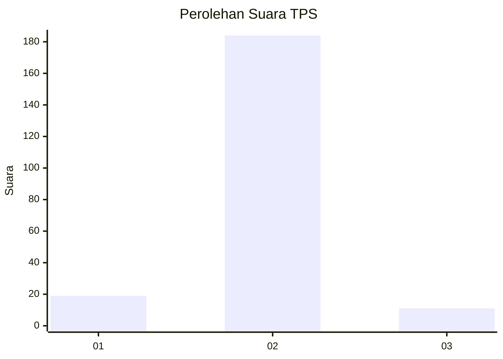
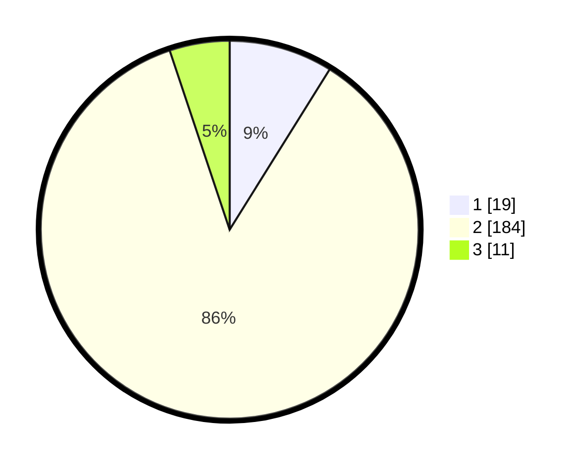

# Hasil

## Grafik

## Tabel

| No. | Nama Paslon    | Suara | Suara (raw) | Persentase |
|:--- |:-------------- | -----:| -----------:| ----------:|
| 1   | ANIES MUHAIMIN | 19    | [19][p-1]   | 8,88       |
| 2   | PRABOWO GIBRAN | 184   | [184][p-2]  | 85,98      |
| 3   | GANJAR MAHFUD  | 11    | [11][p-3]   | 5,14       |

[p-1]: https://github.com/gigit-pemilu/pemilu-2024-16-sumatera-selatan/blob/main/pilpres/hitung-suara/sub/16-sumatera-selatan/sub/10-ogan-ilir/sub/06-rantau-alai/sub/2020-sanding-marga/sub/003-tps/sub/paslon-1.txt
[p-2]: https://github.com/gigit-pemilu/pemilu-2024-16-sumatera-selatan/blob/main/pilpres/hitung-suara/sub/16-sumatera-selatan/sub/10-ogan-ilir/sub/06-rantau-alai/sub/2020-sanding-marga/sub/003-tps/sub/paslon-2.txt
[p-3]: https://github.com/gigit-pemilu/pemilu-2024-16-sumatera-selatan/blob/main/pilpres/hitung-suara/sub/16-sumatera-selatan/sub/10-ogan-ilir/sub/06-rantau-alai/sub/2020-sanding-marga/sub/003-tps/sub/paslon-3.txt

## Foto C Plano

https://sirekap-obj-formc.kpu.go.id/dbba/pemilu/ppwp/16/10/06/20/20/1610062020003-20240215-022509--8b2ce197-ebfa-4985-a6ab-1f78648a5467.jpg

https://sirekap-obj-formc.kpu.go.id/dbba/pemilu/ppwp/16/10/06/20/20/1610062020003-20240215-082751--1a22cde7-1fd4-4dc1-a82d-a81dcb4c0507.jpg

https://sirekap-obj-formc.kpu.go.id/dbba/pemilu/ppwp/16/10/06/20/20/1610062020003-20240215-023023--5c96b7a1-6b77-4c79-a01c-1ecb6795995a.jpg

## Metadata

| Key        | Value               |
| ---------- | ------------------- |
| Time Stamp | 2024-02-15 17:00:25 |

