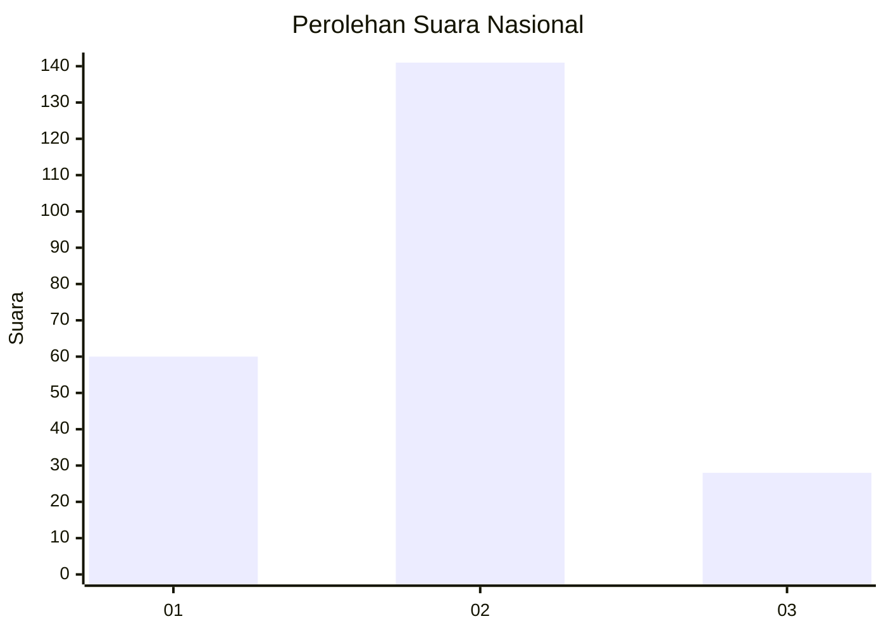
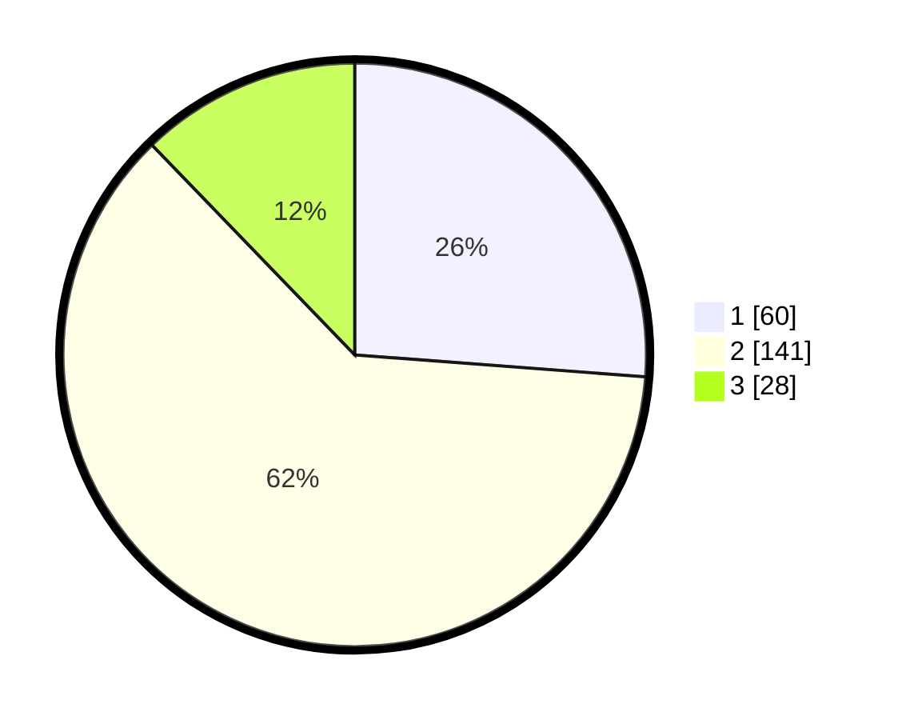

# Hasil

## Grafik

## Tabel

| No. | Nama Paslon    | Suara | Suara (raw) | Persentase |
|:--- |:-------------- | -----:| -----------:| ----------:|
| 1   | ANIES MUHAIMIN | 60    | [60][p-1]   | 26,20      |
| 2   | PRABOWO GIBRAN | 141   | [141][p-2]  | 61,57      |
| 3   | GANJAR MAHFUD  | 28    | [28][p-3]   | 12,23      |

[p-1]: https://github.com/gigit-pemilu/pemilu-2024/blob/main/pilpres/hitung-suara/sub/16-sumatera-selatan/sub/10-ogan-ilir/sub/07-indralaya-utara/sub/1016-timbangan/sub/004-tps/sub/paslon-1.txt
[p-2]: https://github.com/gigit-pemilu/pemilu-2024/blob/main/pilpres/hitung-suara/sub/16-sumatera-selatan/sub/10-ogan-ilir/sub/07-indralaya-utara/sub/1016-timbangan/sub/004-tps/sub/paslon-2.txt
[p-3]: https://github.com/gigit-pemilu/pemilu-2024/blob/main/pilpres/hitung-suara/sub/16-sumatera-selatan/sub/10-ogan-ilir/sub/07-indralaya-utara/sub/1016-timbangan/sub/004-tps/sub/paslon-3.txt

## Foto C Plano

https://sirekap-obj-formc.kpu.go.id/bfd4/pemilu/ppwp/16/10/07/10/16/1610071016004-20240217-084435--42e3f63b-082f-4814-b40f-a4d44ad4aa35.jpg

https://sirekap-obj-formc.kpu.go.id/bfd4/pemilu/ppwp/16/10/07/10/16/1610071016004-20240214-232749--fb519f6e-ea16-43dc-85af-5390e6b7f4de.jpg

https://sirekap-obj-formc.kpu.go.id/bfd4/pemilu/ppwp/16/10/07/10/16/1610071016004-20240214-234035--4f292d55-7380-42b6-8ece-7444ec84d10a.jpg

## Metadata

| Key        | Value               |
| ---------- | ------------------- |
| Time Stamp | 2024-02-17 09:00:02 |

