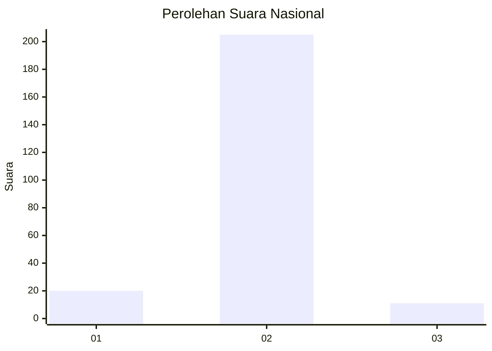
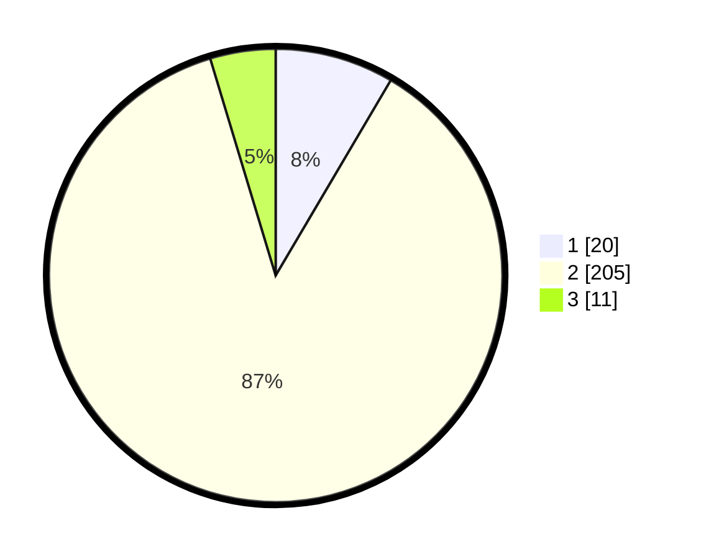

# Hasil

## Grafik

## Tabel

| No. | Nama Paslon    | Suara | Suara (raw) | Persentase |
|:--- |:-------------- | -----:| -----------:| ----------:|
| 1   | ANIES MUHAIMIN | 20    | [20][p-1]   | 8,47       |
| 2   | PRABOWO GIBRAN | 205   | [205][p-2]  | 86,86      |
| 3   | GANJAR MAHFUD  | 11    | [11][p-3]   | 4,66       |

[p-1]: https://github.com/gigit-pemilu/pemilu-2024/blob/main/pilpres/hitung-suara/sub/16-sumatera-selatan/sub/10-ogan-ilir/sub/07-indralaya-utara/sub/2007-purna-jaya/sub/003-tps/sub/paslon-1.txt
[p-2]: https://github.com/gigit-pemilu/pemilu-2024/blob/main/pilpres/hitung-suara/sub/16-sumatera-selatan/sub/10-ogan-ilir/sub/07-indralaya-utara/sub/2007-purna-jaya/sub/003-tps/sub/paslon-2.txt
[p-3]: https://github.com/gigit-pemilu/pemilu-2024/blob/main/pilpres/hitung-suara/sub/16-sumatera-selatan/sub/10-ogan-ilir/sub/07-indralaya-utara/sub/2007-purna-jaya/sub/003-tps/sub/paslon-3.txt

## Foto C Plano

https://sirekap-obj-formc.kpu.go.id/9c87/pemilu/ppwp/16/10/07/20/07/1610072007003-20240215-074210--5f853afd-365b-474d-beb2-1c07e73d1725.jpg

https://sirekap-obj-formc.kpu.go.id/9c87/pemilu/ppwp/16/10/07/20/07/1610072007003-20240215-074416--266d0ebd-e181-49bf-a937-e1318ee8fc5d.jpg

https://sirekap-obj-formc.kpu.go.id/9c87/pemilu/ppwp/16/10/07/20/07/1610072007003-20240215-030826--6fc503bb-7f5f-44a2-a39d-5d32410ca54d.jpg

## Metadata

| Key        | Value               |
| ---------- | ------------------- |
| Time Stamp | 2024-02-21 10:00:00 |

