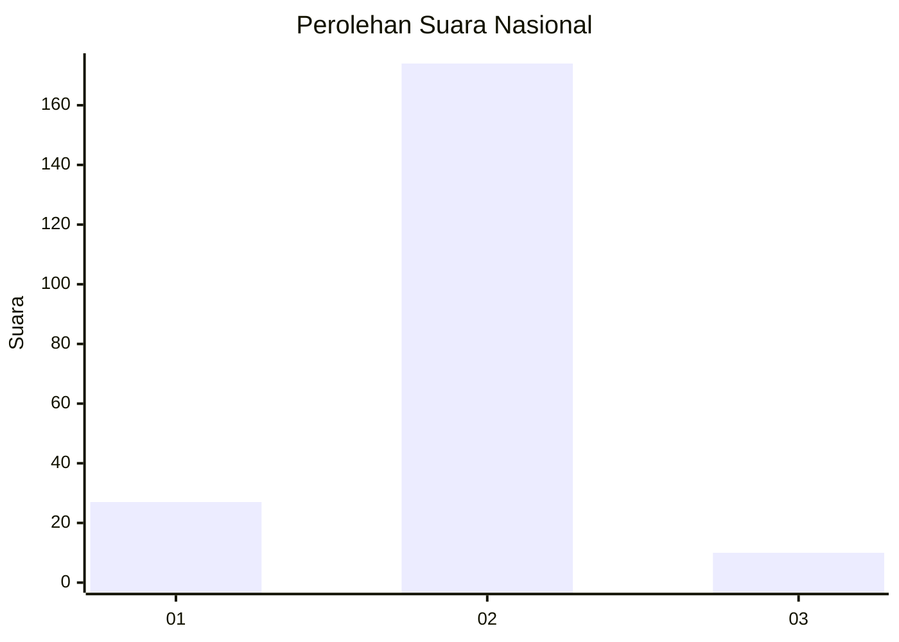
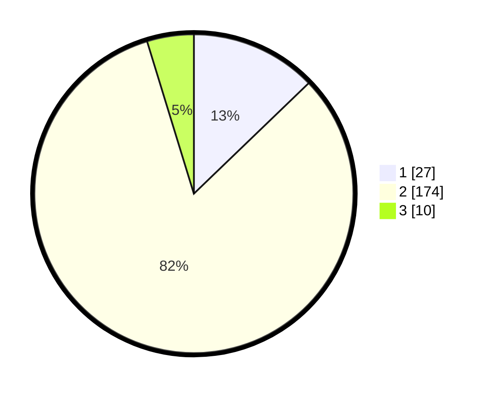

# Hasil

## Grafik

## Tabel

| No. | Nama Paslon    | Suara | Suara (raw) | Persentase |
|:--- |:-------------- | -----:| -----------:| ----------:|
| 1   | ANIES MUHAIMIN | 27    | [27][p-1]   | 12,80      |
| 2   | PRABOWO GIBRAN | 174   | [174][p-2]  | 82,46      |
| 3   | GANJAR MAHFUD  | 10    | [10][p-3]   | 4,74       |

[p-1]: https://github.com/gigit-pemilu/pemilu-2024/blob/main/pilpres/hitung-suara/sub/16-sumatera-selatan/sub/10-ogan-ilir/sub/09-pemulutan-selatan/sub/2007-maju-jaya/sub/001-tps/sub/paslon-1.txt
[p-2]: https://github.com/gigit-pemilu/pemilu-2024/blob/main/pilpres/hitung-suara/sub/16-sumatera-selatan/sub/10-ogan-ilir/sub/09-pemulutan-selatan/sub/2007-maju-jaya/sub/001-tps/sub/paslon-2.txt
[p-3]: https://github.com/gigit-pemilu/pemilu-2024/blob/main/pilpres/hitung-suara/sub/16-sumatera-selatan/sub/10-ogan-ilir/sub/09-pemulutan-selatan/sub/2007-maju-jaya/sub/001-tps/sub/paslon-3.txt

## Foto C Plano

https://sirekap-obj-formc.kpu.go.id/5e0c/pemilu/ppwp/16/10/09/20/07/1610092007001-20240220-221120--7fa67dac-e6fc-4277-a056-ac57c27d97e5.jpg

https://sirekap-obj-formc.kpu.go.id/5e0c/pemilu/ppwp/16/10/09/20/07/1610092007001-20240220-221159--86b976d4-3ebc-4819-84ee-d732365a078f.jpg

https://sirekap-obj-formc.kpu.go.id/5e0c/pemilu/ppwp/16/10/09/20/07/1610092007001-20240220-221240--5bcd37e0-f19f-4f77-bb8c-1142f653ad2a.jpg

## Metadata

| Key        | Value               |
| ---------- | ------------------- |
| Time Stamp | 2024-02-20 23:00:00 |

## DATA PEMILIH TETAP

Jumlah pemilih dalam DPT: **0**.
 * L: **0**.
 * P: **0**.

## DATA PENGGUNA HAK PILIH

Jumlah pengguna hak pilih dalam DPT: **70**.
 * L: **242**.
 * P: **220**.

Jumlah pengguna hak pilih dalam DPTb: **710**.
 * L: **70**.
 * P: **577**.

Jumlah pengguna hak pilih dalam DPK: **0**.
 * L: **0**.
 * P: **0**.

Jumlah pengguna hak pilih: **130**.
 * L: **222**.
 * P: **142**.

## JUMLAH SUARA SAH DAN TIDAK SAH

JUMLAH SELURUH SUARA SAH: **20**.

JUMLAH SUARA TIDAK SAH: **51**.

JUMLAH SELURUH SUARA SAH DAN SUARA TIDAK SAH: **501**.

