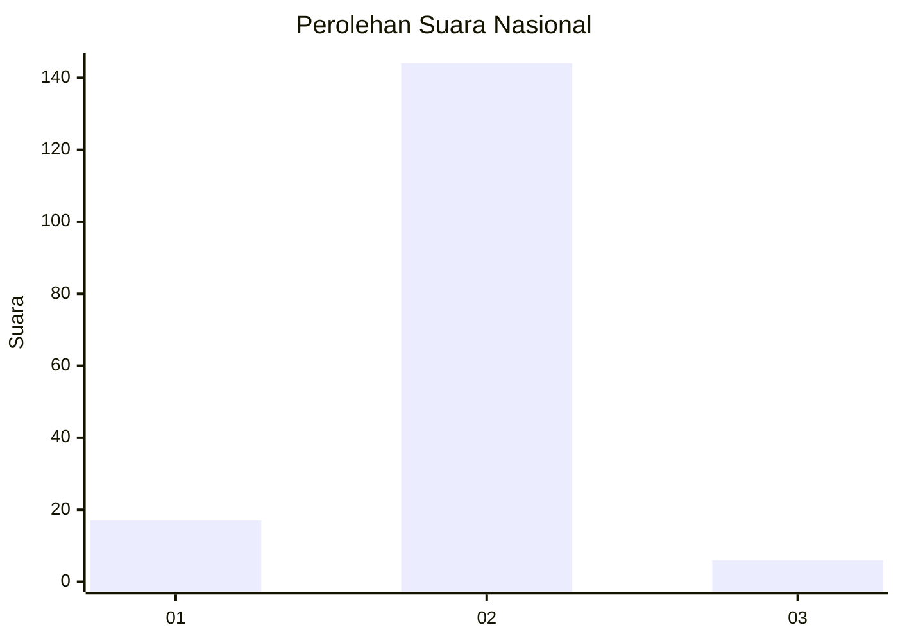
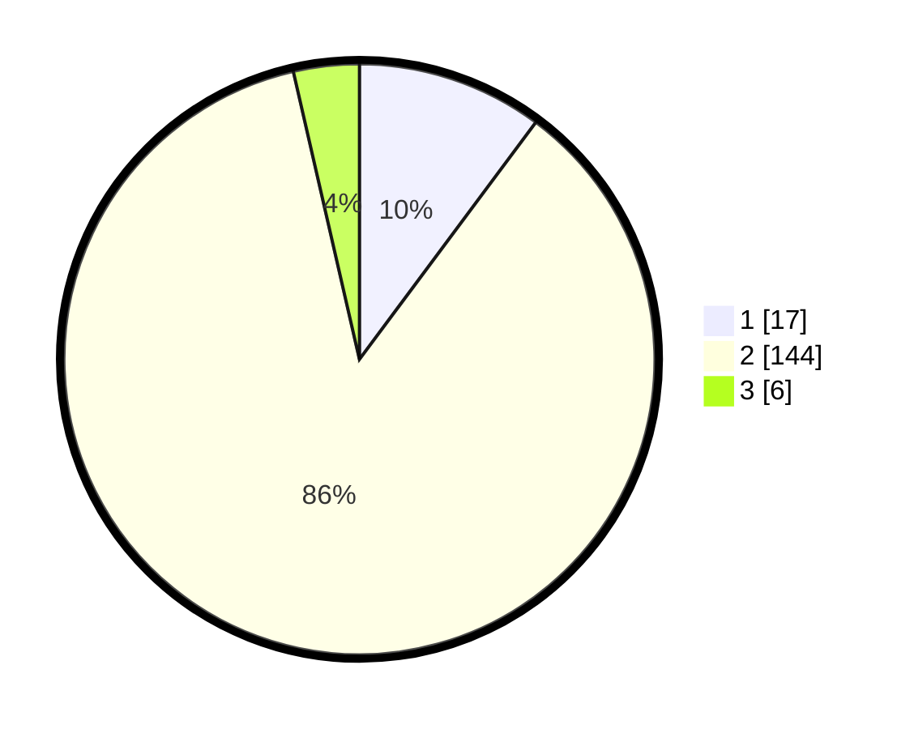

# Hasil

## Grafik

## Tabel

| No. | Nama Paslon    | Suara | Suara (raw) | Persentase |
|:--- |:-------------- | -----:| -----------:| ----------:|
| 1   | ANIES MUHAIMIN | 17    | [17][p-1]   | 10,18      |
| 2   | PRABOWO GIBRAN | 144   | [144][p-2]  | 86,23      |
| 3   | GANJAR MAHFUD  | 6     | [6][p-3]    | 3,59       |

[p-1]: https://github.com/gigit-pemilu/pemilu-2024/blob/main/pilpres/hitung-suara/sub/16-sumatera-selatan/sub/10-ogan-ilir/sub/10-pemulutan-barat/sub/2001-suka-merindu/sub/004-tps/sub/paslon-1.txt
[p-2]: https://github.com/gigit-pemilu/pemilu-2024/blob/main/pilpres/hitung-suara/sub/16-sumatera-selatan/sub/10-ogan-ilir/sub/10-pemulutan-barat/sub/2001-suka-merindu/sub/004-tps/sub/paslon-2.txt
[p-3]: https://github.com/gigit-pemilu/pemilu-2024/blob/main/pilpres/hitung-suara/sub/16-sumatera-selatan/sub/10-ogan-ilir/sub/10-pemulutan-barat/sub/2001-suka-merindu/sub/004-tps/sub/paslon-3.txt

## Foto C Plano

https://sirekap-obj-formc.kpu.go.id/6b39/pemilu/ppwp/16/10/10/20/01/1610102001004-20240219-180407--2626f1d3-3139-4dbb-b923-765385018f14.jpg

https://sirekap-obj-formc.kpu.go.id/6b39/pemilu/ppwp/16/10/10/20/01/1610102001004-20240214-195616--2641e11e-ab90-4f3f-9f11-63aa70d56144.jpg

## Metadata

| Key        | Value               |
| ---------- | ------------------- |
| Time Stamp | 2024-02-20 09:00:00 |

