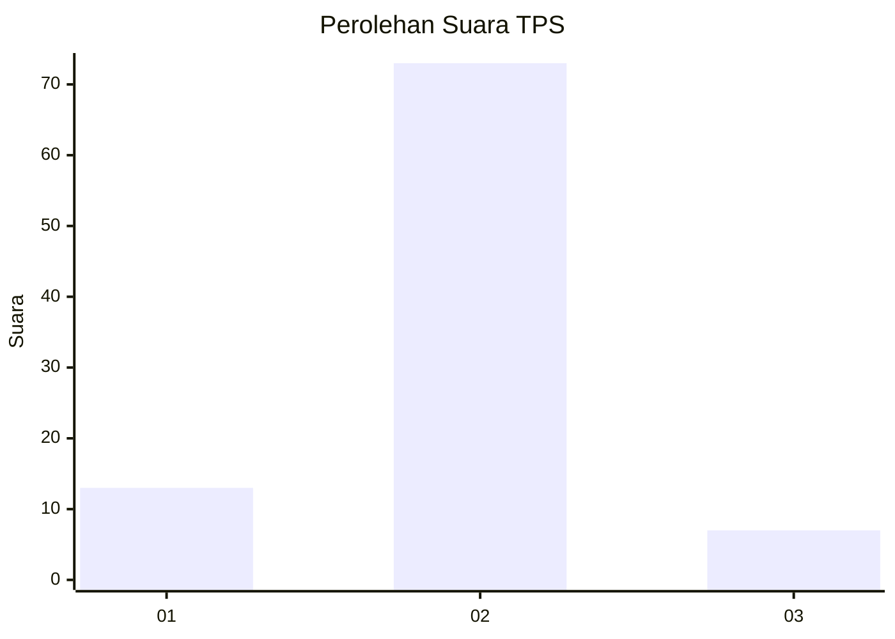
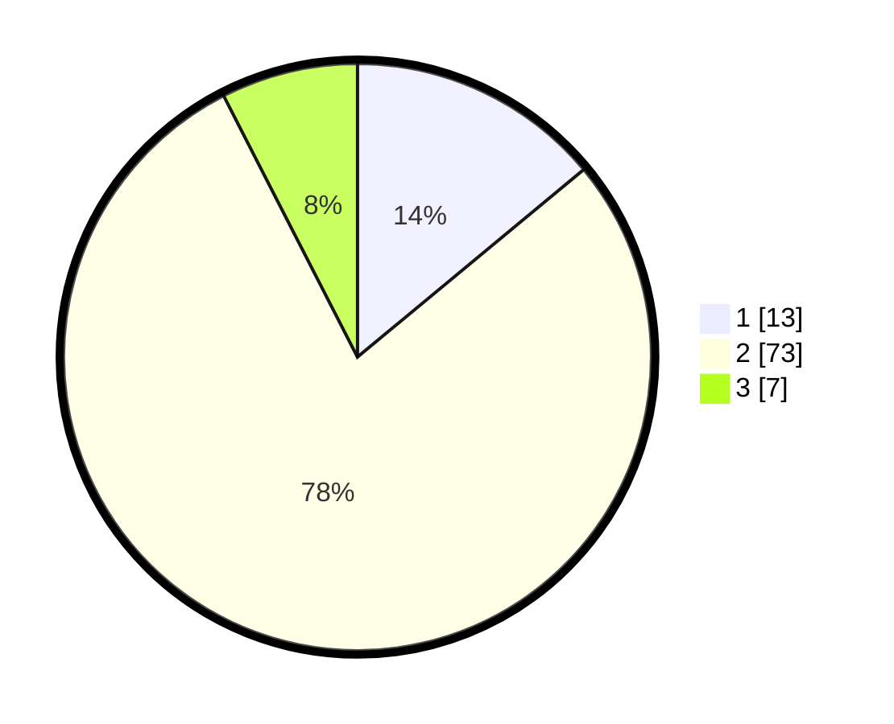

# Hasil

## Grafik

## Tabel

| No. | Nama Paslon    | Suara | Suara (raw) | Persentase |
|:--- |:-------------- | -----:| -----------:| ----------:|
| 1   | ANIES MUHAIMIN | 13    | [13][p-1]   | 13,98      |
| 2   | PRABOWO GIBRAN | 73    | [73][p-2]   | 78,49      |
| 3   | GANJAR MAHFUD  | 7     | [7][p-3]    | 7,53       |

[p-1]: https://github.com/gigit-pemilu/pemilu-2024-16-sumatera-selatan/blob/main/pilpres/hitung-suara/sub/16-sumatera-selatan/sub/10-ogan-ilir/sub/14-rambang-kuang/sub/2010-tanjung-miring/sub/007-tps/sub/paslon-1.txt
[p-2]: https://github.com/gigit-pemilu/pemilu-2024-16-sumatera-selatan/blob/main/pilpres/hitung-suara/sub/16-sumatera-selatan/sub/10-ogan-ilir/sub/14-rambang-kuang/sub/2010-tanjung-miring/sub/007-tps/sub/paslon-2.txt
[p-3]: https://github.com/gigit-pemilu/pemilu-2024-16-sumatera-selatan/blob/main/pilpres/hitung-suara/sub/16-sumatera-selatan/sub/10-ogan-ilir/sub/14-rambang-kuang/sub/2010-tanjung-miring/sub/007-tps/sub/paslon-3.txt

## Foto C Plano

https://sirekap-obj-formc.kpu.go.id/8de1/pemilu/ppwp/16/10/14/20/10/1610142010007-20240220-070740--c2359786-6d4c-4bd7-bee6-8974a4424599.jpg

https://sirekap-obj-formc.kpu.go.id/8de1/pemilu/ppwp/16/10/14/20/10/1610142010007-20240214-221755--82ed28c6-be15-43bb-b5b0-1c6635ae9654.jpg

https://sirekap-obj-formc.kpu.go.id/8de1/pemilu/ppwp/16/10/14/20/10/1610142010007-20240223-172625--6755c7da-e2dd-42d8-bc8e-8b714d5ae7a1.jpg

## Metadata

| Key        | Value               |
| ---------- | ------------------- |
| Time Stamp | 2024-02-24 22:31:28 |

