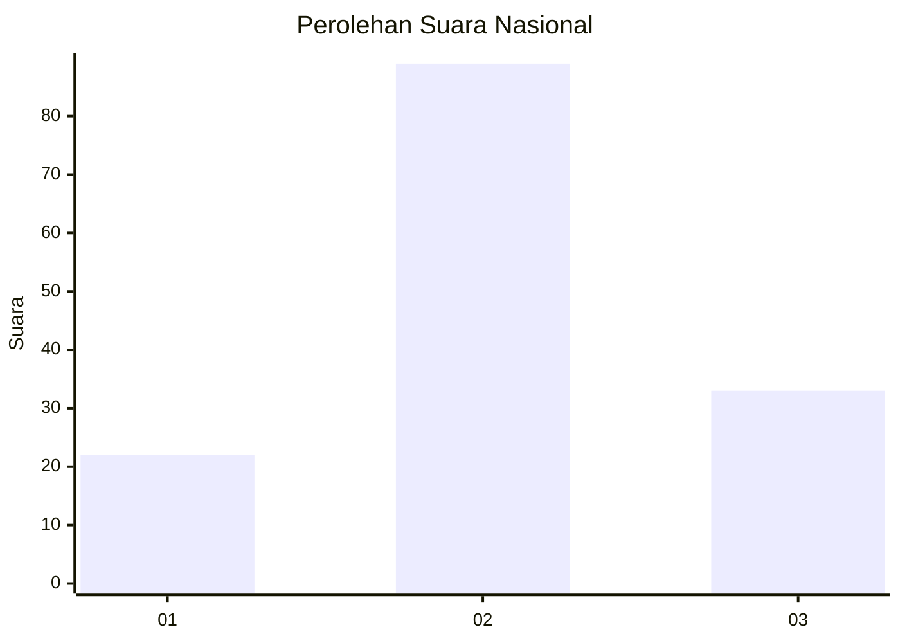
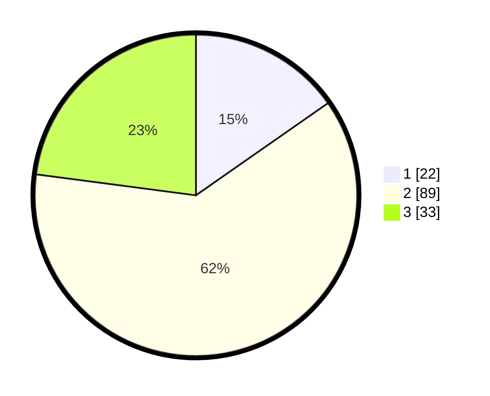

# Hasil

## Grafik

## Tabel

| No. | Nama Paslon    | Suara | Suara (raw) | Persentase |
|:--- |:-------------- | -----:| -----------:| ----------:|
| 1   | ANIES MUHAIMIN | 22    | [22][p-1]   | 15,28      |
| 2   | PRABOWO GIBRAN | 89    | [89][p-2]   | 61,81      |
| 3   | GANJAR MAHFUD  | 33    | [33][p-3]   | 22,92      |

[p-1]: https://github.com/gigit-pemilu/pemilu-2024/blob/main/pilpres/hitung-suara/sub/16-sumatera-selatan/sub/11-empat-lawang/sub/01-muara-pinang/sub/2001-batu-jungul/sub/001-tps/sub/paslon-1.txt
[p-2]: https://github.com/gigit-pemilu/pemilu-2024/blob/main/pilpres/hitung-suara/sub/16-sumatera-selatan/sub/11-empat-lawang/sub/01-muara-pinang/sub/2001-batu-jungul/sub/001-tps/sub/paslon-2.txt
[p-3]: https://github.com/gigit-pemilu/pemilu-2024/blob/main/pilpres/hitung-suara/sub/16-sumatera-selatan/sub/11-empat-lawang/sub/01-muara-pinang/sub/2001-batu-jungul/sub/001-tps/sub/paslon-3.txt

## Foto C Plano

https://sirekap-obj-formc.kpu.go.id/81b3/pemilu/ppwp/16/11/01/20/01/1611012001001-20240215-102418--b69cc164-4946-4424-9648-1a7df11785e8.jpg

https://sirekap-obj-formc.kpu.go.id/81b3/pemilu/ppwp/16/11/01/20/01/1611012001001-20240215-103345--181b8a53-f92d-4639-b938-f0e1bc4702e1.jpg

https://sirekap-obj-formc.kpu.go.id/81b3/pemilu/ppwp/16/11/01/20/01/1611012001001-20240215-103634--bd37008c-0c74-4b06-8b80-e90645d2dcfe.jpg

## Metadata

| Key        | Value               |
| ---------- | ------------------- |
| Time Stamp | 2024-02-15 22:00:27 |

## DATA PEMILIH TETAP

Jumlah pemilih dalam DPT: **281**.
 * L: **148**.
 * P: **133**.

## DATA PENGGUNA HAK PILIH

Jumlah pengguna hak pilih dalam DPT: **147**.
 * L: **74**.
 * P: **73**.

Jumlah pengguna hak pilih dalam DPTb: **5**.
 * L: **3**.
 * P: **2**.

Jumlah pengguna hak pilih dalam DPK: **0**.
 * L: **0**.
 * P: **0**.

Jumlah pengguna hak pilih: **152**.
 * L: **77**.
 * P: **75**.

## JUMLAH SUARA SAH DAN TIDAK SAH

JUMLAH SELURUH SUARA SAH: **144**.

JUMLAH SUARA TIDAK SAH: **8**.

JUMLAH SELURUH SUARA SAH DAN SUARA TIDAK SAH: **152**.

