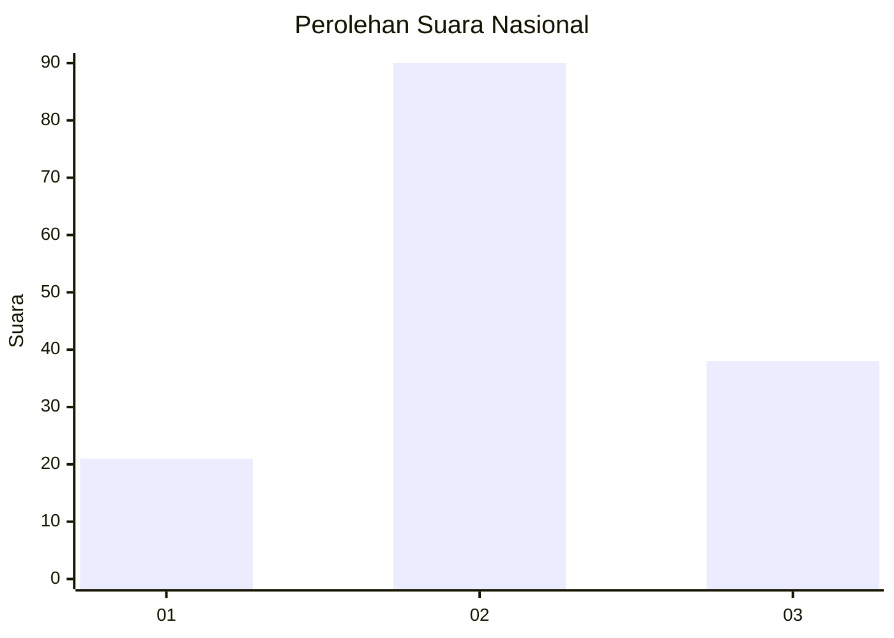
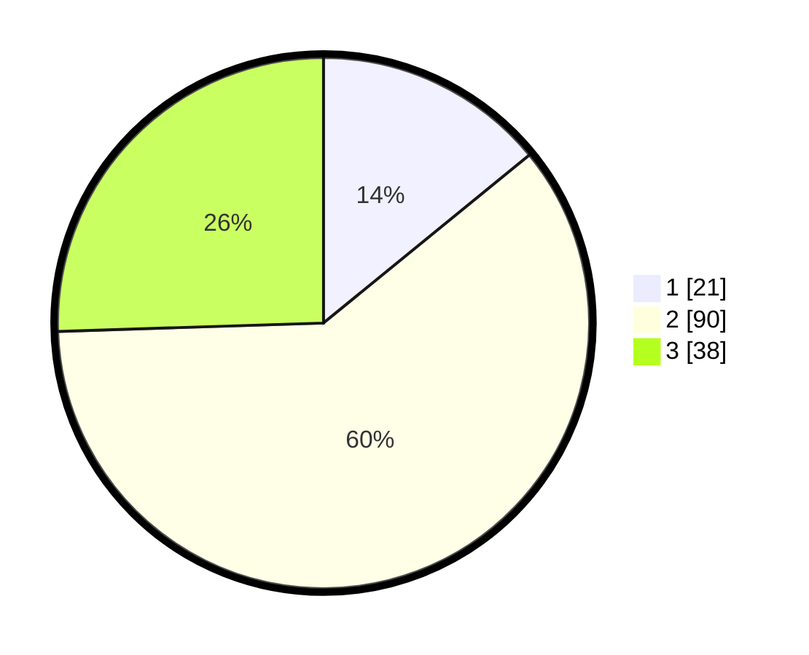

# Hasil

## Grafik

## Tabel

| No. | Nama Paslon    | Suara | Suara (raw) | Persentase |
|:--- |:-------------- | -----:| -----------:| ----------:|
| 1   | ANIES MUHAIMIN | 21    | [21][p-1]   | 14,09      |
| 2   | PRABOWO GIBRAN | 90    | [90][p-2]   | 60,40      |
| 3   | GANJAR MAHFUD  | 38    | [38][p-3]   | 25,50      |

[p-1]: https://github.com/gigit-pemilu/pemilu-2024/blob/main/pilpres/hitung-suara/sub/16-sumatera-selatan/sub/11-empat-lawang/sub/01-muara-pinang/sub/2001-batu-jungul/sub/002-tps/sub/paslon-1.txt
[p-2]: https://github.com/gigit-pemilu/pemilu-2024/blob/main/pilpres/hitung-suara/sub/16-sumatera-selatan/sub/11-empat-lawang/sub/01-muara-pinang/sub/2001-batu-jungul/sub/002-tps/sub/paslon-2.txt
[p-3]: https://github.com/gigit-pemilu/pemilu-2024/blob/main/pilpres/hitung-suara/sub/16-sumatera-selatan/sub/11-empat-lawang/sub/01-muara-pinang/sub/2001-batu-jungul/sub/002-tps/sub/paslon-3.txt

## Foto C Plano

https://sirekap-obj-formc.kpu.go.id/213d/pemilu/ppwp/16/11/01/20/01/1611012001002-20240220-002717--02ca265d-2349-4d51-82b4-49a9a5ba3272.jpg

https://sirekap-obj-formc.kpu.go.id/213d/pemilu/ppwp/16/11/01/20/01/1611012001002-20240215-081950--cec0adb9-2781-452b-b924-5d92138f759a.jpg

https://sirekap-obj-formc.kpu.go.id/213d/pemilu/ppwp/16/11/01/20/01/1611012001002-20240215-085417--6593ea6f-e1d1-4165-b090-e313770a66c5.jpg

## Metadata

| Key        | Value               |
| ---------- | ------------------- |
| Time Stamp | 2024-02-25 22:00:00 |

## DATA PEMILIH TETAP

Jumlah pemilih dalam DPT: **277**.
 * L: **136**.
 * P: **141**.

## DATA PENGGUNA HAK PILIH

Jumlah pengguna hak pilih dalam DPT: **263**.
 * L: **129**.
 * P: **134**.

Jumlah pengguna hak pilih dalam DPTb: **0**.
 * L: **0**.
 * P: **0**.

Jumlah pengguna hak pilih dalam DPK: **0**.
 * L: **0**.
 * P: **0**.

Jumlah pengguna hak pilih: **263**.
 * L: **129**.
 * P: **134**.

## JUMLAH SUARA SAH DAN TIDAK SAH

JUMLAH SELURUH SUARA SAH: **150**.

JUMLAH SUARA TIDAK SAH: **13**.

JUMLAH SELURUH SUARA SAH DAN SUARA TIDAK SAH: **163**.

