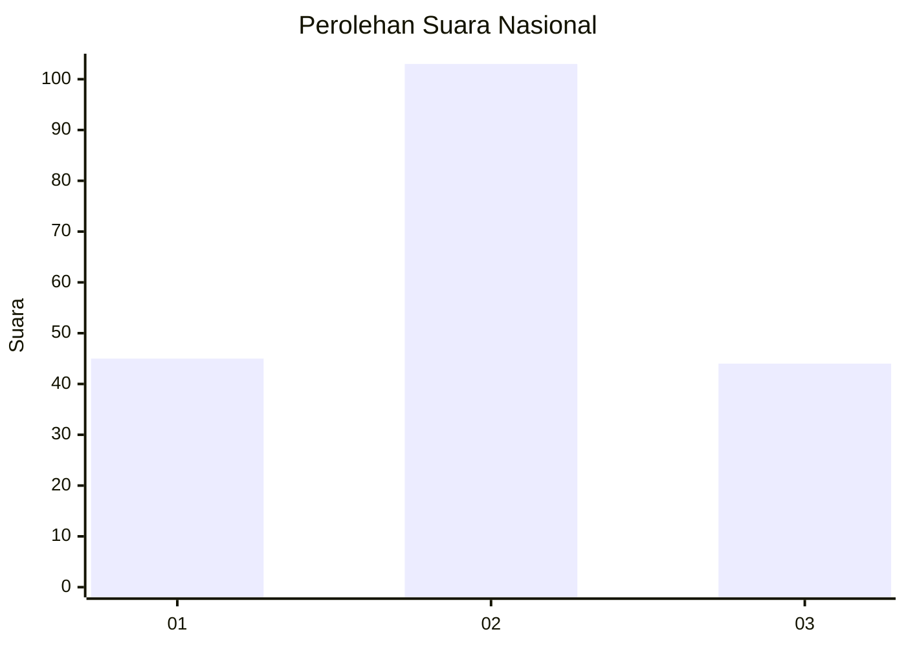
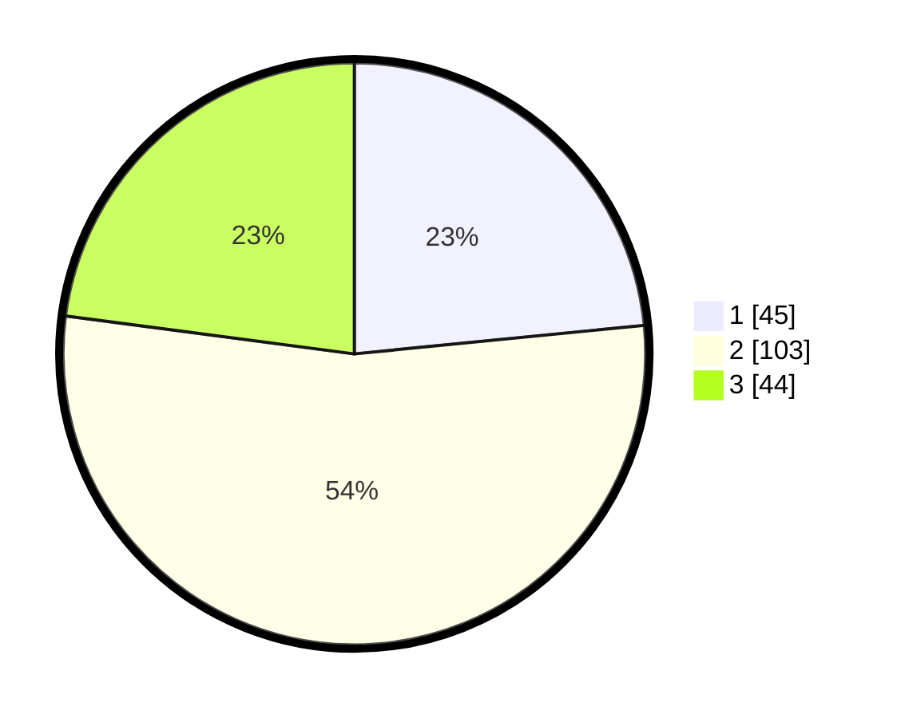

# Hasil

## Grafik

## Tabel

| No. | Nama Paslon    | Suara | Suara (raw) | Persentase |
|:--- |:-------------- | -----:| -----------:| ----------:|
| 1   | ANIES MUHAIMIN | 45    | [45][p-1]   | 23,44      |
| 2   | PRABOWO GIBRAN | 103   | [103][p-2]  | 53,65      |
| 3   | GANJAR MAHFUD  | 44    | [44][p-3]   | 22,92      |

[p-1]: https://github.com/gigit-pemilu/pemilu-2024/blob/main/pilpres/hitung-suara/sub/16-sumatera-selatan/sub/11-empat-lawang/sub/01-muara-pinang/sub/2001-batu-jungul/sub/003-tps/sub/paslon-1.txt
[p-2]: https://github.com/gigit-pemilu/pemilu-2024/blob/main/pilpres/hitung-suara/sub/16-sumatera-selatan/sub/11-empat-lawang/sub/01-muara-pinang/sub/2001-batu-jungul/sub/003-tps/sub/paslon-2.txt
[p-3]: https://github.com/gigit-pemilu/pemilu-2024/blob/main/pilpres/hitung-suara/sub/16-sumatera-selatan/sub/11-empat-lawang/sub/01-muara-pinang/sub/2001-batu-jungul/sub/003-tps/sub/paslon-3.txt

## Foto C Plano

https://sirekap-obj-formc.kpu.go.id/910a/pemilu/ppwp/16/11/01/20/01/1611012001003-20240215-062344--7a35460b-c636-44e2-86cc-b82d34585849.jpg

https://sirekap-obj-formc.kpu.go.id/910a/pemilu/ppwp/16/11/01/20/01/1611012001003-20240215-062552--2b312532-1d42-4267-8535-2a3f67249447.jpg

https://sirekap-obj-formc.kpu.go.id/910a/pemilu/ppwp/16/11/01/20/01/1611012001003-20240215-062620--ec7bace9-d48e-455d-8e64-1d926fe5cc42.jpg

## Metadata

| Key        | Value               |
| ---------- | ------------------- |
| Time Stamp | 2024-02-25 15:00:00 |

