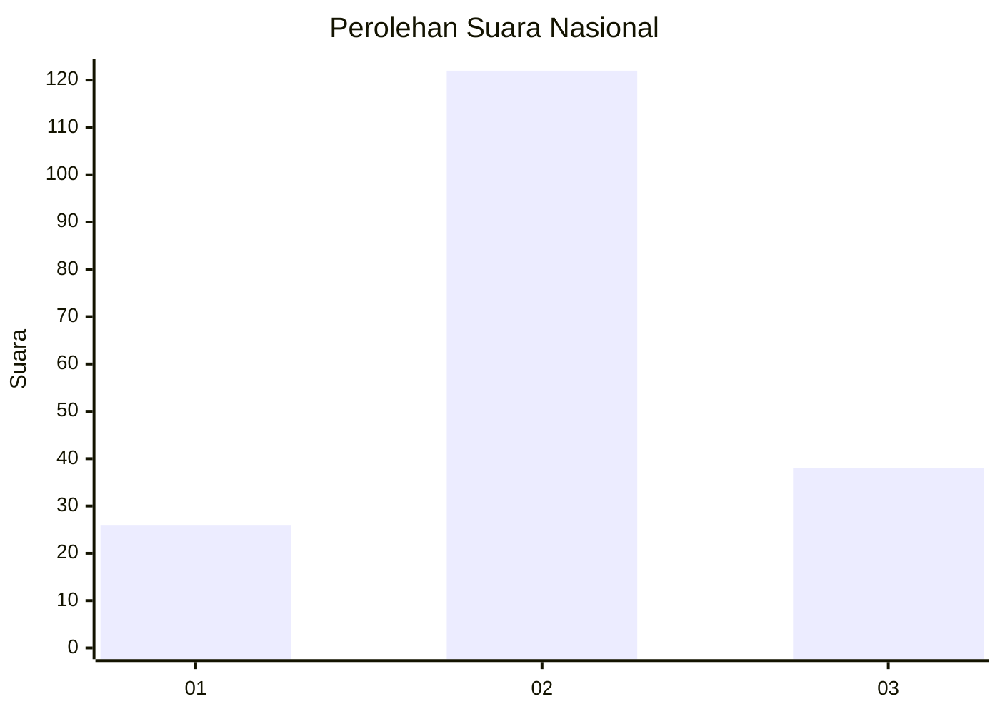
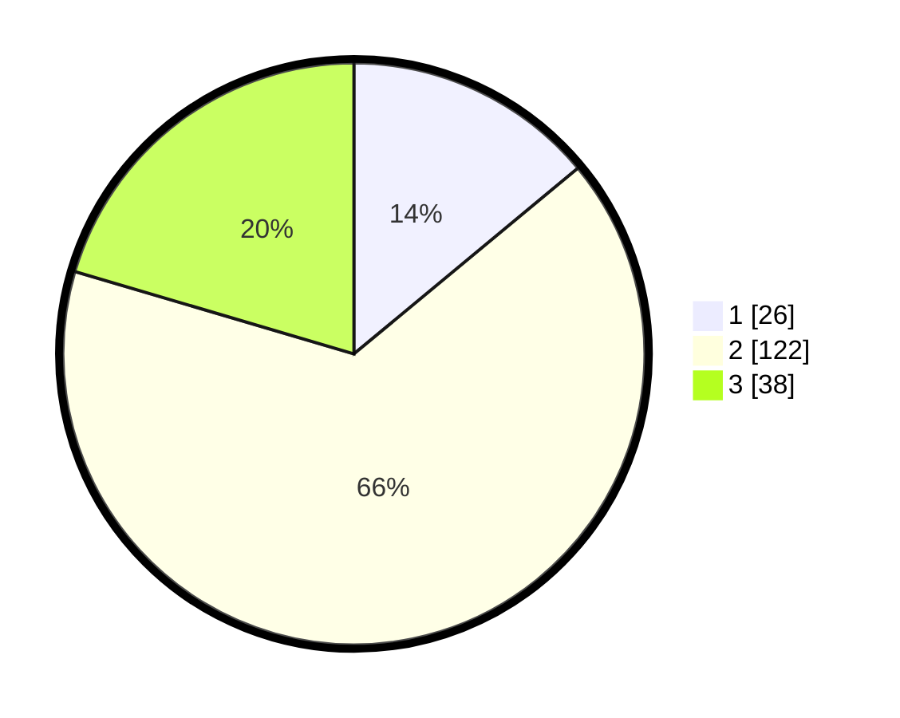

# Hasil

## Grafik

## Tabel

| No. | Nama Paslon    | Suara | Suara (raw) | Persentase |
|:--- |:-------------- | -----:| -----------:| ----------:|
| 1   | ANIES MUHAIMIN | 26    | [26][p-1]   | 13,98      |
| 2   | PRABOWO GIBRAN | 122   | [122][p-2]  | 65,59      |
| 3   | GANJAR MAHFUD  | 38    | [38][p-3]   | 20,43      |

[p-1]: https://github.com/gigit-pemilu/pemilu-2024/blob/main/pilpres/hitung-suara/sub/16-sumatera-selatan/sub/11-empat-lawang/sub/01-muara-pinang/sub/2001-batu-jungul/sub/006-tps/sub/paslon-1.txt
[p-2]: https://github.com/gigit-pemilu/pemilu-2024/blob/main/pilpres/hitung-suara/sub/16-sumatera-selatan/sub/11-empat-lawang/sub/01-muara-pinang/sub/2001-batu-jungul/sub/006-tps/sub/paslon-2.txt
[p-3]: https://github.com/gigit-pemilu/pemilu-2024/blob/main/pilpres/hitung-suara/sub/16-sumatera-selatan/sub/11-empat-lawang/sub/01-muara-pinang/sub/2001-batu-jungul/sub/006-tps/sub/paslon-3.txt

## Foto C Plano

https://sirekap-obj-formc.kpu.go.id/2350/pemilu/ppwp/16/11/01/20/01/1611012001006-20240215-061959--020e3e6f-e4fa-41ca-8266-87c905db378c.jpg

https://sirekap-obj-formc.kpu.go.id/2350/pemilu/ppwp/16/11/01/20/01/1611012001006-20240215-062341--d25eb311-564a-45b0-a2c4-93d6467b522e.jpg

https://sirekap-obj-formc.kpu.go.id/2350/pemilu/ppwp/16/11/01/20/01/1611012001006-20240215-063006--8c9e8191-de42-4f41-9ac4-2f5798575959.jpg

## Metadata

| Key        | Value               |
| ---------- | ------------------- |
| Time Stamp | 2024-02-25 12:00:00 |

