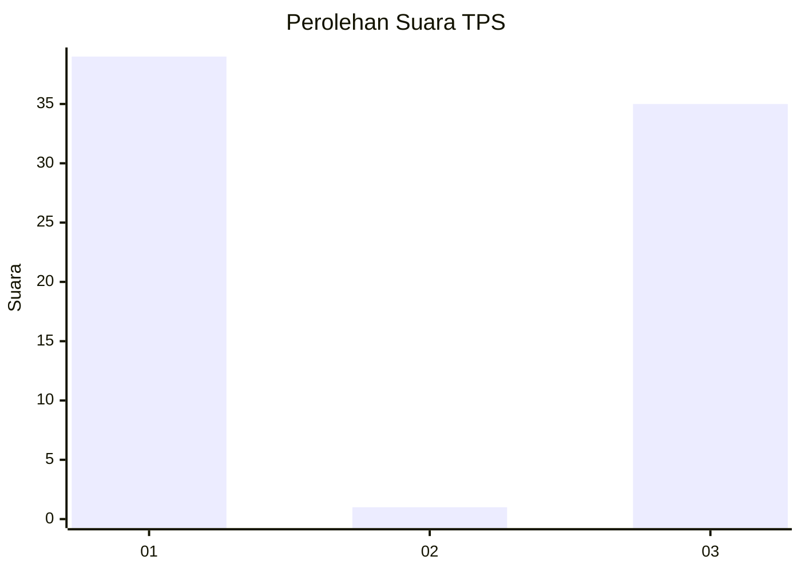
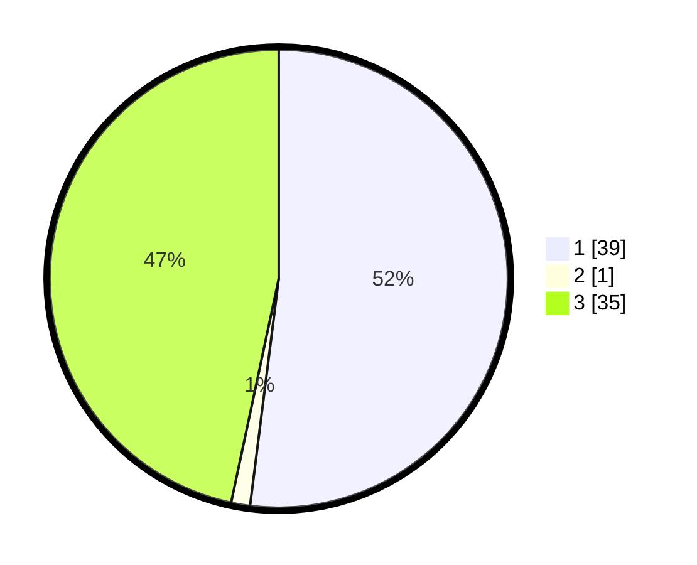

# Hasil

## Grafik

## Tabel

| No. | Nama Paslon    | Suara | Suara (raw) | Persentase |
|:--- |:-------------- | -----:| -----------:| ----------:|
| 1   | ANIES MUHAIMIN | 39    | [39][p-1]   | 52,00      |
| 2   | PRABOWO GIBRAN | 1     | [1][p-2]    | 1,33       |
| 3   | GANJAR MAHFUD  | 35    | [35][p-3]   | 46,67      |

[p-1]: https://github.com/gigit-pemilu/pemilu-2024-16-sumatera-selatan/blob/main/pilpres/hitung-suara/sub/16-sumatera-selatan/sub/11-empat-lawang/sub/01-muara-pinang/sub/2002-suka-dana/sub/005-tps/sub/paslon-1.txt
[p-2]: https://github.com/gigit-pemilu/pemilu-2024-16-sumatera-selatan/blob/main/pilpres/hitung-suara/sub/16-sumatera-selatan/sub/11-empat-lawang/sub/01-muara-pinang/sub/2002-suka-dana/sub/005-tps/sub/paslon-2.txt
[p-3]: https://github.com/gigit-pemilu/pemilu-2024-16-sumatera-selatan/blob/main/pilpres/hitung-suara/sub/16-sumatera-selatan/sub/11-empat-lawang/sub/01-muara-pinang/sub/2002-suka-dana/sub/005-tps/sub/paslon-3.txt

## Foto C Plano

https://sirekap-obj-formc.kpu.go.id/67e1/pemilu/ppwp/16/11/01/20/02/1611012002005-20240215-042247--eef129f5-33e3-44e5-bc40-4e7a08ebf912.jpg

https://sirekap-obj-formc.kpu.go.id/67e1/pemilu/ppwp/16/11/01/20/02/1611012002005-20240215-042414--cc857ddb-d41a-4958-8dc3-3f7d60a0f357.jpg

https://sirekap-obj-formc.kpu.go.id/67e1/pemilu/ppwp/16/11/01/20/02/1611012002005-20240215-042543--da4888e4-33fe-4119-b1e3-b7688a9f4d33.jpg

## Metadata

| Key        | Value               |
| ---------- | ------------------- |
| Time Stamp | 2024-02-24 22:31:28 |

