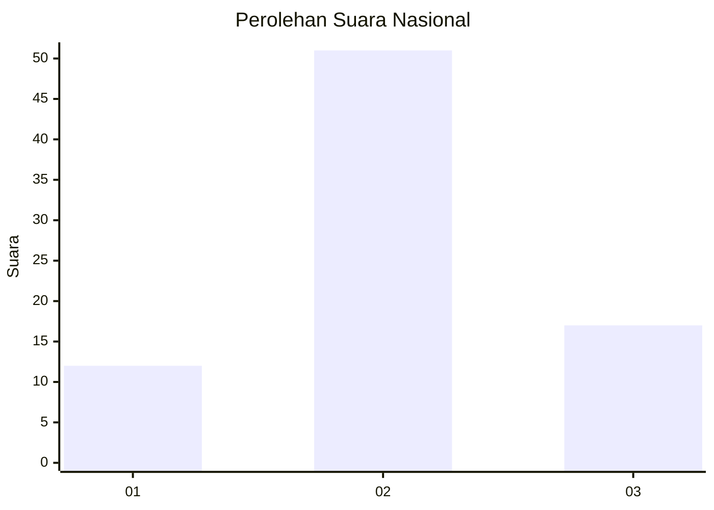
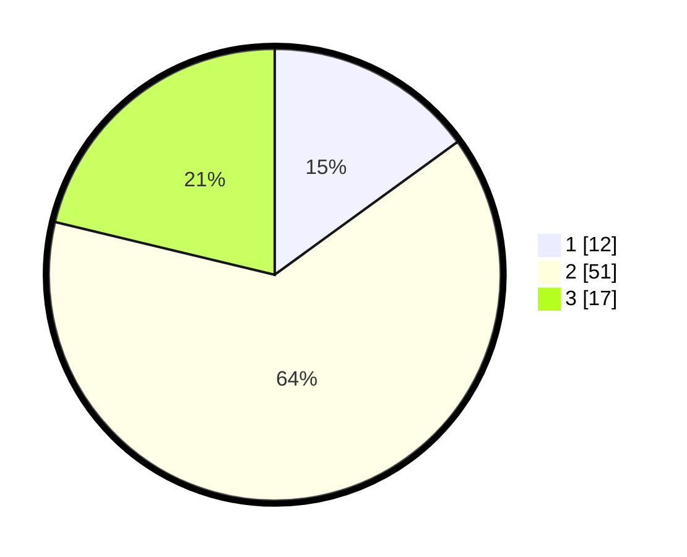

# Hasil

## Grafik

## Tabel

| No. | Nama Paslon    | Suara | Suara (raw) | Persentase |
|:--- |:-------------- | -----:| -----------:| ----------:|
| 1   | ANIES MUHAIMIN | 12    | [12][p-1]   | 15,00      |
| 2   | PRABOWO GIBRAN | 51    | [51][p-2]   | 63,75      |
| 3   | GANJAR MAHFUD  | 17    | [17][p-3]   | 21,25      |

[p-1]: https://github.com/gigit-pemilu/pemilu-2024/blob/main/pilpres/hitung-suara/sub/16-sumatera-selatan/sub/11-empat-lawang/sub/01-muara-pinang/sub/2002-suka-dana/sub/009-tps/sub/paslon-1.txt
[p-2]: https://github.com/gigit-pemilu/pemilu-2024/blob/main/pilpres/hitung-suara/sub/16-sumatera-selatan/sub/11-empat-lawang/sub/01-muara-pinang/sub/2002-suka-dana/sub/009-tps/sub/paslon-2.txt
[p-3]: https://github.com/gigit-pemilu/pemilu-2024/blob/main/pilpres/hitung-suara/sub/16-sumatera-selatan/sub/11-empat-lawang/sub/01-muara-pinang/sub/2002-suka-dana/sub/009-tps/sub/paslon-3.txt

## Foto C Plano

https://sirekap-obj-formc.kpu.go.id/f6b7/pemilu/ppwp/16/11/01/20/02/1611012002009-20240215-053017--0d7122cc-4e2f-4721-bbca-6d97a0b1a7a0.jpg

https://sirekap-obj-formc.kpu.go.id/f6b7/pemilu/ppwp/16/11/01/20/02/1611012002009-20240215-053526--04b70217-8d54-4e31-8e0f-b3c881ea9d8b.jpg

https://sirekap-obj-formc.kpu.go.id/f6b7/pemilu/ppwp/16/11/01/20/02/1611012002009-20240215-053823--a807baf8-f39f-4ea6-92c3-88d17d81cd75.jpg

## Metadata

| Key        | Value               |
| ---------- | ------------------- |
| Time Stamp | 2024-02-24 22:31:28 |

