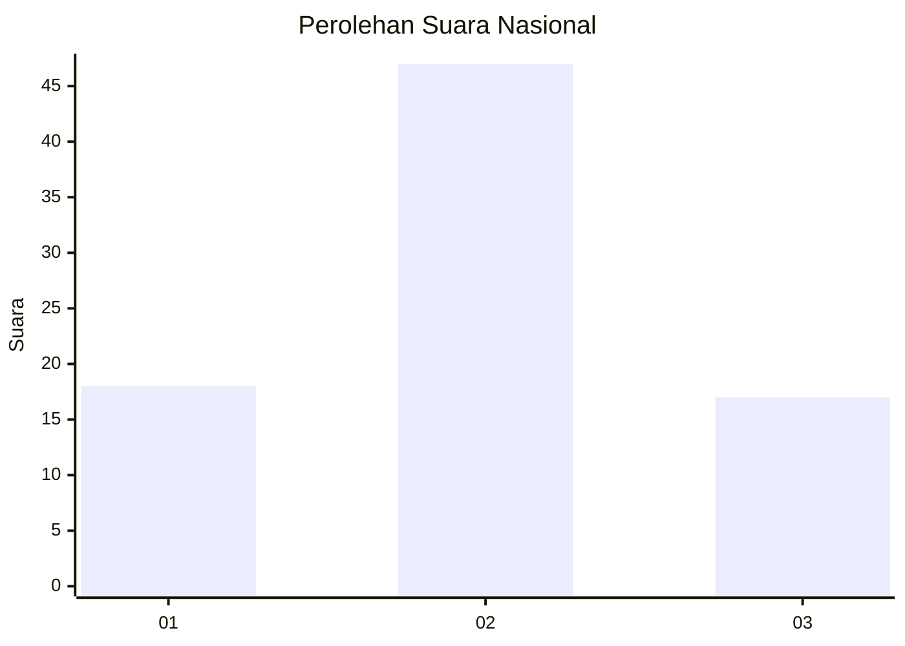
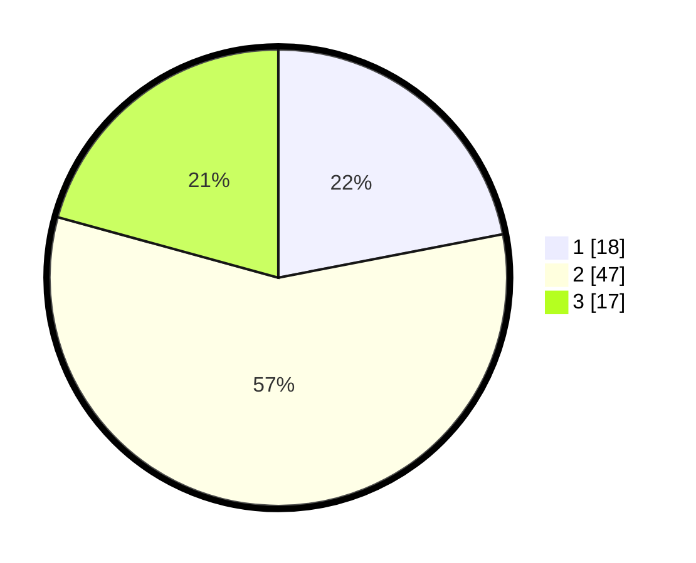

# Hasil

## Grafik

## Tabel

| No. | Nama Paslon    | Suara | Suara (raw) | Persentase |
|:--- |:-------------- | -----:| -----------:| ----------:|
| 1   | ANIES MUHAIMIN | 18    | [18][p-1]   | 21,95      |
| 2   | PRABOWO GIBRAN | 47    | [47][p-2]   | 57,32      |
| 3   | GANJAR MAHFUD  | 17    | [17][p-3]   | 20,73      |

[p-1]: https://github.com/gigit-pemilu/pemilu-2024/blob/main/pilpres/hitung-suara/sub/16-sumatera-selatan/sub/11-empat-lawang/sub/01-muara-pinang/sub/2005-tanjung-kurung/sub/002-tps/sub/paslon-1.txt
[p-2]: https://github.com/gigit-pemilu/pemilu-2024/blob/main/pilpres/hitung-suara/sub/16-sumatera-selatan/sub/11-empat-lawang/sub/01-muara-pinang/sub/2005-tanjung-kurung/sub/002-tps/sub/paslon-2.txt
[p-3]: https://github.com/gigit-pemilu/pemilu-2024/blob/main/pilpres/hitung-suara/sub/16-sumatera-selatan/sub/11-empat-lawang/sub/01-muara-pinang/sub/2005-tanjung-kurung/sub/002-tps/sub/paslon-3.txt

## Foto C Plano

https://sirekap-obj-formc.kpu.go.id/9b29/pemilu/ppwp/16/11/01/20/05/1611012005002-20240215-002444--853cc9ef-be5c-4172-a3eb-27392e86b69c.jpg

https://sirekap-obj-formc.kpu.go.id/9b29/pemilu/ppwp/16/11/01/20/05/1611012005002-20240214-141613--6e628cbd-3630-4c9e-b443-03ccb2976660.jpg

https://sirekap-obj-formc.kpu.go.id/9b29/pemilu/ppwp/16/11/01/20/05/1611012005002-20240214-141659--43041cf4-9576-41ce-99d7-9deedca16448.jpg

## Metadata

| Key        | Value               |
| ---------- | ------------------- |
| Time Stamp | 2024-02-15 15:00:29 |

