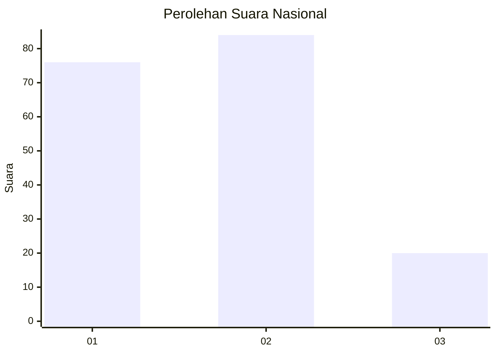
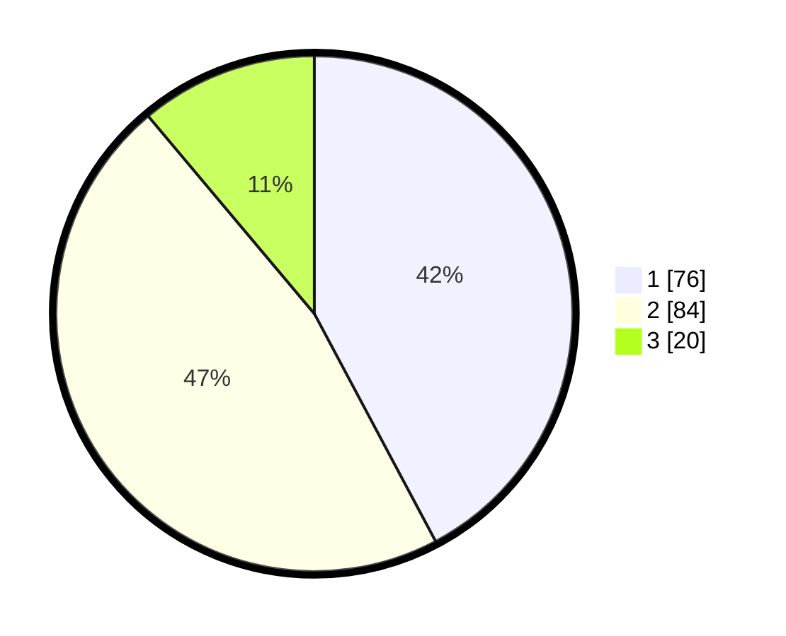

# Hasil

## Grafik

## Tabel

| No. | Nama Paslon    | Suara | Suara (raw) | Persentase |
|:--- |:-------------- | -----:| -----------:| ----------:|
| 1   | ANIES MUHAIMIN | 76    | [76][p-1]   | 42,22      |
| 2   | PRABOWO GIBRAN | 84    | [84][p-2]   | 46,67      |
| 3   | GANJAR MAHFUD  | 20    | [20][p-3]   | 11,11      |

[p-1]: https://github.com/gigit-pemilu/pemilu-2024/blob/main/pilpres/hitung-suara/sub/16-sumatera-selatan/sub/11-empat-lawang/sub/01-muara-pinang/sub/2006-muara-pinang-baru/sub/005-tps/sub/paslon-1.txt
[p-2]: https://github.com/gigit-pemilu/pemilu-2024/blob/main/pilpres/hitung-suara/sub/16-sumatera-selatan/sub/11-empat-lawang/sub/01-muara-pinang/sub/2006-muara-pinang-baru/sub/005-tps/sub/paslon-2.txt
[p-3]: https://github.com/gigit-pemilu/pemilu-2024/blob/main/pilpres/hitung-suara/sub/16-sumatera-selatan/sub/11-empat-lawang/sub/01-muara-pinang/sub/2006-muara-pinang-baru/sub/005-tps/sub/paslon-3.txt

## Foto C Plano

https://sirekap-obj-formc.kpu.go.id/747b/pemilu/ppwp/16/11/01/20/06/1611012006005-20240215-110019--8fe91452-6ed6-48fa-998f-ef85a81e8b1a.jpg

https://sirekap-obj-formc.kpu.go.id/747b/pemilu/ppwp/16/11/01/20/06/1611012006005-20240215-110326--2a08a5f1-1ac1-47f1-8146-893ce236d083.jpg

https://sirekap-obj-formc.kpu.go.id/747b/pemilu/ppwp/16/11/01/20/06/1611012006005-20240215-110455--2c02f11c-03ac-4f5c-9113-4add74a47148.jpg

## Metadata

| Key        | Value               |
| ---------- | ------------------- |
| Time Stamp | 2024-02-25 12:00:00 |

