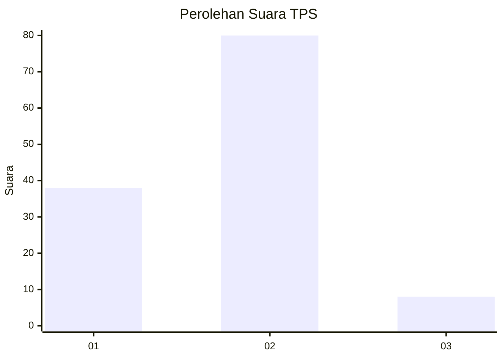
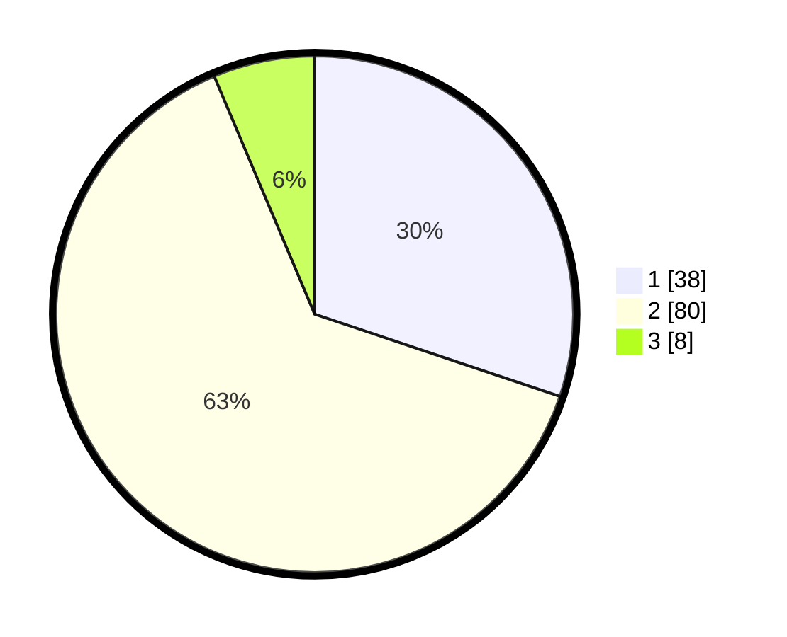

# Hasil

## Grafik

## Tabel

| No. | Nama Paslon    | Suara | Suara (raw) | Persentase |
|:--- |:-------------- | -----:| -----------:| ----------:|
| 1   | ANIES MUHAIMIN | 38    | [38][p-1]   | 30,16      |
| 2   | PRABOWO GIBRAN | 80    | [80][p-2]   | 63,49      |
| 3   | GANJAR MAHFUD  | 8     | [8][p-3]    | 6,35       |

[p-1]: https://github.com/gigit-pemilu/pemilu-2024-16-sumatera-selatan/blob/main/pilpres/hitung-suara/sub/16-sumatera-selatan/sub/11-empat-lawang/sub/01-muara-pinang/sub/2006-muara-pinang-baru/sub/013-tps/sub/paslon-1.txt
[p-2]: https://github.com/gigit-pemilu/pemilu-2024-16-sumatera-selatan/blob/main/pilpres/hitung-suara/sub/16-sumatera-selatan/sub/11-empat-lawang/sub/01-muara-pinang/sub/2006-muara-pinang-baru/sub/013-tps/sub/paslon-2.txt
[p-3]: https://github.com/gigit-pemilu/pemilu-2024-16-sumatera-selatan/blob/main/pilpres/hitung-suara/sub/16-sumatera-selatan/sub/11-empat-lawang/sub/01-muara-pinang/sub/2006-muara-pinang-baru/sub/013-tps/sub/paslon-3.txt

## Foto C Plano

https://sirekap-obj-formc.kpu.go.id/14ad/pemilu/ppwp/16/11/01/20/06/1611012006013-20240215-003217--5c1978a2-1800-4f29-bdbd-f1ce59151d65.jpg

https://sirekap-obj-formc.kpu.go.id/14ad/pemilu/ppwp/16/11/01/20/06/1611012006013-20240215-003405--f8933387-b389-4d81-8be8-3cef13ee33fb.jpg

https://sirekap-obj-formc.kpu.go.id/14ad/pemilu/ppwp/16/11/01/20/06/1611012006013-20240215-003538--25fc352d-042a-456b-9914-629712345c18.jpg

## Metadata

| Key        | Value               |
| ---------- | ------------------- |
| Time Stamp | 2024-02-25 19:00:00 |

