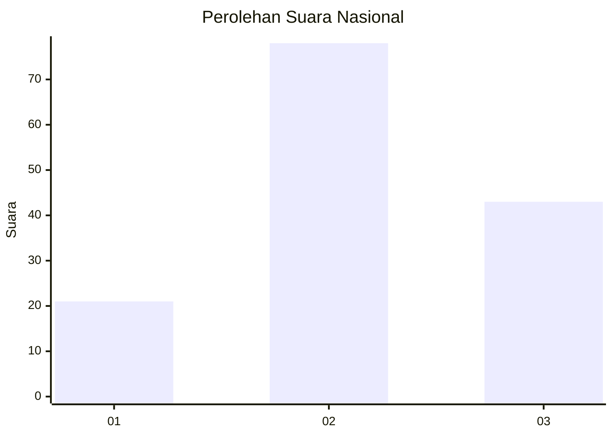
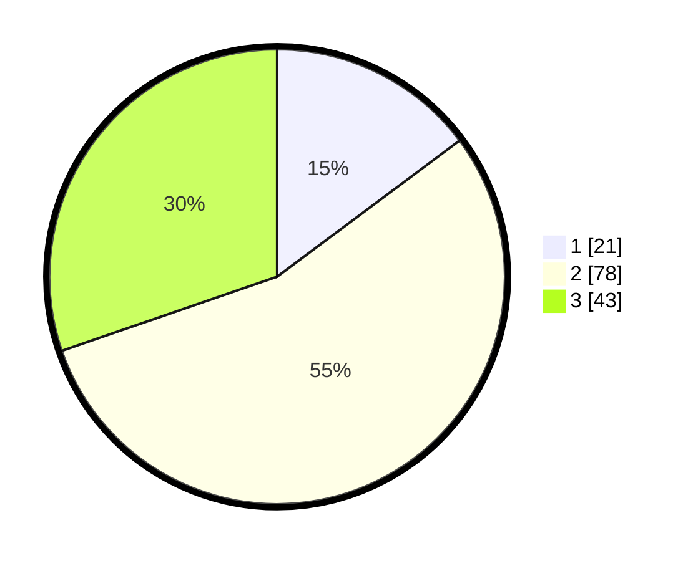

# Hasil

## Grafik

## Tabel

| No. | Nama Paslon    | Suara | Suara (raw) | Persentase |
|:--- |:-------------- | -----:| -----------:| ----------:|
| 1   | ANIES MUHAIMIN | 21    | [21][p-1]   | 14,79      |
| 2   | PRABOWO GIBRAN | 78    | [78][p-2]   | 54,93      |
| 3   | GANJAR MAHFUD  | 43    | [43][p-3]   | 30,28      |

[p-1]: https://github.com/gigit-pemilu/pemilu-2024/blob/main/pilpres/hitung-suara/sub/16-sumatera-selatan/sub/11-empat-lawang/sub/01-muara-pinang/sub/2010-muara-pinang-lama/sub/003-tps/sub/paslon-1.txt
[p-2]: https://github.com/gigit-pemilu/pemilu-2024/blob/main/pilpres/hitung-suara/sub/16-sumatera-selatan/sub/11-empat-lawang/sub/01-muara-pinang/sub/2010-muara-pinang-lama/sub/003-tps/sub/paslon-2.txt
[p-3]: https://github.com/gigit-pemilu/pemilu-2024/blob/main/pilpres/hitung-suara/sub/16-sumatera-selatan/sub/11-empat-lawang/sub/01-muara-pinang/sub/2010-muara-pinang-lama/sub/003-tps/sub/paslon-3.txt

## Foto C Plano

https://sirekap-obj-formc.kpu.go.id/700a/pemilu/ppwp/16/11/01/20/10/1611012010003-20240215-082608--bf4480c4-dece-4e04-ac75-bb868c217b8d.jpg

https://sirekap-obj-formc.kpu.go.id/700a/pemilu/ppwp/16/11/01/20/10/1611012010003-20240215-082830--1d5910ae-ffe7-45a0-bcbf-ca0e424e8e89.jpg

https://sirekap-obj-formc.kpu.go.id/700a/pemilu/ppwp/16/11/01/20/10/1611012010003-20240215-083050--914b5a0c-72f8-42db-8cb9-bc7a3c872724.jpg

## Metadata

| Key        | Value               |
| ---------- | ------------------- |
| Time Stamp | 2024-02-24 22:31:28 |

