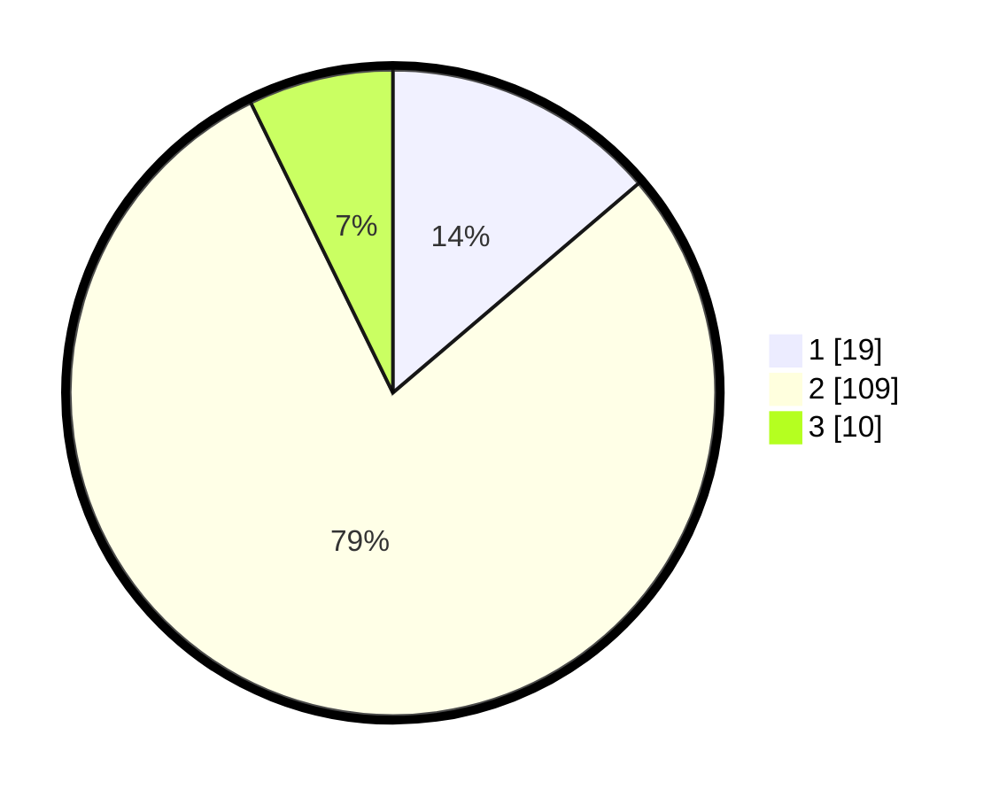

# Hasil

## Grafik

## Tabel

| No. | Nama Paslon    | Suara | Suara (raw) | Persentase |
|:--- |:-------------- | -----:| -----------:| ----------:|
| 1   | ANIES MUHAIMIN | 19    | [19][p-1]   | 13,77      |
| 2   | PRABOWO GIBRAN | 109   | [109][p-2]  | 78,99      |
| 3   | GANJAR MAHFUD  | 10    | [10][p-3]   | 7,25       |

[p-1]: https://github.com/gigit-pemilu/pemilu-2024-16-sumatera-selatan/blob/main/pilpres/hitung-suara/sub/16-sumatera-selatan/sub/11-empat-lawang/sub/01-muara-pinang/sub/2011-tanjung-tawang/sub/005-tps/sub/paslon-1.txt
[p-2]: https://github.com/gigit-pemilu/pemilu-2024-16-sumatera-selatan/blob/main/pilpres/hitung-suara/sub/16-sumatera-selatan/sub/11-empat-lawang/sub/01-muara-pinang/sub/2011-tanjung-tawang/sub/005-tps/sub/paslon-2.txt
[p-3]: https://github.com/gigit-pemilu/pemilu-2024-16-sumatera-selatan/blob/main/pilpres/hitung-suara/sub/16-sumatera-selatan/sub/11-empat-lawang/sub/01-muara-pinang/sub/2011-tanjung-tawang/sub/005-tps/sub/paslon-3.txt

## Foto C Plano

https://sirekap-obj-formc.kpu.go.id/ad16/pemilu/ppwp/16/11/01/20/11/1611012011005-20240215-003854--c5f4af32-8316-4601-93a3-98cd771c7b4e.jpg

https://sirekap-obj-formc.kpu.go.id/ad16/pemilu/ppwp/16/11/01/20/11/1611012011005-20240215-003652--05597b48-1a38-4d29-85f1-cbf045978511.jpg

https://sirekap-obj-formc.kpu.go.id/ad16/pemilu/ppwp/16/11/01/20/11/1611012011005-20240215-104737--93a8e480-5c6d-4261-8bd7-780972bb2171.jpg

## Metadata

| Key        | Value               |
| ---------- | ------------------- |
| Time Stamp | 2024-02-24 22:31:28 |

