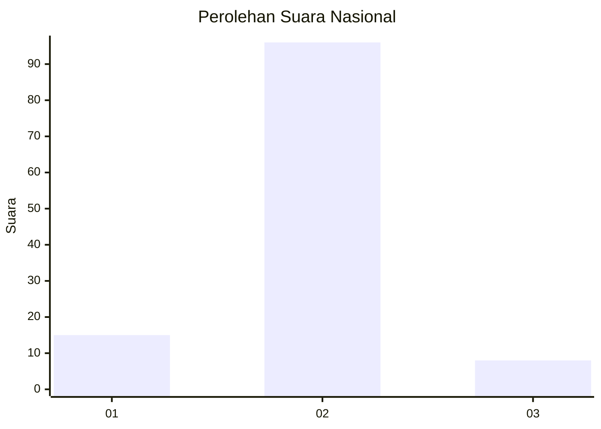
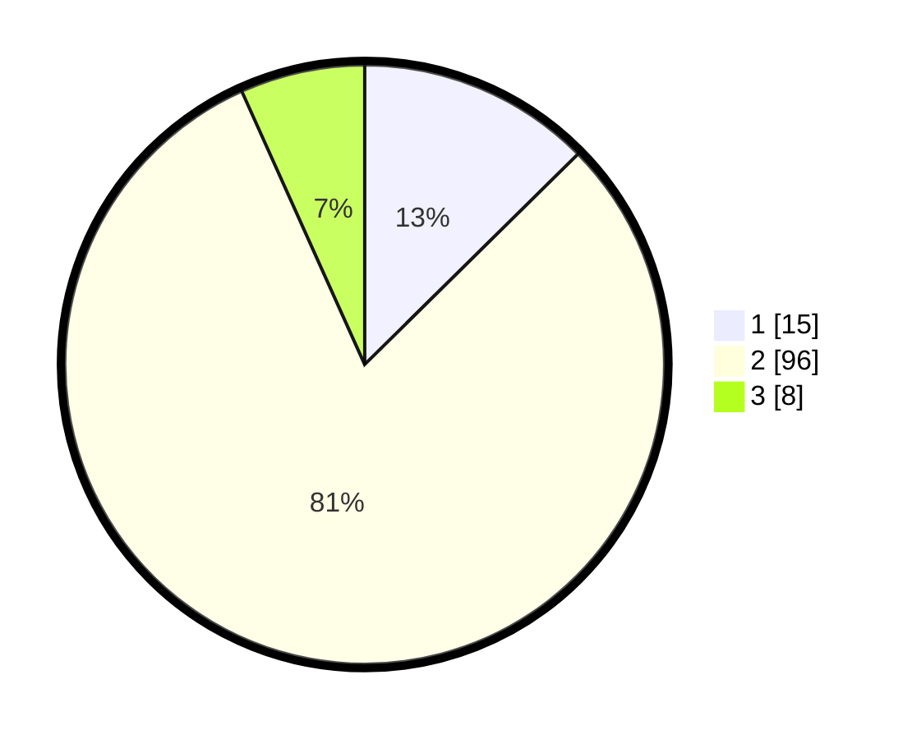

# Hasil

## Grafik

## Tabel

| No. | Nama Paslon    | Suara | Suara (raw) | Persentase |
|:--- |:-------------- | -----:| -----------:| ----------:|
| 1   | ANIES MUHAIMIN | 15    | [15][p-1]   | 12,61      |
| 2   | PRABOWO GIBRAN | 96    | [96][p-2]   | 80,67      |
| 3   | GANJAR MAHFUD  | 8     | [8][p-3]    | 6,72       |

[p-1]: https://github.com/gigit-pemilu/pemilu-2024/blob/main/pilpres/hitung-suara/sub/16-sumatera-selatan/sub/11-empat-lawang/sub/01-muara-pinang/sub/2019-muara-timbuk/sub/003-tps/sub/paslon-1.txt
[p-2]: https://github.com/gigit-pemilu/pemilu-2024/blob/main/pilpres/hitung-suara/sub/16-sumatera-selatan/sub/11-empat-lawang/sub/01-muara-pinang/sub/2019-muara-timbuk/sub/003-tps/sub/paslon-2.txt
[p-3]: https://github.com/gigit-pemilu/pemilu-2024/blob/main/pilpres/hitung-suara/sub/16-sumatera-selatan/sub/11-empat-lawang/sub/01-muara-pinang/sub/2019-muara-timbuk/sub/003-tps/sub/paslon-3.txt

## Foto C Plano

https://sirekap-obj-formc.kpu.go.id/54f4/pemilu/ppwp/16/11/01/20/19/1611012019003-20240220-013750--e4bb7721-02cf-4eaf-8ae8-20636ba5ca50.jpg

https://sirekap-obj-formc.kpu.go.id/54f4/pemilu/ppwp/16/11/01/20/19/1611012019003-20240220-013931--ec0dd04b-941f-44f9-a3d0-70893466eb3b.jpg

https://sirekap-obj-formc.kpu.go.id/54f4/pemilu/ppwp/16/11/01/20/19/1611012019003-20240220-014001--c8dd0fc6-8b31-4ff4-9dbd-50bba2bfb66c.jpg

## Metadata

| Key        | Value               |
| ---------- | ------------------- |
| Time Stamp | 2024-02-21 12:00:00 |

## DATA PEMILIH TETAP

Jumlah pemilih dalam DPT: **243**.
 * L: **131**.
 * P: **112**.

## DATA PENGGUNA HAK PILIH

Jumlah pengguna hak pilih dalam DPT: **230**.
 * L: **124**.
 * P: **106**.

Jumlah pengguna hak pilih dalam DPTb: **0**.
 * L: **0**.
 * P: **0**.

Jumlah pengguna hak pilih dalam DPK: **0**.
 * L: **0**.
 * P: **0**.

Jumlah pengguna hak pilih: **230**.
 * L: **124**.
 * P: **106**.

## JUMLAH SUARA SAH DAN TIDAK SAH

JUMLAH SELURUH SUARA SAH: **119**.

JUMLAH SUARA TIDAK SAH: **111**.

JUMLAH SELURUH SUARA SAH DAN SUARA TIDAK SAH: **230**.

