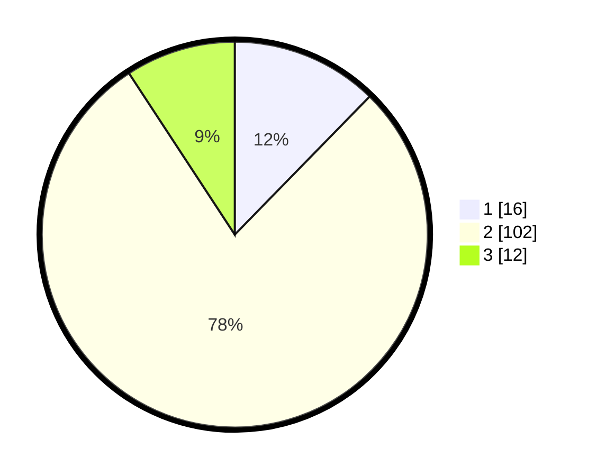

# Hasil

## Grafik

## Tabel

| No. | Nama Paslon    | Suara | Suara (raw) | Persentase |
|:--- |:-------------- | -----:| -----------:| ----------:|
| 1   | ANIES MUHAIMIN | 16    | [16][p-1]   | 12,31      |
| 2   | PRABOWO GIBRAN | 102   | [102][p-2]  | 78,46      |
| 3   | GANJAR MAHFUD  | 12    | [12][p-3]   | 9,23       |

[p-1]: https://github.com/gigit-pemilu/pemilu-2024-16-sumatera-selatan/blob/main/pilpres/hitung-suara/sub/16-sumatera-selatan/sub/11-empat-lawang/sub/01-muara-pinang/sub/2020-seleman-ilir/sub/002-tps/sub/paslon-1.txt
[p-2]: https://github.com/gigit-pemilu/pemilu-2024-16-sumatera-selatan/blob/main/pilpres/hitung-suara/sub/16-sumatera-selatan/sub/11-empat-lawang/sub/01-muara-pinang/sub/2020-seleman-ilir/sub/002-tps/sub/paslon-2.txt
[p-3]: https://github.com/gigit-pemilu/pemilu-2024-16-sumatera-selatan/blob/main/pilpres/hitung-suara/sub/16-sumatera-selatan/sub/11-empat-lawang/sub/01-muara-pinang/sub/2020-seleman-ilir/sub/002-tps/sub/paslon-3.txt

## Foto C Plano

https://sirekap-obj-formc.kpu.go.id/d714/pemilu/ppwp/16/11/01/20/20/1611012020002-20240215-004319--87e44faf-eb9b-42f5-b73b-3ce5f091b080.jpg

https://sirekap-obj-formc.kpu.go.id/d714/pemilu/ppwp/16/11/01/20/20/1611012020002-20240215-092603--8a789385-eb37-4fda-bdfe-1f11b50f92c8.jpg

https://sirekap-obj-formc.kpu.go.id/d714/pemilu/ppwp/16/11/01/20/20/1611012020002-20240215-095008--831241be-0725-402a-9a95-2ef9dff598b5.jpg

## Metadata

| Key        | Value               |
| ---------- | ------------------- |
| Time Stamp | 2024-02-25 20:00:00 |

