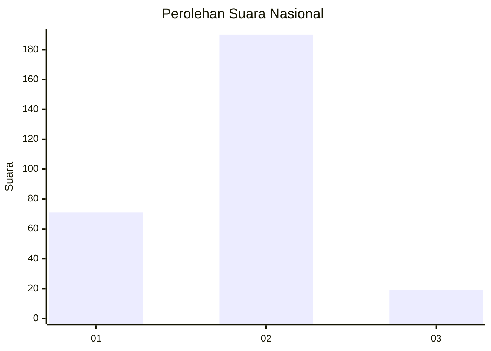
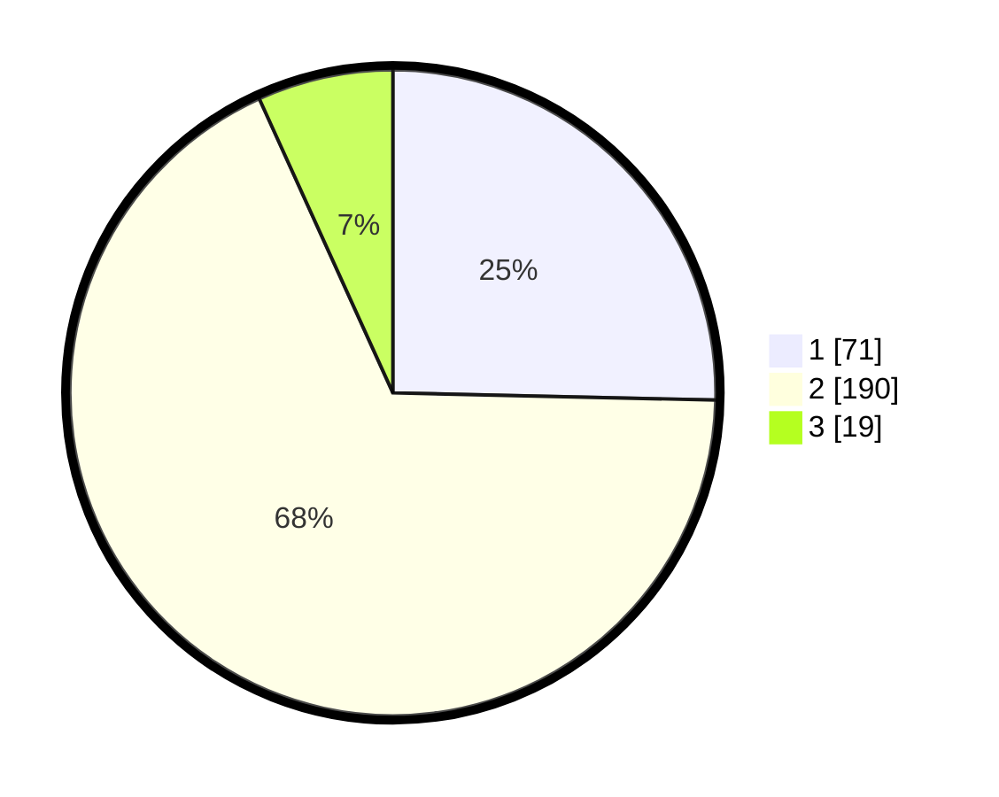

# Hasil

## Grafik

## Tabel

| No. | Nama Paslon    | Suara | Suara (raw) | Persentase |
|:--- |:-------------- | -----:| -----------:| ----------:|
| 1   | ANIES MUHAIMIN | 71    | [71][p-1]   | 25,36      |
| 2   | PRABOWO GIBRAN | 190   | [190][p-2]  | 67,86      |
| 3   | GANJAR MAHFUD  | 19    | [19][p-3]   | 6,79       |

[p-1]: https://github.com/gigit-pemilu/pemilu-2024/blob/main/pilpres/hitung-suara/sub/16-sumatera-selatan/sub/11-empat-lawang/sub/01-muara-pinang/sub/2022-sawah/sub/004-tps/sub/paslon-1.txt
[p-2]: https://github.com/gigit-pemilu/pemilu-2024/blob/main/pilpres/hitung-suara/sub/16-sumatera-selatan/sub/11-empat-lawang/sub/01-muara-pinang/sub/2022-sawah/sub/004-tps/sub/paslon-2.txt
[p-3]: https://github.com/gigit-pemilu/pemilu-2024/blob/main/pilpres/hitung-suara/sub/16-sumatera-selatan/sub/11-empat-lawang/sub/01-muara-pinang/sub/2022-sawah/sub/004-tps/sub/paslon-3.txt

## Foto C Plano

https://sirekap-obj-formc.kpu.go.id/942b/pemilu/ppwp/16/11/01/20/22/1611012022004-20240215-010228--4ae9b869-2b36-422a-8763-3e188771b069.jpg

https://sirekap-obj-formc.kpu.go.id/942b/pemilu/ppwp/16/11/01/20/22/1611012022004-20240215-003500--a3f4b074-0ac1-46c5-a8ae-e1d036a4ecf8.jpg

https://sirekap-obj-formc.kpu.go.id/942b/pemilu/ppwp/16/11/01/20/22/1611012022004-20240215-010608--d6ec3514-cf96-4196-ad67-69659258d7a7.jpg

## Metadata

| Key        | Value               |
| ---------- | ------------------- |
| Time Stamp | 2024-02-25 15:00:00 |

