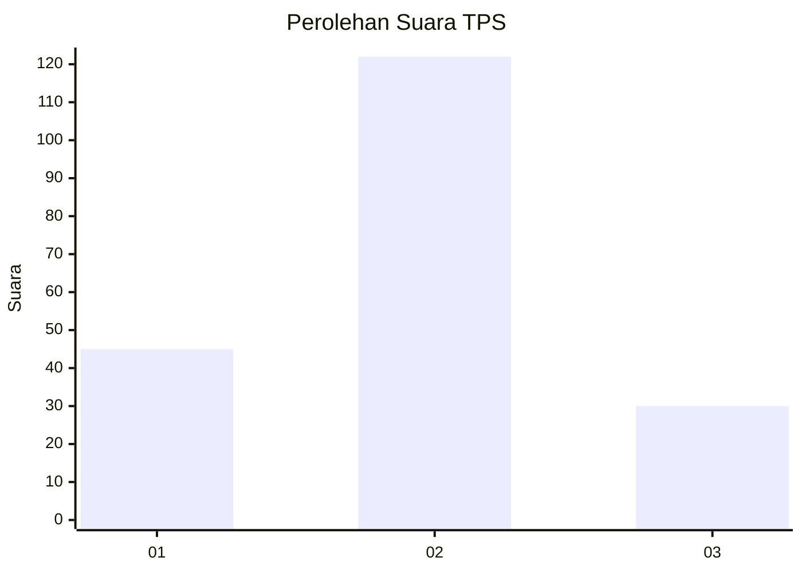
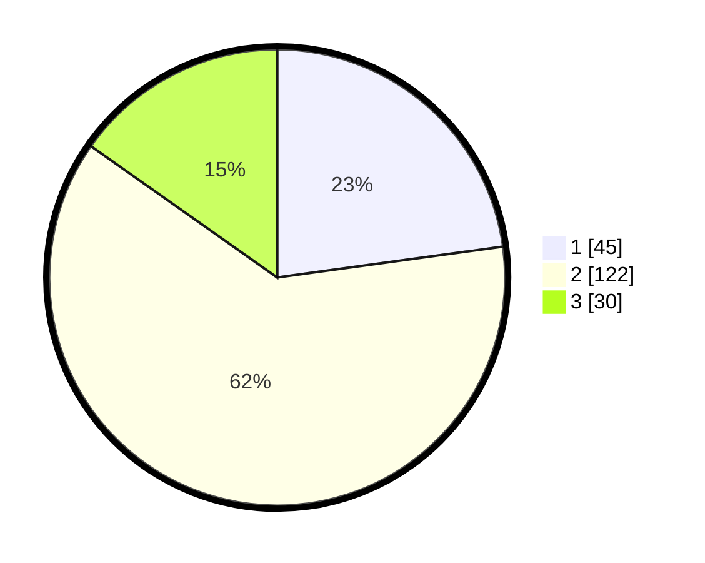

# Hasil

## Grafik

## Tabel

| No. | Nama Paslon    | Suara | Suara (raw) | Persentase |
|:--- |:-------------- | -----:| -----------:| ----------:|
| 1   | ANIES MUHAIMIN | 45    | [45][p-1]   | 22,84      |
| 2   | PRABOWO GIBRAN | 122   | [122][p-2]  | 61,93      |
| 3   | GANJAR MAHFUD  | 30    | [30][p-3]   | 15,23      |

[p-1]: https://github.com/gigit-pemilu/pemilu-2024-16-sumatera-selatan/blob/main/pilpres/hitung-suara/sub/16-sumatera-selatan/sub/11-empat-lawang/sub/02-pendopo/sub/1018-beruge-ilir/sub/012-tps/sub/paslon-1.txt
[p-2]: https://github.com/gigit-pemilu/pemilu-2024-16-sumatera-selatan/blob/main/pilpres/hitung-suara/sub/16-sumatera-selatan/sub/11-empat-lawang/sub/02-pendopo/sub/1018-beruge-ilir/sub/012-tps/sub/paslon-2.txt
[p-3]: https://github.com/gigit-pemilu/pemilu-2024-16-sumatera-selatan/blob/main/pilpres/hitung-suara/sub/16-sumatera-selatan/sub/11-empat-lawang/sub/02-pendopo/sub/1018-beruge-ilir/sub/012-tps/sub/paslon-3.txt

## Foto C Plano

https://sirekap-obj-formc.kpu.go.id/b1a3/pemilu/ppwp/16/11/02/10/18/1611021018012-20240214-141212--ad5e1b0d-8e78-4fe8-bc73-60a1f80889d3.jpg

https://sirekap-obj-formc.kpu.go.id/b1a3/pemilu/ppwp/16/11/02/10/18/1611021018012-20240214-141731--199f1118-649b-4a81-ac95-0050ad441ee3.jpg

https://sirekap-obj-formc.kpu.go.id/b1a3/pemilu/ppwp/16/11/02/10/18/1611021018012-20240214-141437--dbe6926f-a513-4420-8daf-3d3adf0eefdf.jpg

## Metadata

| Key        | Value               |
| ---------- | ------------------- |
| Time Stamp | 2024-02-16 21:01:00 |

