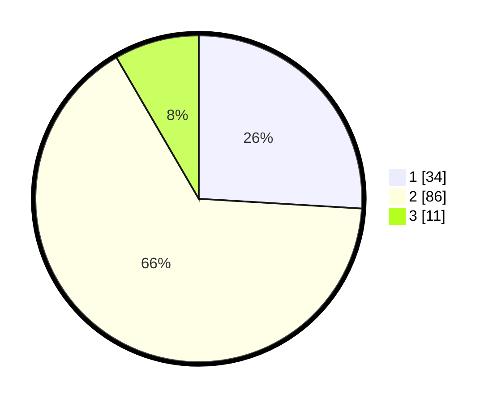

# Hasil

## Grafik

## Tabel

| No. | Nama Paslon    | Suara | Suara (raw) | Persentase |
|:--- |:-------------- | -----:| -----------:| ----------:|
| 1   | ANIES MUHAIMIN | 34    | [34][p-1]   | 25,95      |
| 2   | PRABOWO GIBRAN | 86    | [86][p-2]   | 65,65      |
| 3   | GANJAR MAHFUD  | 11    | [11][p-3]   | 8,40       |

[p-1]: https://github.com/gigit-pemilu/pemilu-2024-16-sumatera-selatan/blob/main/pilpres/hitung-suara/sub/16-sumatera-selatan/sub/11-empat-lawang/sub/02-pendopo/sub/1030-pendopo/sub/010-tps/sub/paslon-1.txt
[p-2]: https://github.com/gigit-pemilu/pemilu-2024-16-sumatera-selatan/blob/main/pilpres/hitung-suara/sub/16-sumatera-selatan/sub/11-empat-lawang/sub/02-pendopo/sub/1030-pendopo/sub/010-tps/sub/paslon-2.txt
[p-3]: https://github.com/gigit-pemilu/pemilu-2024-16-sumatera-selatan/blob/main/pilpres/hitung-suara/sub/16-sumatera-selatan/sub/11-empat-lawang/sub/02-pendopo/sub/1030-pendopo/sub/010-tps/sub/paslon-3.txt

## Foto C Plano

https://sirekap-obj-formc.kpu.go.id/05d1/pemilu/ppwp/16/11/02/10/30/1611021030010-20240214-235538--b2908712-e7be-4761-8b1b-a16110d805e7.jpg

https://sirekap-obj-formc.kpu.go.id/05d1/pemilu/ppwp/16/11/02/10/30/1611021030010-20240214-235852--df6661a3-3459-4844-bb43-0f9eda7ddc8c.jpg

## Metadata

| Key        | Value               |
| ---------- | ------------------- |
| Time Stamp | 2024-02-25 16:00:00 |

