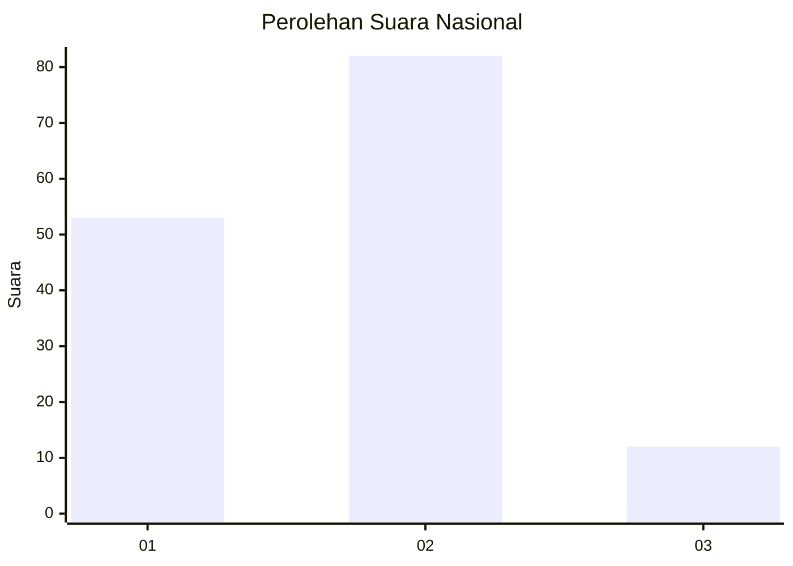
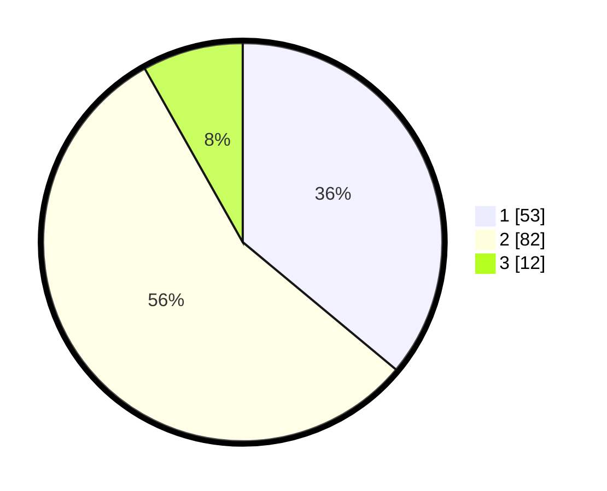

# Hasil

## Grafik

## Tabel

| No. | Nama Paslon    | Suara | Suara (raw) | Persentase |
|:--- |:-------------- | -----:| -----------:| ----------:|
| 1   | ANIES MUHAIMIN | 53    | [53][p-1]   | 36,05      |
| 2   | PRABOWO GIBRAN | 82    | [82][p-2]   | 55,78      |
| 3   | GANJAR MAHFUD  | 12    | [12][p-3]   | 8,16       |

[p-1]: https://github.com/gigit-pemilu/pemilu-2024/blob/main/pilpres/hitung-suara/sub/16-sumatera-selatan/sub/11-empat-lawang/sub/02-pendopo/sub/1030-pendopo/sub/014-tps/sub/paslon-1.txt
[p-2]: https://github.com/gigit-pemilu/pemilu-2024/blob/main/pilpres/hitung-suara/sub/16-sumatera-selatan/sub/11-empat-lawang/sub/02-pendopo/sub/1030-pendopo/sub/014-tps/sub/paslon-2.txt
[p-3]: https://github.com/gigit-pemilu/pemilu-2024/blob/main/pilpres/hitung-suara/sub/16-sumatera-selatan/sub/11-empat-lawang/sub/02-pendopo/sub/1030-pendopo/sub/014-tps/sub/paslon-3.txt

## Foto C Plano

https://sirekap-obj-formc.kpu.go.id/32e0/pemilu/ppwp/16/11/02/10/30/1611021030014-20240215-164325--1ea2afc5-ece6-4dfe-98cd-6d44adc57a5d.jpg

https://sirekap-obj-formc.kpu.go.id/32e0/pemilu/ppwp/16/11/02/10/30/1611021030014-20240215-164459--e72510bc-71df-4846-9980-03d328c1a716.jpg

https://sirekap-obj-formc.kpu.go.id/32e0/pemilu/ppwp/16/11/02/10/30/1611021030014-20240215-164740--219ab296-2f64-43d7-8ab1-042472d5c75c.jpg

## Metadata

| Key        | Value               |
| ---------- | ------------------- |
| Time Stamp | 2024-02-16 23:00:00 |

