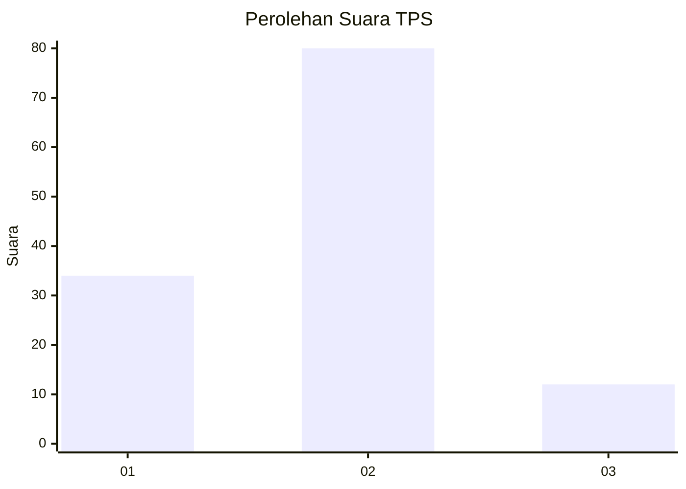
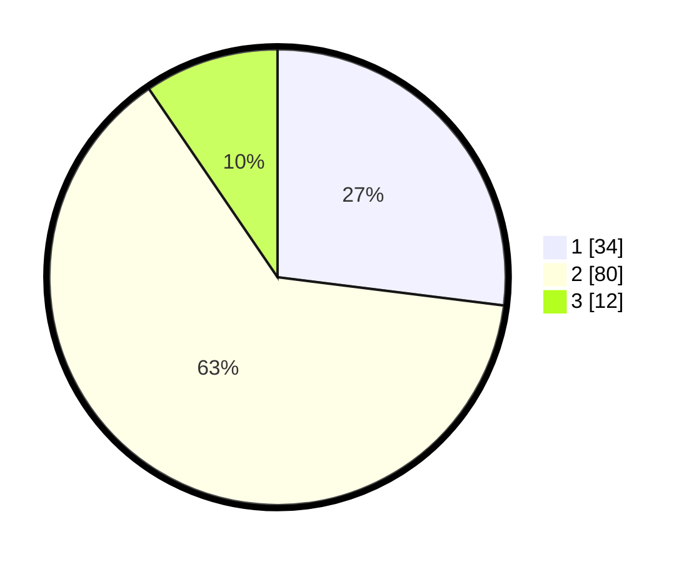

# Hasil

## Grafik

## Tabel

| No. | Nama Paslon    | Suara | Suara (raw) | Persentase |
|:--- |:-------------- | -----:| -----------:| ----------:|
| 1   | ANIES MUHAIMIN | 34    | [34][p-1]   | 26,98      |
| 2   | PRABOWO GIBRAN | 80    | [80][p-2]   | 63,49      |
| 3   | GANJAR MAHFUD  | 12    | [12][p-3]   | 9,52       |

[p-1]: https://github.com/gigit-pemilu/pemilu-2024-16-sumatera-selatan/blob/main/pilpres/hitung-suara/sub/16-sumatera-selatan/sub/11-empat-lawang/sub/02-pendopo/sub/1030-pendopo/sub/019-tps/sub/paslon-1.txt
[p-2]: https://github.com/gigit-pemilu/pemilu-2024-16-sumatera-selatan/blob/main/pilpres/hitung-suara/sub/16-sumatera-selatan/sub/11-empat-lawang/sub/02-pendopo/sub/1030-pendopo/sub/019-tps/sub/paslon-2.txt
[p-3]: https://github.com/gigit-pemilu/pemilu-2024-16-sumatera-selatan/blob/main/pilpres/hitung-suara/sub/16-sumatera-selatan/sub/11-empat-lawang/sub/02-pendopo/sub/1030-pendopo/sub/019-tps/sub/paslon-3.txt

## Foto C Plano

https://sirekap-obj-formc.kpu.go.id/caf1/pemilu/ppwp/16/11/02/10/30/1611021030019-20240215-144128--860fac88-74d4-4239-af27-6e5a3b2df808.jpg

https://sirekap-obj-formc.kpu.go.id/caf1/pemilu/ppwp/16/11/02/10/30/1611021030019-20240215-144326--0cdbec3a-4948-42eb-9742-787054189fc8.jpg

https://sirekap-obj-formc.kpu.go.id/caf1/pemilu/ppwp/16/11/02/10/30/1611021030019-20240215-215331--cbb4afc5-4e7d-48bb-82a6-d6ff62aaaadf.jpg

## Metadata

| Key        | Value               |
| ---------- | ------------------- |
| Time Stamp | 2024-02-26 12:00:00 |

