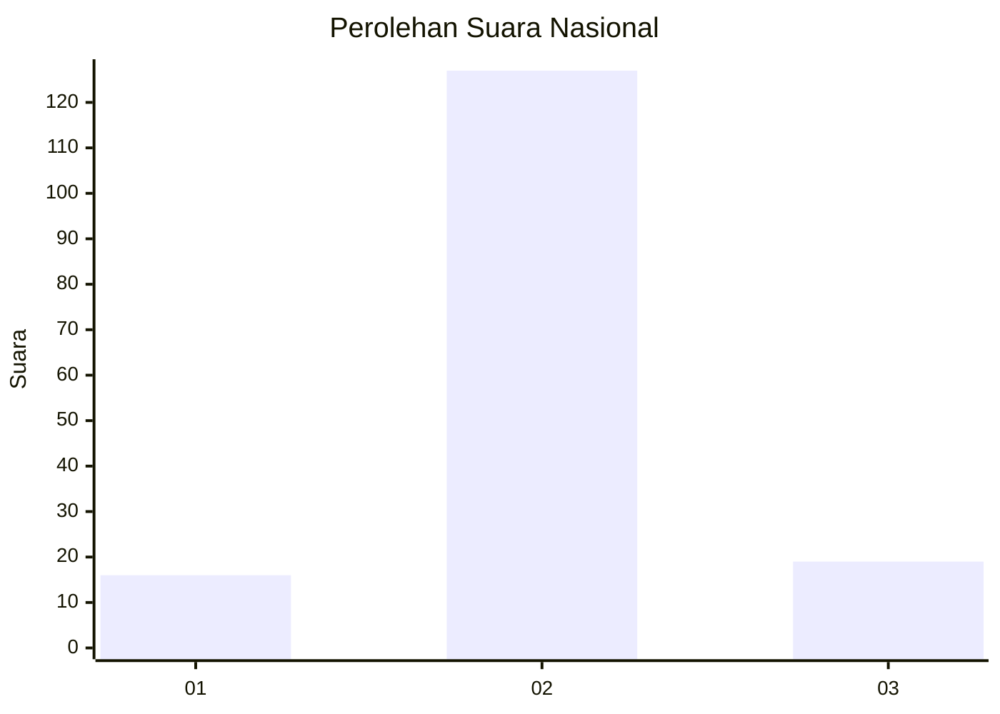
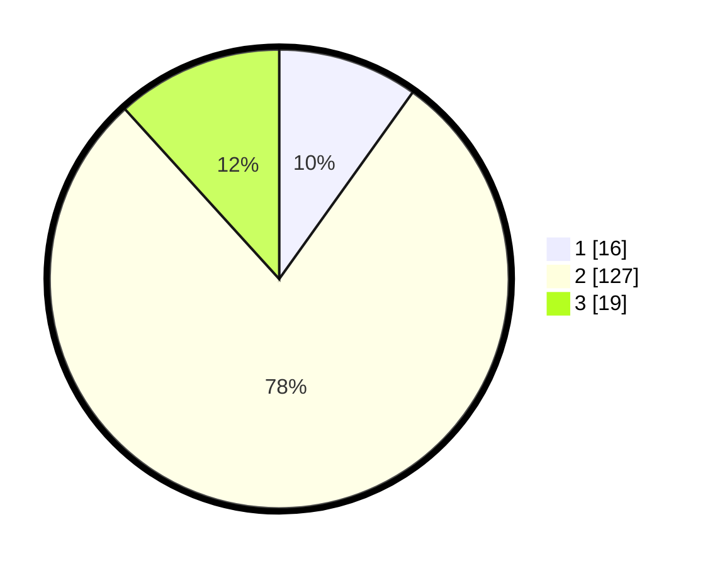

# Hasil

## Grafik

## Tabel

| No. | Nama Paslon    | Suara | Suara (raw) | Persentase |
|:--- |:-------------- | -----:| -----------:| ----------:|
| 1   | ANIES MUHAIMIN | 16    | [16][p-1]   | 9,88       |
| 2   | PRABOWO GIBRAN | 127   | [127][p-2]  | 78,40      |
| 3   | GANJAR MAHFUD  | 19    | [19][p-3]   | 11,73      |

[p-1]: https://github.com/gigit-pemilu/pemilu-2024/blob/main/pilpres/hitung-suara/sub/16-sumatera-selatan/sub/11-empat-lawang/sub/02-pendopo/sub/2001-jarakan/sub/004-tps/sub/paslon-1.txt
[p-2]: https://github.com/gigit-pemilu/pemilu-2024/blob/main/pilpres/hitung-suara/sub/16-sumatera-selatan/sub/11-empat-lawang/sub/02-pendopo/sub/2001-jarakan/sub/004-tps/sub/paslon-2.txt
[p-3]: https://github.com/gigit-pemilu/pemilu-2024/blob/main/pilpres/hitung-suara/sub/16-sumatera-selatan/sub/11-empat-lawang/sub/02-pendopo/sub/2001-jarakan/sub/004-tps/sub/paslon-3.txt

## Foto C Plano

https://sirekap-obj-formc.kpu.go.id/b5fd/pemilu/ppwp/16/11/02/20/01/1611022001004-20240214-234419--8bf3c9d7-91ee-4ec5-9c2d-6fa5321667c4.jpg

https://sirekap-obj-formc.kpu.go.id/b5fd/pemilu/ppwp/16/11/02/20/01/1611022001004-20240214-234523--ffffec3e-bf98-437d-906e-85dbdbe64fcd.jpg

https://sirekap-obj-formc.kpu.go.id/b5fd/pemilu/ppwp/16/11/02/20/01/1611022001004-20240214-234622--befde78d-8b46-48ab-8e8e-01ebeeff58dd.jpg

## Metadata

| Key        | Value               |
| ---------- | ------------------- |
| Time Stamp | 2024-02-16 21:01:00 |

