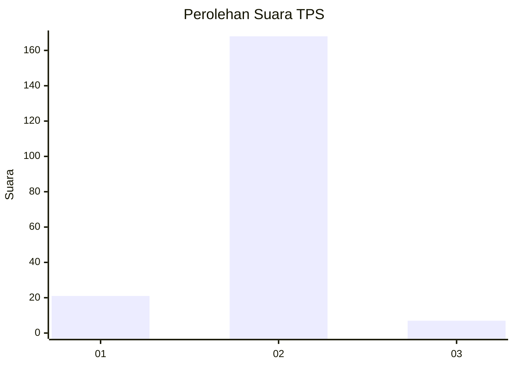
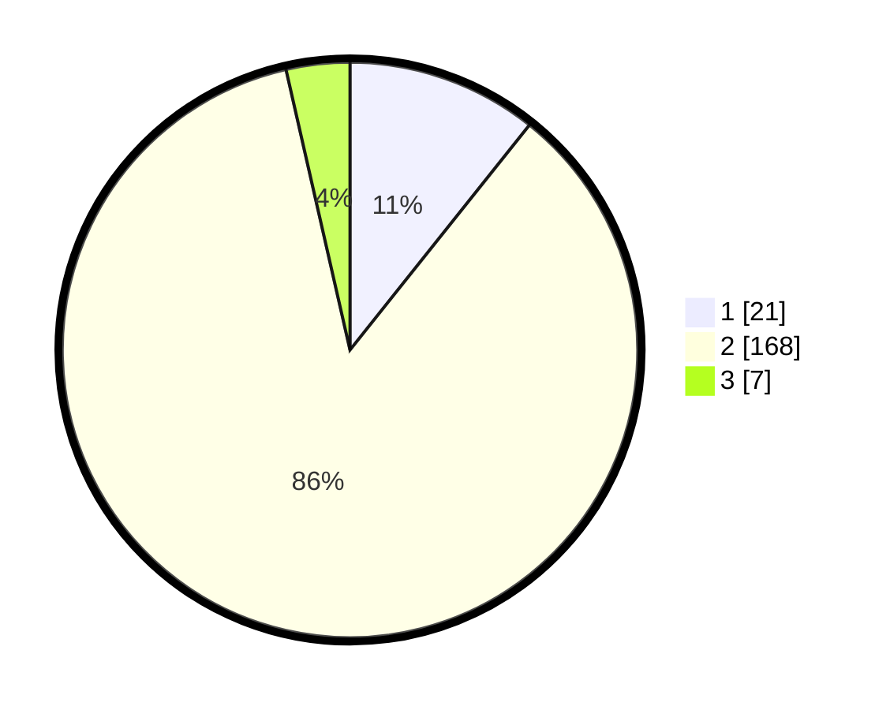

# Hasil

## Grafik

## Tabel

| No. | Nama Paslon    | Suara | Suara (raw) | Persentase |
|:--- |:-------------- | -----:| -----------:| ----------:|
| 1   | ANIES MUHAIMIN | 21    | [21][p-1]   | 10,71      |
| 2   | PRABOWO GIBRAN | 168   | [168][p-2]  | 85,71      |
| 3   | GANJAR MAHFUD  | 7     | [7][p-3]    | 3,57       |

[p-1]: https://github.com/gigit-pemilu/pemilu-2024-16-sumatera-selatan/blob/main/pilpres/hitung-suara/sub/16-sumatera-selatan/sub/11-empat-lawang/sub/02-pendopo/sub/2002-bandar-agung/sub/002-tps/sub/paslon-1.txt
[p-2]: https://github.com/gigit-pemilu/pemilu-2024-16-sumatera-selatan/blob/main/pilpres/hitung-suara/sub/16-sumatera-selatan/sub/11-empat-lawang/sub/02-pendopo/sub/2002-bandar-agung/sub/002-tps/sub/paslon-2.txt
[p-3]: https://github.com/gigit-pemilu/pemilu-2024-16-sumatera-selatan/blob/main/pilpres/hitung-suara/sub/16-sumatera-selatan/sub/11-empat-lawang/sub/02-pendopo/sub/2002-bandar-agung/sub/002-tps/sub/paslon-3.txt

## Foto C Plano

https://sirekap-obj-formc.kpu.go.id/4668/pemilu/ppwp/16/11/02/20/02/1611022002002-20240215-143227--0e7e43e4-fdba-443b-b2f7-d2a4431834f2.jpg

https://sirekap-obj-formc.kpu.go.id/4668/pemilu/ppwp/16/11/02/20/02/1611022002002-20240215-143258--548c34ae-c3d2-432f-942b-c5b7cad45054.jpg

https://sirekap-obj-formc.kpu.go.id/4668/pemilu/ppwp/16/11/02/20/02/1611022002002-20240215-143321--4d3614c3-17ed-4f83-9f12-7ee7d9b4f396.jpg

## Metadata

| Key        | Value               |
| ---------- | ------------------- |
| Time Stamp | 2024-02-16 21:01:00 |

