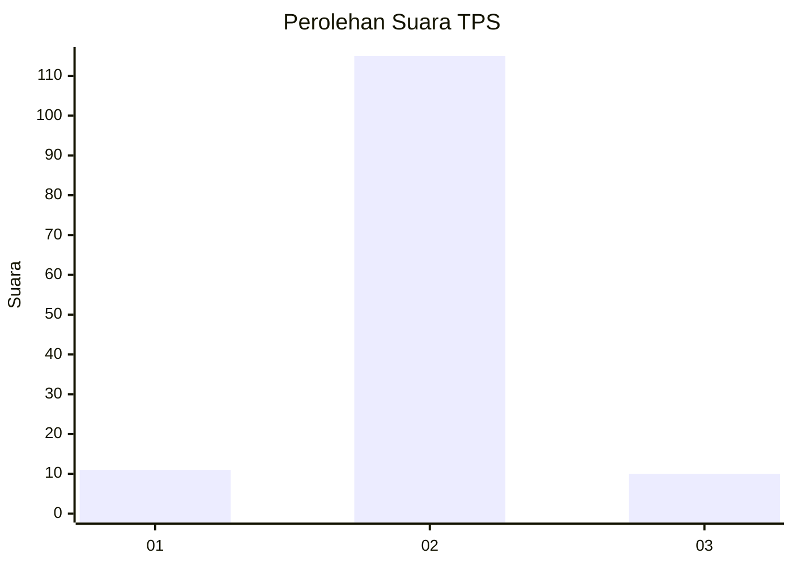
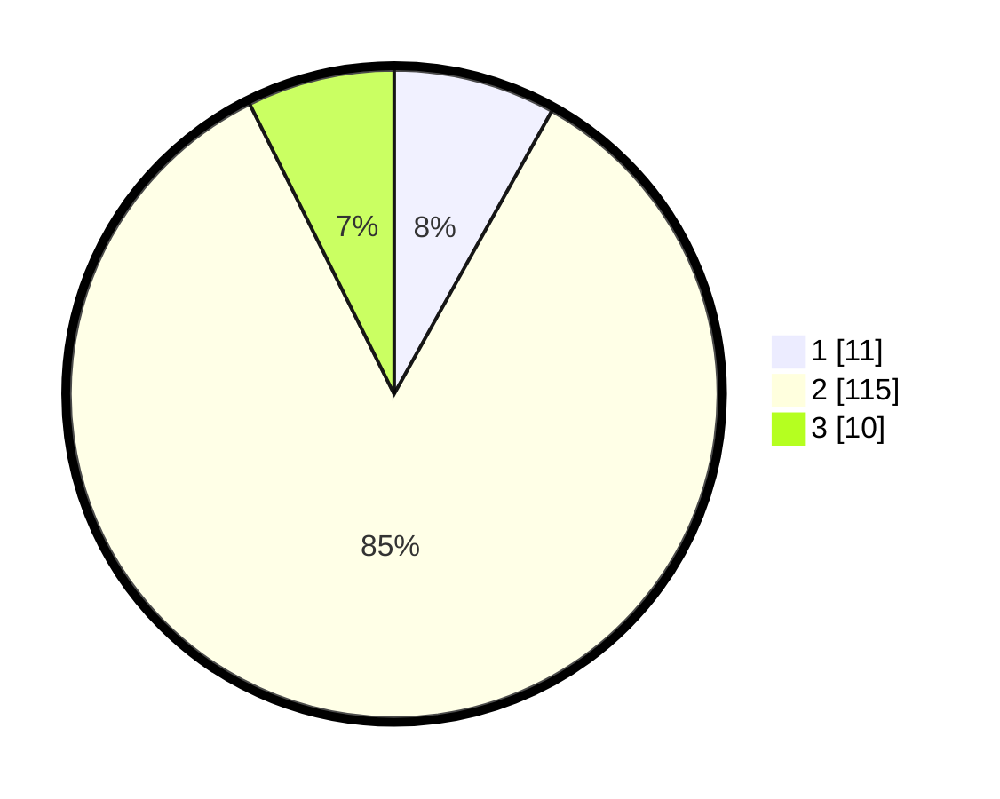

# Hasil

## Grafik

## Tabel

| No. | Nama Paslon    | Suara | Suara (raw) | Persentase |
|:--- |:-------------- | -----:| -----------:| ----------:|
| 1   | ANIES MUHAIMIN | 11    | [11][p-1]   | 8,09       |
| 2   | PRABOWO GIBRAN | 115   | [115][p-2]  | 84,56      |
| 3   | GANJAR MAHFUD  | 10    | [10][p-3]   | 7,35       |

[p-1]: https://github.com/gigit-pemilu/pemilu-2024-16-sumatera-selatan/blob/main/pilpres/hitung-suara/sub/16-sumatera-selatan/sub/11-empat-lawang/sub/02-pendopo/sub/2004-lubuk-layang/sub/002-tps/sub/paslon-1.txt
[p-2]: https://github.com/gigit-pemilu/pemilu-2024-16-sumatera-selatan/blob/main/pilpres/hitung-suara/sub/16-sumatera-selatan/sub/11-empat-lawang/sub/02-pendopo/sub/2004-lubuk-layang/sub/002-tps/sub/paslon-2.txt
[p-3]: https://github.com/gigit-pemilu/pemilu-2024-16-sumatera-selatan/blob/main/pilpres/hitung-suara/sub/16-sumatera-selatan/sub/11-empat-lawang/sub/02-pendopo/sub/2004-lubuk-layang/sub/002-tps/sub/paslon-3.txt

## Foto C Plano

https://sirekap-obj-formc.kpu.go.id/8239/pemilu/ppwp/16/11/02/20/04/1611022004002-20240215-003027--455d13d5-6c60-4a80-ab7b-170e472d755e.jpg

https://sirekap-obj-formc.kpu.go.id/8239/pemilu/ppwp/16/11/02/20/04/1611022004002-20240215-004021--cfa23828-efc7-44c4-88e3-7cb1e0abead7.jpg

https://sirekap-obj-formc.kpu.go.id/8239/pemilu/ppwp/16/11/02/20/04/1611022004002-20240216-133005--7893f377-eaae-4743-815e-b3dbb1a424aa.jpg

## Metadata

| Key        | Value               |
| ---------- | ------------------- |
| Time Stamp | 2024-02-25 12:00:00 |

