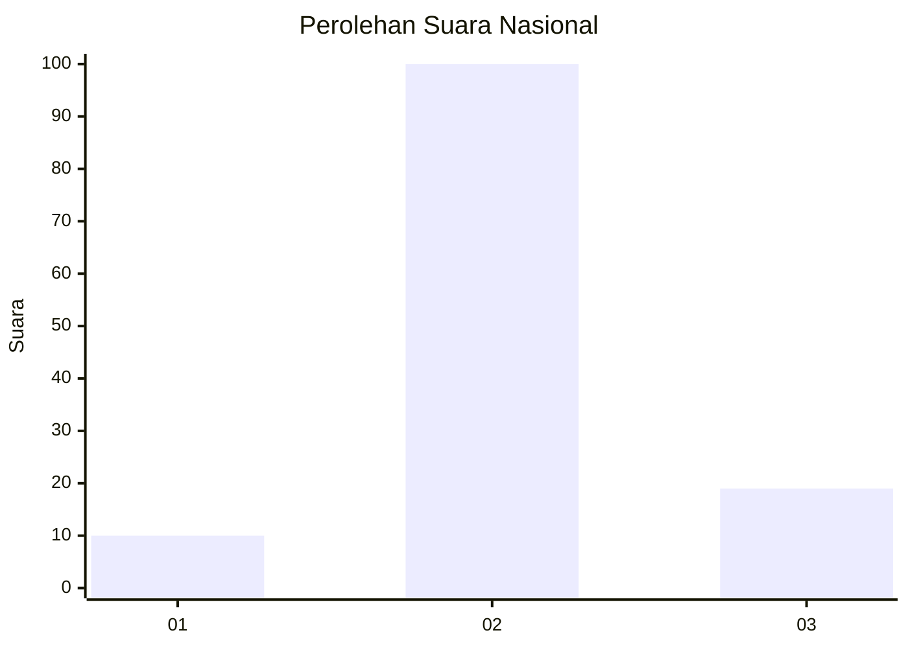

# Hasil

## Grafik

## Tabel

| No. | Nama Paslon    | Suara | Suara (raw) | Persentase |
|:--- |:-------------- | -----:| -----------:| ----------:|
| 1   | ANIES MUHAIMIN | 10    | [10][p-1]   | 7,75       |
| 2   | PRABOWO GIBRAN | 100   | [100][p-2]  | 77,52      |
| 3   | GANJAR MAHFUD  | 19    | [19][p-3]   | 14,73      |

[p-1]: https://github.com/gigit-pemilu/pemilu-2024/blob/main/pilpres/hitung-suara/sub/16-sumatera-selatan/sub/11-empat-lawang/sub/02-pendopo/sub/2004-lubuk-layang/sub/007-tps/sub/paslon-1.txt
[p-2]: https://github.com/gigit-pemilu/pemilu-2024/blob/main/pilpres/hitung-suara/sub/16-sumatera-selatan/sub/11-empat-lawang/sub/02-pendopo/sub/2004-lubuk-layang/sub/007-tps/sub/paslon-2.txt
[p-3]: https://github.com/gigit-pemilu/pemilu-2024/blob/main/pilpres/hitung-suara/sub/16-sumatera-selatan/sub/11-empat-lawang/sub/02-pendopo/sub/2004-lubuk-layang/sub/007-tps/sub/paslon-3.txt

## Foto C Plano

https://sirekap-obj-formc.kpu.go.id/7d17/pemilu/ppwp/16/11/02/20/04/1611022004007-20240214-225934--37d0ac12-7aa8-42a9-bce9-8196cd47aeac.jpg

https://sirekap-obj-formc.kpu.go.id/7d17/pemilu/ppwp/16/11/02/20/04/1611022004007-20240214-230023--f523b84e-9e48-4256-ad87-b957c3c2c7c9.jpg

https://sirekap-obj-formc.kpu.go.id/7d17/pemilu/ppwp/16/11/02/20/04/1611022004007-20240214-230115--0a338e7c-c789-45be-8acf-0ad4735234d3.jpg

## Metadata

| Key        | Value               |
| ---------- | ------------------- |
| Time Stamp | 2024-02-25 20:00:00 |

