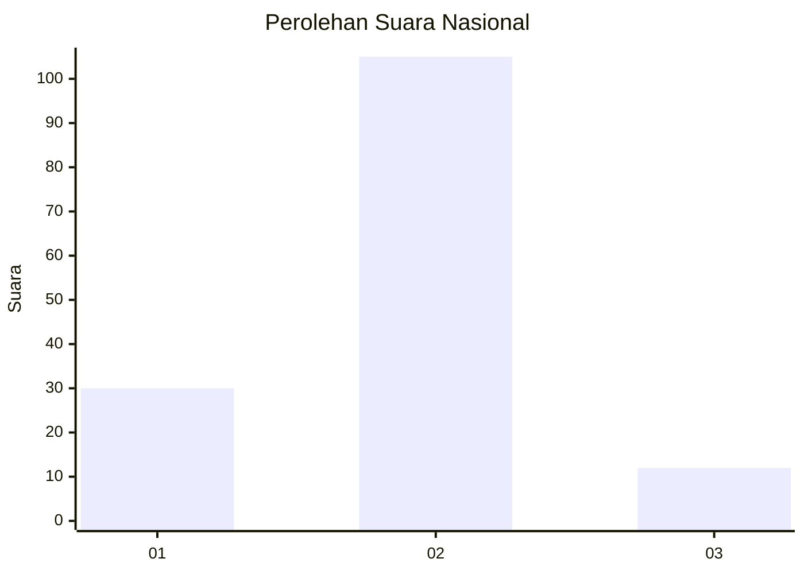
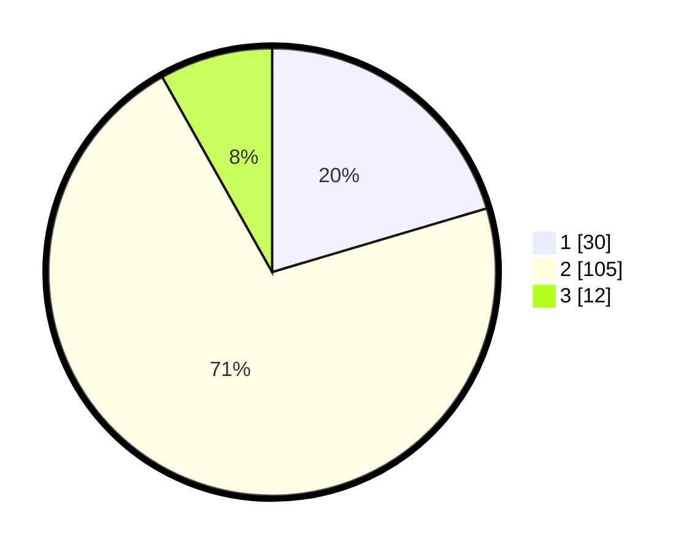

# Hasil

## Grafik

## Tabel

| No. | Nama Paslon    | Suara | Suara (raw) | Persentase |
|:--- |:-------------- | -----:| -----------:| ----------:|
| 1   | ANIES MUHAIMIN | 30    | [30][p-1]   | 20,41      |
| 2   | PRABOWO GIBRAN | 105   | [105][p-2]  | 71,43      |
| 3   | GANJAR MAHFUD  | 12    | [12][p-3]   | 8,16       |

[p-1]: https://github.com/gigit-pemilu/pemilu-2024/blob/main/pilpres/hitung-suara/sub/16-sumatera-selatan/sub/11-empat-lawang/sub/02-pendopo/sub/2004-lubuk-layang/sub/008-tps/sub/paslon-1.txt
[p-2]: https://github.com/gigit-pemilu/pemilu-2024/blob/main/pilpres/hitung-suara/sub/16-sumatera-selatan/sub/11-empat-lawang/sub/02-pendopo/sub/2004-lubuk-layang/sub/008-tps/sub/paslon-2.txt
[p-3]: https://github.com/gigit-pemilu/pemilu-2024/blob/main/pilpres/hitung-suara/sub/16-sumatera-selatan/sub/11-empat-lawang/sub/02-pendopo/sub/2004-lubuk-layang/sub/008-tps/sub/paslon-3.txt

## Foto C Plano

https://sirekap-obj-formc.kpu.go.id/6b3f/pemilu/ppwp/16/11/02/20/04/1611022004008-20240214-233641--54c213f6-a7d9-4a28-8de8-98adf9b68b54.jpg

https://sirekap-obj-formc.kpu.go.id/6b3f/pemilu/ppwp/16/11/02/20/04/1611022004008-20240214-233830--29838191-9f6a-4879-975f-c5171c97be76.jpg

https://sirekap-obj-formc.kpu.go.id/6b3f/pemilu/ppwp/16/11/02/20/04/1611022004008-20240214-233956--f4c8a5f1-3511-4365-8f18-5f7900ff77e2.jpg

## Metadata

| Key        | Value               |
| ---------- | ------------------- |
| Time Stamp | 2024-02-16 22:01:00 |

