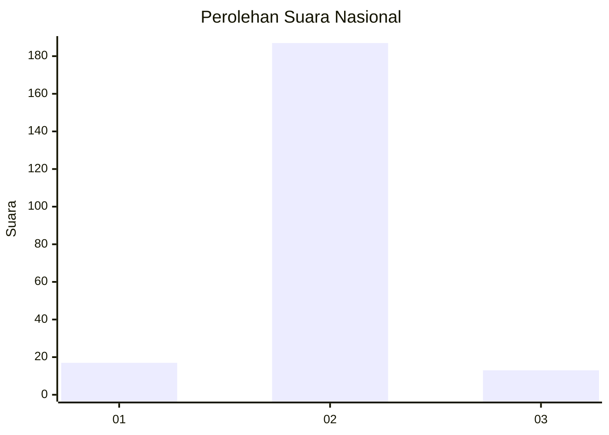
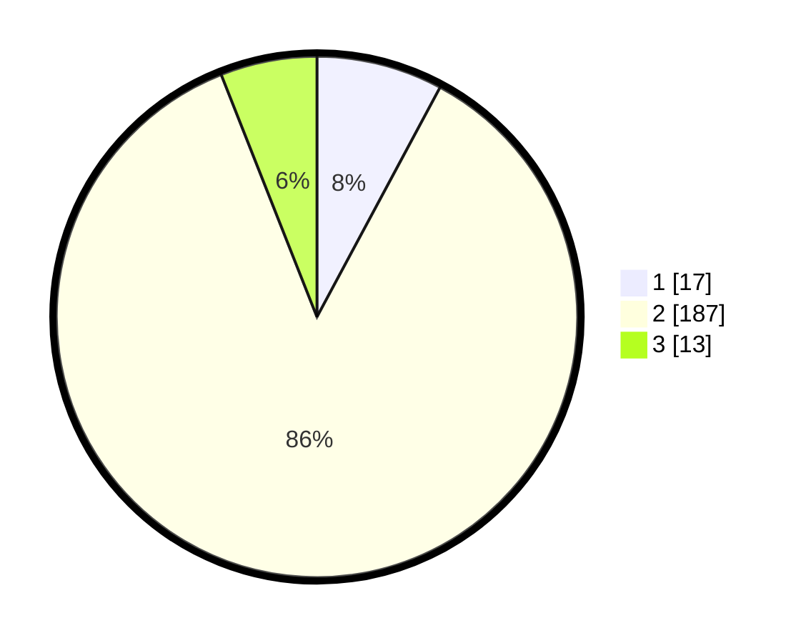

# Hasil

## Grafik

## Tabel

| No. | Nama Paslon    | Suara | Suara (raw) | Persentase |
|:--- |:-------------- | -----:| -----------:| ----------:|
| 1   | ANIES MUHAIMIN | 17    | [17][p-1]   | 7,83       |
| 2   | PRABOWO GIBRAN | 187   | [187][p-2]  | 86,18      |
| 3   | GANJAR MAHFUD  | 13    | [13][p-3]   | 5,99       |

[p-1]: https://github.com/gigit-pemilu/pemilu-2024/blob/main/pilpres/hitung-suara/sub/16-sumatera-selatan/sub/11-empat-lawang/sub/02-pendopo/sub/2007-tanjung-raman/sub/001-tps/sub/paslon-1.txt
[p-2]: https://github.com/gigit-pemilu/pemilu-2024/blob/main/pilpres/hitung-suara/sub/16-sumatera-selatan/sub/11-empat-lawang/sub/02-pendopo/sub/2007-tanjung-raman/sub/001-tps/sub/paslon-2.txt
[p-3]: https://github.com/gigit-pemilu/pemilu-2024/blob/main/pilpres/hitung-suara/sub/16-sumatera-selatan/sub/11-empat-lawang/sub/02-pendopo/sub/2007-tanjung-raman/sub/001-tps/sub/paslon-3.txt

## Foto C Plano

https://sirekap-obj-formc.kpu.go.id/3c94/pemilu/ppwp/16/11/02/20/07/1611022007001-20240215-115544--630b06f2-8e66-4b37-9f3f-d2ac20fcbe16.jpg

https://sirekap-obj-formc.kpu.go.id/3c94/pemilu/ppwp/16/11/02/20/07/1611022007001-20240215-115919--d4bed6db-91fc-407e-8bb3-917b03c919ff.jpg

https://sirekap-obj-formc.kpu.go.id/3c94/pemilu/ppwp/16/11/02/20/07/1611022007001-20240215-120218--4288adb9-4bb7-4f27-8f69-acce772c95db.jpg

## Metadata

| Key        | Value               |
| ---------- | ------------------- |
| Time Stamp | 2024-02-25 12:00:00 |

