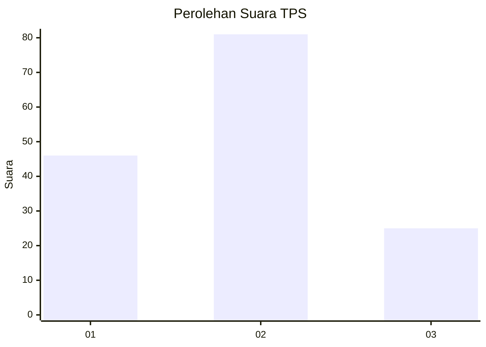
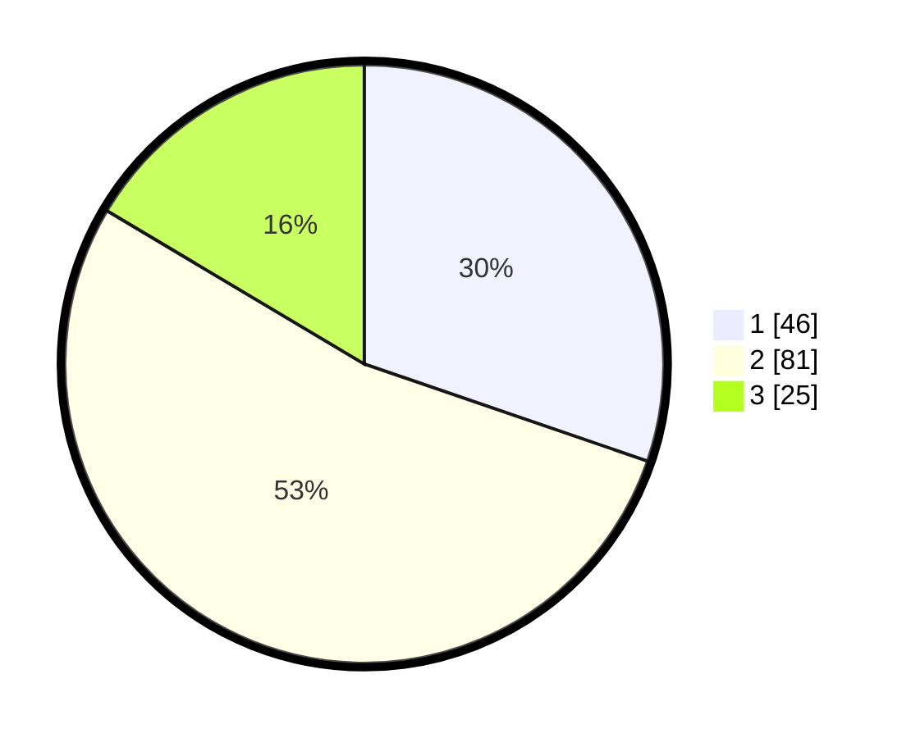

# Hasil

## Grafik

## Tabel

| No. | Nama Paslon    | Suara | Suara (raw) | Persentase |
|:--- |:-------------- | -----:| -----------:| ----------:|
| 1   | ANIES MUHAIMIN | 46    | [46][p-1]   | 30,26      |
| 2   | PRABOWO GIBRAN | 81    | [81][p-2]   | 53,29      |
| 3   | GANJAR MAHFUD  | 25    | [25][p-3]   | 16,45      |

[p-1]: https://github.com/gigit-pemilu/pemilu-2024-16-sumatera-selatan/blob/main/pilpres/hitung-suara/sub/16-sumatera-selatan/sub/11-empat-lawang/sub/02-pendopo/sub/2022-gn-meraksa-baru/sub/003-tps/sub/paslon-1.txt
[p-2]: https://github.com/gigit-pemilu/pemilu-2024-16-sumatera-selatan/blob/main/pilpres/hitung-suara/sub/16-sumatera-selatan/sub/11-empat-lawang/sub/02-pendopo/sub/2022-gn-meraksa-baru/sub/003-tps/sub/paslon-2.txt
[p-3]: https://github.com/gigit-pemilu/pemilu-2024-16-sumatera-selatan/blob/main/pilpres/hitung-suara/sub/16-sumatera-selatan/sub/11-empat-lawang/sub/02-pendopo/sub/2022-gn-meraksa-baru/sub/003-tps/sub/paslon-3.txt

## Foto C Plano

https://sirekap-obj-formc.kpu.go.id/856e/pemilu/ppwp/16/11/02/20/22/1611022022003-20240214-203652--26d84456-ee82-4bbc-862d-4a0d7af93548.jpg

https://sirekap-obj-formc.kpu.go.id/856e/pemilu/ppwp/16/11/02/20/22/1611022022003-20240214-204226--d5bc498b-0067-47e5-be46-0bf436b3a573.jpg

https://sirekap-obj-formc.kpu.go.id/856e/pemilu/ppwp/16/11/02/20/22/1611022022003-20240214-204350--1e0cb599-8a42-4320-a0d4-6e0f2b823369.jpg

## Metadata

| Key        | Value               |
| ---------- | ------------------- |
| Time Stamp | 2024-02-24 22:31:28 |

