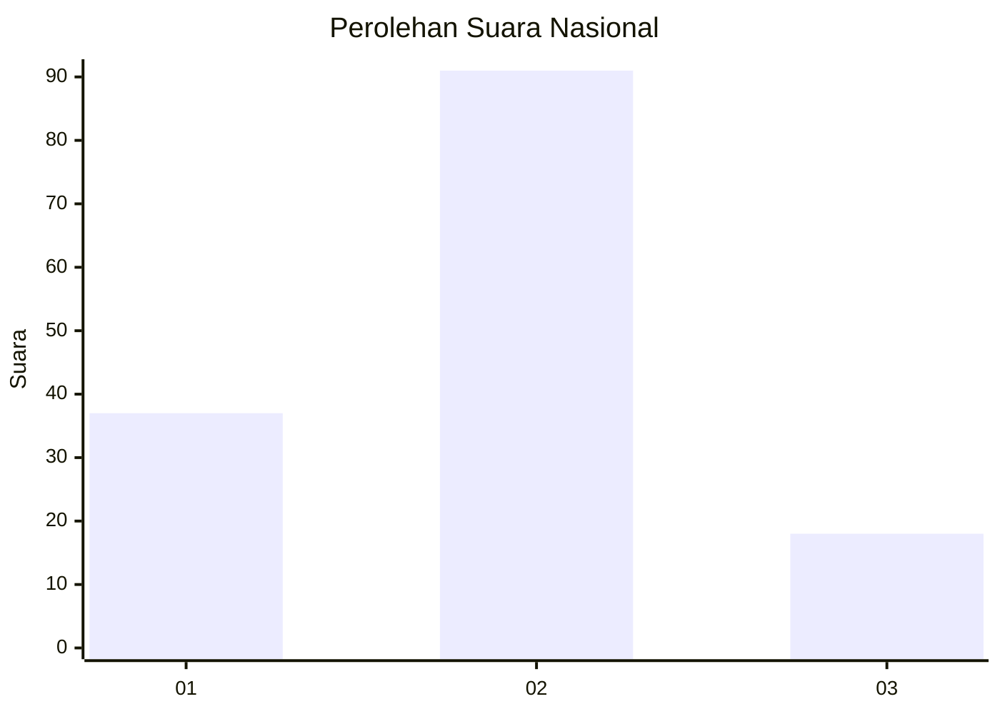
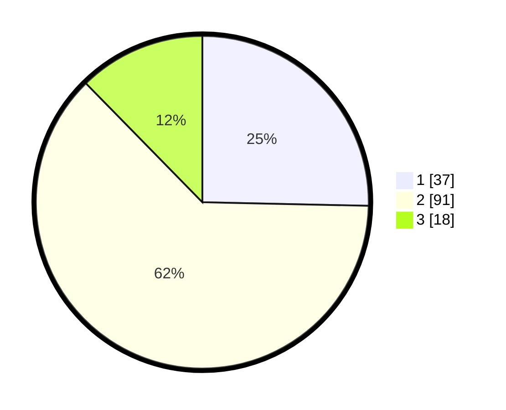

# Hasil

## Grafik

## Tabel

| No. | Nama Paslon    | Suara | Suara (raw) | Persentase |
|:--- |:-------------- | -----:| -----------:| ----------:|
| 1   | ANIES MUHAIMIN | 37    | [37][p-1]   | 25,34      |
| 2   | PRABOWO GIBRAN | 91    | [91][p-2]   | 62,33      |
| 3   | GANJAR MAHFUD  | 18    | [18][p-3]   | 12,33      |

[p-1]: https://github.com/gigit-pemilu/pemilu-2024/blob/main/pilpres/hitung-suara/sub/16-sumatera-selatan/sub/11-empat-lawang/sub/02-pendopo/sub/2022-gn-meraksa-baru/sub/010-tps/sub/paslon-1.txt
[p-2]: https://github.com/gigit-pemilu/pemilu-2024/blob/main/pilpres/hitung-suara/sub/16-sumatera-selatan/sub/11-empat-lawang/sub/02-pendopo/sub/2022-gn-meraksa-baru/sub/010-tps/sub/paslon-2.txt
[p-3]: https://github.com/gigit-pemilu/pemilu-2024/blob/main/pilpres/hitung-suara/sub/16-sumatera-selatan/sub/11-empat-lawang/sub/02-pendopo/sub/2022-gn-meraksa-baru/sub/010-tps/sub/paslon-3.txt

## Foto C Plano

https://sirekap-obj-formc.kpu.go.id/7c93/pemilu/ppwp/16/11/02/20/22/1611022022010-20240214-235915--b47dc6ed-c374-4c22-b067-f9d49abd8bd4.jpg

https://sirekap-obj-formc.kpu.go.id/7c93/pemilu/ppwp/16/11/02/20/22/1611022022010-20240215-000144--b8d9ae30-dc15-4f25-ac47-ff858f72cd7b.jpg

https://sirekap-obj-formc.kpu.go.id/7c93/pemilu/ppwp/16/11/02/20/22/1611022022010-20240215-000634--bca2b9f4-d52e-441f-9b75-d49f218da3a9.jpg

## Metadata

| Key        | Value               |
| ---------- | ------------------- |
| Time Stamp | 2024-02-25 17:00:00 |

