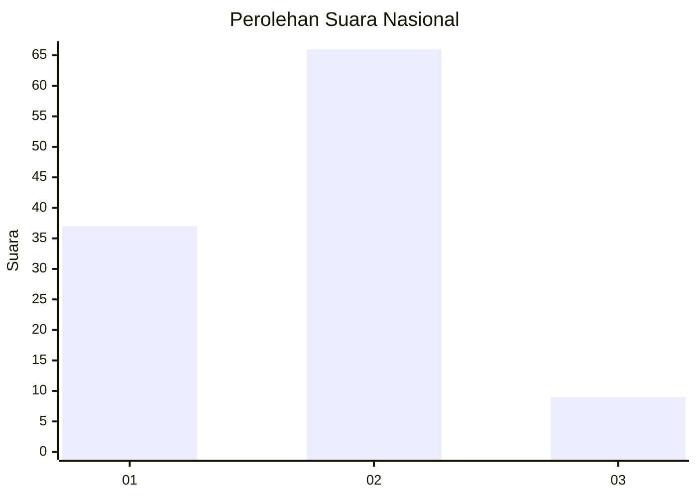
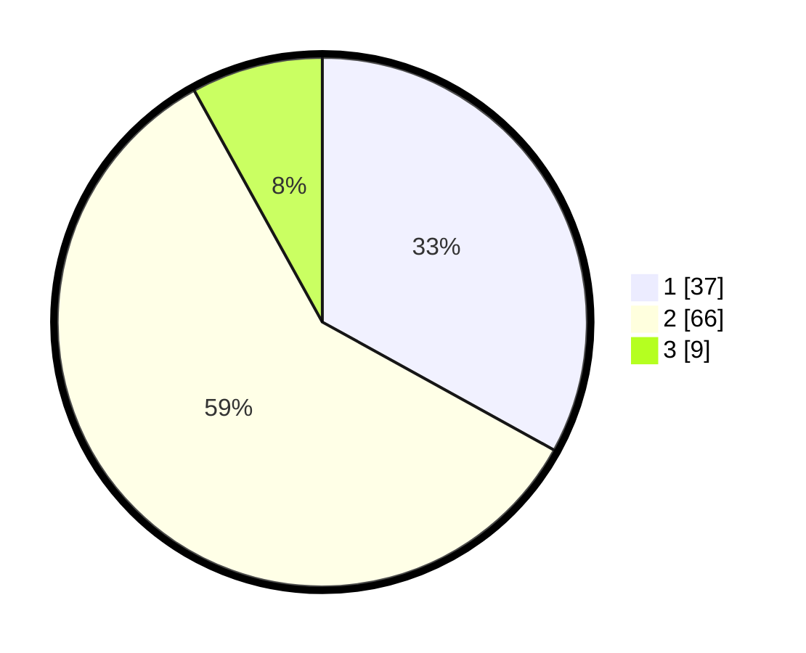

# Hasil

## Grafik

## Tabel

| No. | Nama Paslon    | Suara | Suara (raw) | Persentase |
|:--- |:-------------- | -----:| -----------:| ----------:|
| 1   | ANIES MUHAIMIN | 37    | [37][p-1]   | 33,04      |
| 2   | PRABOWO GIBRAN | 66    | [66][p-2]   | 58,93      |
| 3   | GANJAR MAHFUD  | 9     | [9][p-3]    | 8,04       |

[p-1]: https://github.com/gigit-pemilu/pemilu-2024/blob/main/pilpres/hitung-suara/sub/16-sumatera-selatan/sub/11-empat-lawang/sub/02-pendopo/sub/2022-gn-meraksa-baru/sub/011-tps/sub/paslon-1.txt
[p-2]: https://github.com/gigit-pemilu/pemilu-2024/blob/main/pilpres/hitung-suara/sub/16-sumatera-selatan/sub/11-empat-lawang/sub/02-pendopo/sub/2022-gn-meraksa-baru/sub/011-tps/sub/paslon-2.txt
[p-3]: https://github.com/gigit-pemilu/pemilu-2024/blob/main/pilpres/hitung-suara/sub/16-sumatera-selatan/sub/11-empat-lawang/sub/02-pendopo/sub/2022-gn-meraksa-baru/sub/011-tps/sub/paslon-3.txt

## Foto C Plano

https://sirekap-obj-formc.kpu.go.id/5323/pemilu/ppwp/16/11/02/20/22/1611022022011-20240214-223846--47cddee3-741d-4c44-a48d-0355e5b7ad02.jpg

https://sirekap-obj-formc.kpu.go.id/5323/pemilu/ppwp/16/11/02/20/22/1611022022011-20240215-021325--52a045f2-6001-4c8c-8773-954188b72f6f.jpg

https://sirekap-obj-formc.kpu.go.id/5323/pemilu/ppwp/16/11/02/20/22/1611022022011-20240214-224248--a809c809-c912-4e85-962e-00c1a2a06e73.jpg

## Metadata

| Key        | Value               |
| ---------- | ------------------- |
| Time Stamp | 2024-02-16 21:01:00 |

