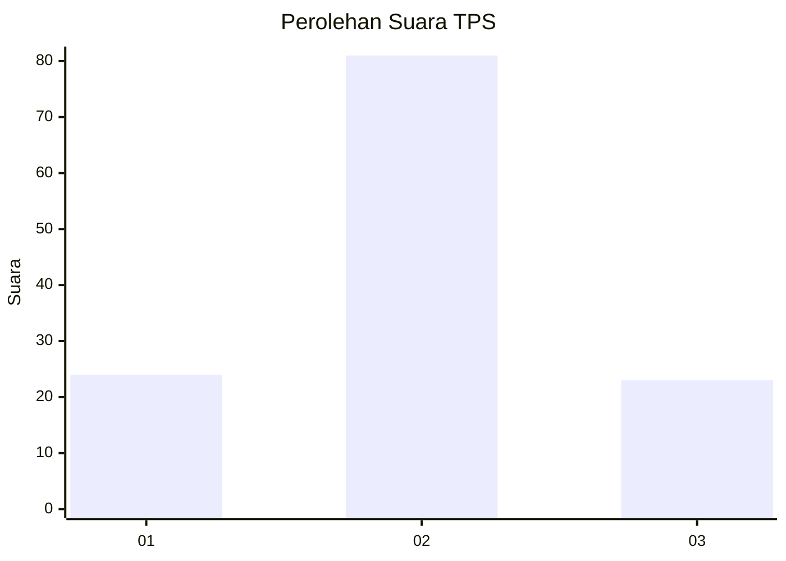
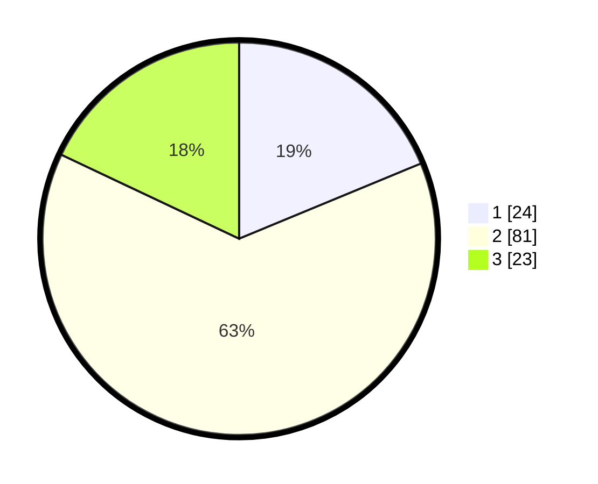

# Hasil

## Grafik

## Tabel

| No. | Nama Paslon    | Suara | Suara (raw) | Persentase |
|:--- |:-------------- | -----:| -----------:| ----------:|
| 1   | ANIES MUHAIMIN | 24    | [24][p-1]   | 18,75      |
| 2   | PRABOWO GIBRAN | 81    | [81][p-2]   | 63,28      |
| 3   | GANJAR MAHFUD  | 23    | [23][p-3]   | 17,97      |

[p-1]: https://github.com/gigit-pemilu/pemilu-2024-16-sumatera-selatan/blob/main/pilpres/hitung-suara/sub/16-sumatera-selatan/sub/11-empat-lawang/sub/02-pendopo/sub/2023-landur/sub/001-tps/sub/paslon-1.txt
[p-2]: https://github.com/gigit-pemilu/pemilu-2024-16-sumatera-selatan/blob/main/pilpres/hitung-suara/sub/16-sumatera-selatan/sub/11-empat-lawang/sub/02-pendopo/sub/2023-landur/sub/001-tps/sub/paslon-2.txt
[p-3]: https://github.com/gigit-pemilu/pemilu-2024-16-sumatera-selatan/blob/main/pilpres/hitung-suara/sub/16-sumatera-selatan/sub/11-empat-lawang/sub/02-pendopo/sub/2023-landur/sub/001-tps/sub/paslon-3.txt

## Foto C Plano

https://sirekap-obj-formc.kpu.go.id/4409/pemilu/ppwp/16/11/02/20/23/1611022023001-20240215-031859--13f55d54-fad5-4dcd-98b1-cefc6951ddac.jpg

https://sirekap-obj-formc.kpu.go.id/4409/pemilu/ppwp/16/11/02/20/23/1611022023001-20240215-032011--ec556633-320c-45c7-9b71-98f5390dcdbf.jpg

https://sirekap-obj-formc.kpu.go.id/4409/pemilu/ppwp/16/11/02/20/23/1611022023001-20240215-032154--66cd6f17-5abd-4ea1-a061-d22614039651.jpg

## Metadata

| Key        | Value               |
| ---------- | ------------------- |
| Time Stamp | 2024-02-25 21:00:00 |

