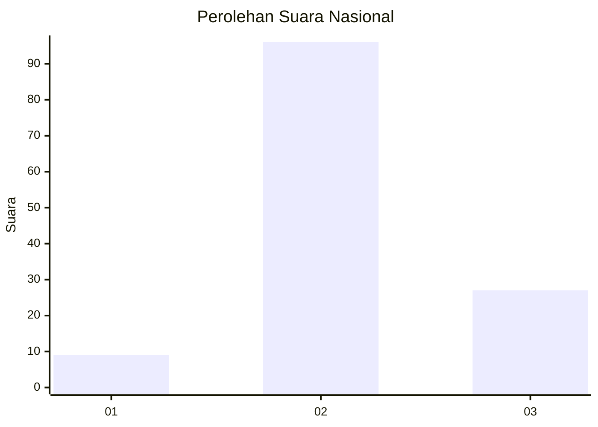

# Hasil

## Grafik

## Tabel

| No. | Nama Paslon    | Suara | Suara (raw) | Persentase |
|:--- |:-------------- | -----:| -----------:| ----------:|
| 1   | ANIES MUHAIMIN | 9     | [9][p-1]    | 6,82       |
| 2   | PRABOWO GIBRAN | 96    | [96][p-2]   | 72,73      |
| 3   | GANJAR MAHFUD  | 27    | [27][p-3]   | 20,45      |

[p-1]: https://github.com/gigit-pemilu/pemilu-2024/blob/main/pilpres/hitung-suara/sub/16-sumatera-selatan/sub/11-empat-lawang/sub/02-pendopo/sub/2023-landur/sub/010-tps/sub/paslon-1.txt
[p-2]: https://github.com/gigit-pemilu/pemilu-2024/blob/main/pilpres/hitung-suara/sub/16-sumatera-selatan/sub/11-empat-lawang/sub/02-pendopo/sub/2023-landur/sub/010-tps/sub/paslon-2.txt
[p-3]: https://github.com/gigit-pemilu/pemilu-2024/blob/main/pilpres/hitung-suara/sub/16-sumatera-selatan/sub/11-empat-lawang/sub/02-pendopo/sub/2023-landur/sub/010-tps/sub/paslon-3.txt

## Foto C Plano

https://sirekap-obj-formc.kpu.go.id/0adb/pemilu/ppwp/16/11/02/20/23/1611022023010-20240215-144406--265487b7-8f88-49d3-8526-3f9dd89fbfb1.jpg

https://sirekap-obj-formc.kpu.go.id/0adb/pemilu/ppwp/16/11/02/20/23/1611022023010-20240215-144813--52d8df5b-c7be-423a-a63d-a0789baf5d41.jpg

https://sirekap-obj-formc.kpu.go.id/0adb/pemilu/ppwp/16/11/02/20/23/1611022023010-20240215-145028--02fe5584-0366-4894-a422-1bf2840ba71e.jpg

## Metadata

| Key        | Value               |
| ---------- | ------------------- |
| Time Stamp | 2024-02-16 22:01:00 |

