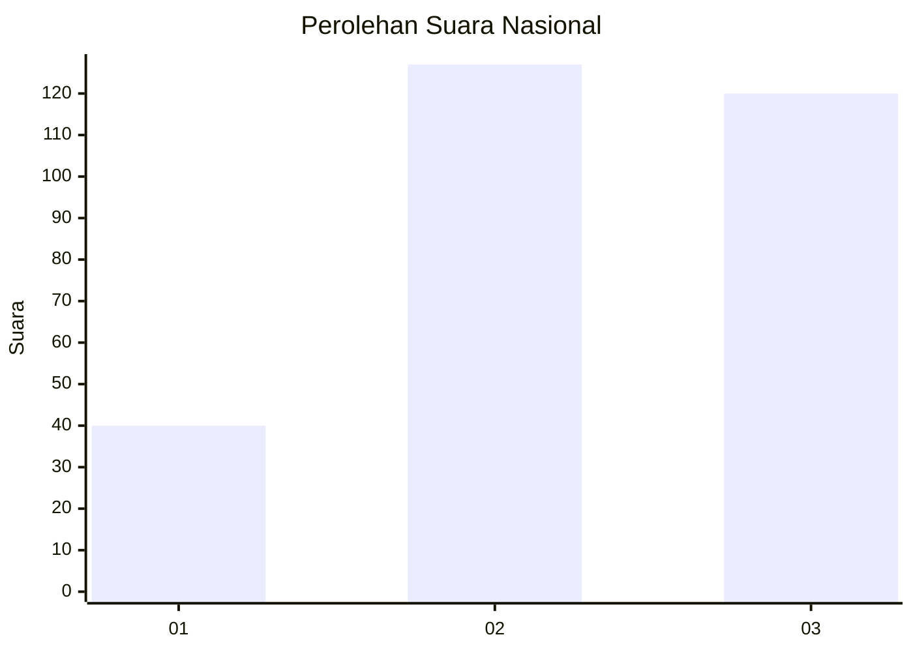
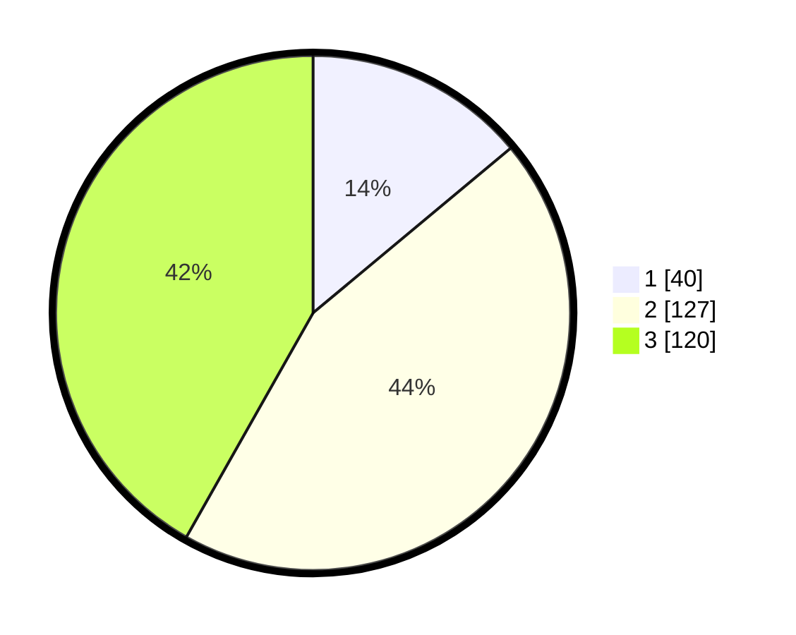

# Hasil

## Grafik

## Tabel

| No. | Nama Paslon    | Suara | Suara (raw) | Persentase |
|:--- |:-------------- | -----:| -----------:| ----------:|
| 1   | ANIES MUHAIMIN | 40    | [40][p-1]   | 13,94      |
| 2   | PRABOWO GIBRAN | 127   | [127][p-2]  | 44,25      |
| 3   | GANJAR MAHFUD  | 120   | [120][p-3]  | 41,81      |

[p-1]: https://github.com/gigit-pemilu/pemilu-2024/blob/main/pilpres/hitung-suara/sub/16-sumatera-selatan/sub/11-empat-lawang/sub/02-pendopo/sub/2025-sarang-bulan/sub/005-tps/sub/paslon-1.txt
[p-2]: https://github.com/gigit-pemilu/pemilu-2024/blob/main/pilpres/hitung-suara/sub/16-sumatera-selatan/sub/11-empat-lawang/sub/02-pendopo/sub/2025-sarang-bulan/sub/005-tps/sub/paslon-2.txt
[p-3]: https://github.com/gigit-pemilu/pemilu-2024/blob/main/pilpres/hitung-suara/sub/16-sumatera-selatan/sub/11-empat-lawang/sub/02-pendopo/sub/2025-sarang-bulan/sub/005-tps/sub/paslon-3.txt

## Foto C Plano

https://sirekap-obj-formc.kpu.go.id/6c26/pemilu/ppwp/16/11/02/20/25/1611022025005-20240214-215536--9f5e9796-e11a-4397-a1ff-d7274870a171.jpg

https://sirekap-obj-formc.kpu.go.id/6c26/pemilu/ppwp/16/11/02/20/25/1611022025005-20240214-215623--47ac0b4f-55e1-4a77-b774-8c21c4c66678.jpg

https://sirekap-obj-formc.kpu.go.id/6c26/pemilu/ppwp/16/11/02/20/25/1611022025005-20240214-215721--c6227b0d-48e5-44e5-be27-ba2ed18c9260.jpg

## Metadata

| Key        | Value               |
| ---------- | ------------------- |
| Time Stamp | 2024-02-16 23:00:00 |

